# pascc 项目详细设计文档

## 第一章 项目概述

**pascc**（Pascal-S to C Compiler）是一个将 Pascal-S（教学用简化 Pascal）源程序翻译为 C 语言代码的编译器，作为《编译原理与技术课程设计》的课程项目。整个项目采用经典的四阶段编译流水线架构，以 C++17 为核心语言，集成 Flex 词法生成器和 Bison 语法生成器（均来自 WinFlexBison 工具链），使用 CMake 3.16+ 作为跨平台构建系统。

项目的设计核心理念是**模块独立性**与**流水线可编排性**。四个编译阶段（词法分析、语法分析、语义分析、代码生成）各自作为独立模块运行，由编译驱动（`CompilerDriver`）统一编排调用顺序，阶段之间通过明确的数据结构（`LexerResult`、`ParserResult`、`SemanticResult`、`CodegenResult`）传递信息和错误。这种设计使得每个模块可以独立测试、独立调试、独立演化。

### 1.1 技术栈

| 技术 | 用途 | 版本要求 |
|------|------|---------|
| C++17 | 核心编程语言，使用 `if constexpr`（如 `TableSet::insert<T>()` 中的分支）、结构化绑定等特性 | C++17 标准 |
| CMake | 跨平台构建系统，管理 Flex/Bison 自定义代码生成命令和 12 个 CTest 测试目标的注册 | >= 3.16 |
| Flex (win_flex) | 词法分析器生成器，从 192 行 `.l` 文件中的正则表达式生成确定性有限自动机（DFA）扫描器 | WinFlexBison 2.5+ |
| Bison (win_bison) | 语法分析器生成器，从 343 行 `.y` 文件中的 BNF 文法生成 LALR(1) 移进-归约解析器 | WinFlexBison 2.5+ |
| CTest | CMake 内置测试框架，通过 `add_test()` 注册 12 个测试目标，支持 `ctest` 统一运行 | CMake 内置 |
| 静态链接 (`-static`) | Linux 下通过 `-static -static-libstdc++ -static-libgcc` 生成可移植二进制 | GCC/Clang |

### 1.2 模块划分与文件映射

项目严格遵循头文件与实现文件分离的 C++ 工程规范，所有公开头文件置于 `include/` 目录，实现文件置于 `src/` 目录，Flex/Bison 的源文件（`.l` / `.y`）也置于 `src/` 目录但其编译产物输出到 `build/` 目录。

| 模块 | 头文件 (include/) | 实现文件 (src/) | 生成/桥接文件 |
|------|-------------------|-----------------|---------------|
| Token 定义 | `token.h` | — | `parser_bison.tab.h`（Bison 生成） |
| 词法分析 | `lexer.h` | `lexer.cpp`（119 行） | `lexer_flex.l`（203 行） |
| 语法分析 | `parser.h`, `parser_bison.h`, `ast.h` | `parser.cpp`（7 行）, `parser_bison_bridge.cpp`（163 行） | `parser_bison.y`（848 行） |
| 语义分析 | `semantic_declaration.h`, `semantic_tables.h`（261 行） | `semantic_declaration.cpp`（992 行） | — |
| 代码生成 | `code_generator.h` | `code_generator.cpp`（791 行） | — |
| 编译驱动 | `compiler_driver.h` | `compiler_driver.cpp`（106 行）, `main.cpp`（22 行） | — |
| 错误处理 | `error_codes.h`, `log.h` | — | — |

下图以分层架构的方式展示了模块与文件之间的物理对应关系及编译依赖。

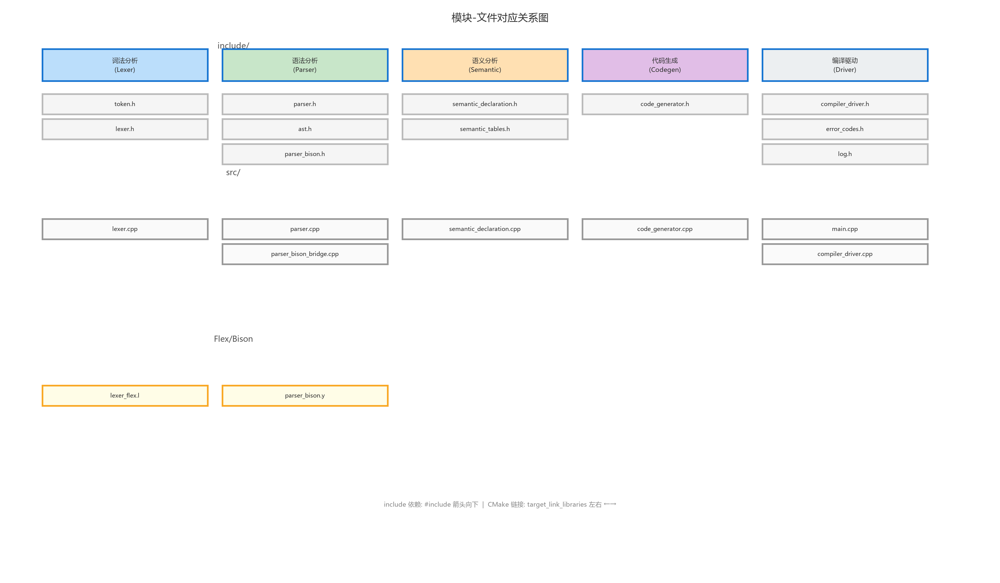

该图采用三层结构清晰展示了每个模块在项目中的物理分布：

- **头文件层（include/）**：定义各模块的公开接口和数据结构，是模块间通信的契约层。例如 `token.h` 定义了 `TokenType` 枚举（共 50+ 种取值，分为特殊、字面量、关键字、运算符、界符五大类）和 `Token`/`SourcePosition` 结构体，被所有下游模块引用。`semantic_tables.h`（261 行）定义了完整的类型系统（`TypeTemplate`/`BasicType` 继承体系）、符号系统（`ObjectSymbol`/`VariableSymbol`/`RoutineSymbol` 继承体系）、作用域管理（`TableSet`/`ScopeStack`）和内置类型池（`BuiltinTypePool`）。
- **实现层（src/）**：包含各模块的具体实现逻辑。其中 `compiler_driver.cpp`（106 行）实现流水线编排，`code_generator.cpp`（791 行）实现基于 AST 遍历的代码生成，`semantic_declaration.cpp`（992 行）实现全部语义分析逻辑。各实现文件的内部结构均采用匿名 `namespace {}` 隐藏内部实现细节，仅通过公开头文件暴露最小接口。
- **生成层（Flex/Bison）**：Flex 源文件 `lexer_flex.l`（203 行）通过 CMake 自定义命令生成 `lexer_flex.cpp` + `lexer_flex.h`；Bison 源文件 `parser_bison.y`（848 行）通过 `bison -d` 选项生成 `parser_bison.tab.c` + `parser_bison.tab.h`。Bison 生成的头文件（含 `T_IDENTIFIER`、`T_BEGIN` 等 Token 编号宏定义）被 Flex 源文件和桥接层共享，确保 Token 编号的一致性。

---

## 第二章 总体架构设计

### 2.1 编译流水线

整个编译过程从 Pascal-S 源文件（`.pas`）到 C 目标文件（`.c`），依次经过四个阶段，由 `CompilerDriver::run()` 统一编排。下图展示了完整的编译流水线架构和各阶段间的数据传递关系。

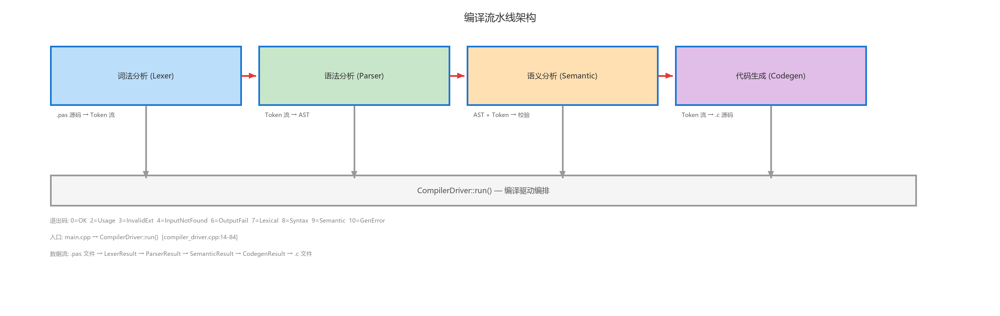

上图清晰地展示了四个阶段的输入/输出格式和流转方向：

- **词法分析阶段**（`Lexer`）：接收原始 Pascal-S 源代码字符串（`.pas` 文件内容），通过 Flex 生成的确定性有限自动机（DFA）扫描，输出 Token 流（`std::vector<Token>`）及词法错误列表（`std::vector<LexError>`）。Token 流是后续所有阶段的唯一输入数据源。Flex 扫描器内部维护行号 `g_line`、列号 `g_col` 全局状态，每匹配一个词素即通过 `EMIT_TOKEN()` 宏记录位置并返回 Bison Token 整型码。
- **语法分析阶段**（`Parser`）：接收词法分析器输出的 Token 流，通过 Bison 生成的 LALR(1) 解析器进行自底向上的移进-归约分析，在归约过程中同步构造完整的 AST 节点树（如 `BinaryExprNode`、`IfStmtNode` 等）。Bison 使用 `%union`（12 种语义值类型）和 `%type` 声明确保类型安全，使用 `%left`/`%right` 指令声明运算符优先级与结合性。若语法正确则返回完整的 `ProgramNode` AST 根节点；若有语法错误则通过 `yyerror()` 回调收集 `std::vector<ParseError>`。
- **语义分析阶段**（`SemanticDeclarationAnalyzer`）：接收 Token 流和语法分析结果（`ParserResult`），对 Token 流做独立的递归下降遍历，构建作用域栈（`ScopeStack`）和符号表体系（`TableSet` 链表），执行标识符声明前使用检测、同一作用域内重复定义检测、类型兼容性检查和过程/函数调用的参数数量与类型匹配检查。
- **代码生成阶段**（`CodeGenerator`）：接收原始输入文件路径（而非 Token 流——模块内部重新调用 Lexer），对 Token 流做两次递归下降扫描，直接输出等效的 C 语言源代码字符串。

`CompilerDriver` 作为编排者位于流水线底部，负责按序调用、错误检查和文件 I/O 管理。

- **输入**：`.pas` 后缀的 Pascal-S 源文件
- **输出**：同名 `.c` 后缀的 C 语言源文件
- **命令行**：`pascc -i <input.pas>`

### 2.2 核心数据流

```
main.cpp
  └→ CompilerDriver::run(inputPath)
       ├─ 1. 检查输入文件扩展名是否为 .pas（大小写不敏感）
       ├─ 2. 检查文件可读性并读取全部内容到内存字符串
       ├─ 3. Lexer::tokenizeDetailed(source) → LexerResult
       │     └─ 内部：重置 Flex 状态 → 创建扫描缓冲区 →
       │        循环 yylex() → mapBisonTokenToInternal() →
       │        释放缓冲区 → 追加 EndOfFile 哨兵 Token
       ├─ 4. Parser::parse(lexResult.tokens) → ParserResult
       │     └─ 委托给 parseWithBison() → 设置全局 Token 指针 →
       │        yyparse() 执行 Bison LALR(1) 解析
       ├─ 5. SemanticDeclarationAnalyzer::analyze(tokens, parserResult) → SemanticResult
       │     └─ 内部：创建全局作用域 → 注入内建类型 →
       │        递归下降遍历 Token 流 → parseProgram() → parseBlock() →
       │        逐子程序解析 + 表达式类型推导
       ├─ 6. CodeGenerator::generate(parserResult) → CodegenResult
       │     └─ 内部：从 AST 构建 CodeGenContext（类型映射、函数签名）→
       │        emitPreamble() → emitGlobalConsts() → emitGlobalVars() →
       │        emitForwardDecl() → emitRoutine() × N → emitMain()
       └─ 7. 写入输出 .c 文件并打印统计信息
```

### 2.3 核心数据结构总览

整个编译流水线中，以下数据结构构成了模块间通信的"通用语言"。每个阶段将其分析结果封装在对应的 Result 结构体中，同时携带错误信息。

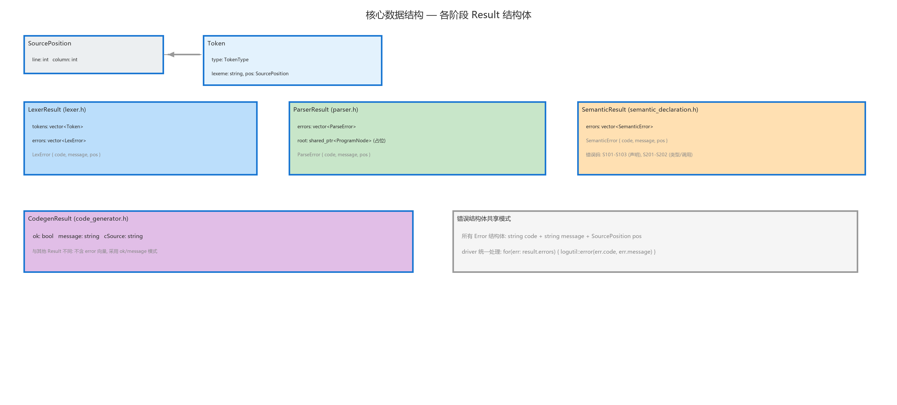

上图以 UML 类图的形式展示了贯穿整个编译流水线的核心数据结构层次关系：

- **`SourcePosition`**（定义于 `token.h:76-80`）：所有位置信息的原子类型，包含 `line`（int，初始值 1）和 `column`（int，初始值 1）两个整型字段，用于错误定位和 Token 溯源。
- **`Token`**（定义于 `token.h:82-86`）：词法分析的基本输出单元，包含三个字段：`type`（`TokenType` 枚举）、`lexeme`（`std::string` 类型，已做 ASCII 小写化处理）、`pos`（`SourcePosition` 类型的起始行列号）。
- **`LexError`** / **`LexerResult`**（定义于 `lexer.h:9-14, 16-21`）：词法分析阶段的输出结构体。`LexError` 包含 `code`（如 `"E106"`）、`message` 和 `pos`；`LexerResult` 通过组合关系持有 `std::vector<Token>` 和 `std::vector<LexError>`。
- **`ParseError`** / **`ParserResult`**（定义于 `parser.h:8-13, 15-20`）：语法分析阶段的输出。`ParserResult` 包含 `errors` 向量和 `root`（`std::shared_ptr<ProgramNode>` 类型的完整 AST 根节点，含声明节点树和语句节点树）。
- **`SemanticError`** / **`SemanticResult`**（定义于 `semantic_declaration.h:6-11, 13-17`）：语义分析阶段的输出，仅包含 `errors` 向量（语义分析不产出新的中间表示，只做验证）。
- **`CodegenResult`**（定义于 `code_generator.h:6-10`）：代码生成阶段的输出，包含 `ok`（bool）、`message`（std::string）和 `cSource`（std::string，完整的 C 语言源代码）。

注意所有错误结构体（`LexError`、`ParseError`、`SemanticError`）都共享相似的字段模式（`code` + `message` + `pos`），但在代码中它们是独立定义的结构体而非通过继承关联——这是为了保持各模块的完全独立性。

### 2.4 模块间接口契约

以下接口契约图精确描述了四个核心模块的公开函数签名、参数类型和返回类型，以及数据在模块间的流动方向。

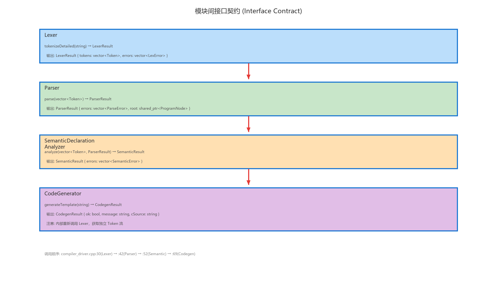

该图揭示了几个重要的设计细节：

1. **数据传递路径**：Lexer 产出的 `LexerResult.tokens` 被 Parser 消费（通过 `parse(const std::vector<Token>&)` 传递），Parser 产出的 `ParserResult`（含完整 AST `ProgramNode*`）被 Semantic 消费（通过 `analyze(tokens, parserResult)` 传递——Semantic 同时需要 tokens 和语法验证结果作为前提条件），也被 CodeGenerator 消费（通过 `generate(parserResult)` 传递完整的 AST 树）。Token 流仅在词法→语法→语义三个阶段间传递；代码生成阶段直接接收 AST，不再重新执行词法分析。

2. **只读语义**：Parser 和 Semantic 对 tokens 向量只有只读访问权限（通过 `const std::vector<Token>&` 传递），不会修改词法分析的结果。CodeGenerator 对 `ParserResult` 也只有只读访问权限。

3. **错误传播机制**：每个阶段将其错误累积在各自 Result 结构体的 errors 字段中，Driver 在每个阶段完成后检查 `errors.empty()`，若不为空则通过 `logutil::error()` 逐条输出错误信息到 stderr，然后立即终止流水线并返回对应退出码。

4. **单次词法分析**：词法分析在编译流水线中仅执行一次（由 `CompilerDriver` 在阶段 1 调用）。代码生成阶段不再重新执行词法分析——它直接从 AST 中获取所需的类型信息和声明信息。

### 2.5 重要架构决策

#### 决策一：Bison 构建完整 AST，代码生成器遍历 AST 翻译

项目采用以 AST 为中心的编译架构，Bison 解析器和代码生成器通过 AST 实现解耦：

- **Bison 解析器**（`parser_bison.y` 848 行 + `parser_bison_bridge.cpp` 163 行）：负责**语法正确性验证 + AST 构建**。它使用从 `.y` 文法文件生成的 LALR(1) 自动机对 Token 流进行移进-归约分析。每条产生式的语义动作不再是空的——在归约过程中同步构造 AST 节点（如 `BinaryExprNode`、`IfStmtNode`、`RoutineNode` 等），最终在 `program` 起始规则归约时产出完整的 `ProgramNode` 树。Bison 的 `%union` 定义了 12 种语义值类型，`%type` 为所有非终结符声明了类型，形成完整的类型化文法体系。
- **AST 遍历代码生成器**（`code_generator.cpp` 791 行）：负责**代码翻译**。它接收 Bison 产出的完整 AST（`ProgramNode*`），通过 `emitExpr(ExprNode*)`、`emitStmt(StmtNode*)` 等函数递归遍历 AST 节点树，将每种节点翻译为等效 C 代码。代码生成器不再直接操作 Token 流——所有语法结构信息已编码在 AST 节点的类型和字段中。

这种"Bison 构建 AST → 代码生成器遍历 AST"的架构使语法分析和代码翻译通过明确的 AST 接口解耦。Bison 专注于文法验证和树构造，代码生成器专注于目标语言发射，两者可以独立调试和优化。同时，完整的 AST 也为语义分析器提供了利用结构化语法信息的可能性。

#### 决策二：语义分析独立遍历 Token 流

语义分析器（`semantic_declaration.cpp` 992 行）采用独立于 AST 的工作方式：它自己重新遍历 Token 流（通过内部维护的 `pos_` 游标和 `advance()`、`match(type)`、`peekType(n)` 辅助函数），不使用 Bison 构建的 AST。它拥有独立的符号表体系：`ScopeStack` 管理嵌套作用域，`TableSet` 通过 `prevSet_` 指针形成单向链表实现链式查找，`BuiltinTypePool` 管理四种内建类型的单例。语义分析器通过 `ParserResult.root != nullptr` 验证语法阶段已通过，但不访问 AST 节点内容。

#### 决策三：代码生成采用"直译"策略

代码生成器对 AST 做递归遍历，逐节点翻译为等效 C 语法。核心翻译策略包括类型映射（Pascal `integer` → C `int`，Pascal `real` → C `float`，Pascal `boolean` → C `int`，Pascal `char` → C `char`）、控制流映射（`for i := A to B do` → `for (i = A; i <= B; ++i)`、`repeat stmts until C` → `do { stmts } while (!(C))` 等）、VAR 参数的指针模拟以及运行时 I/O 辅助函数的自动生成。与旧版基于 Token 流的直译相比，基于 AST 的直译不再需要两遍 Token 扫描策略——类型信息、函数签名、变量声明等全部从 AST 声明节点中直接获取。

---

## 第三章 词法分析模块

### 3.1 模块职责

词法分析模块是编译流水线的第一阶段，负责将 Pascal-S 源代码字符串转换为结构化的 Token 流（`std::vector<Token>`），同时检测三类词法错误：非法字符、未闭合注释、非法字符字面量。模块的核心由 Flex 生成的确定性有限自动机（DFA）驱动，外层通过 `Lexer` 类封装 Flex 的 C 语言接口，向编译器其余部分提供类型安全的 C++ 接口。

### 3.2 文件结构

| 文件 | 行数 | 职责 |
|------|------|------|
| `token.h` | 90 | `TokenType` 枚举（50+ 种取值）、`Token` 与 `SourcePosition` 结构体定义 |
| `lexer.h` | 27 | `LexError`、`LexerResult` 结构体 + `Lexer` 类公开接口 |
| `lexer.cpp` | 119 | Flex 扫描器调用的 C++ 封装、`mapBisonTokenToInternal()` 反向映射表的实现 |
| `lexer_flex.l` | 203 | Flex 词法规则源文件（正则表达式 → Bison Token 码） |

模块的物理依赖关系：`lexer_flex.l` →（`#include`）→ `parser_bison.tab.h`（Bison 生成，提供 `T_IDENTIFIER` 等 Token 编号宏）→ `lexer.cpp` → `token.h`。Flex/Bison 之间通过 Token 编号宏实现"编号契约"：Flex 返回的整型码必须与 Bison `%token` 声明中分配的编号完全一致。

### 3.3 Token 类型体系

`TokenType` 是一个 `enum class`，共包含 50+ 种取值，按语义分为五大类。下图以树形结构展示了完整分类。


树的根节点为 `TokenType (enum class)`，五个一级分支分别对应特殊类型、字面量类型、关键字类型、运算符类型和界符类型。

#### 特殊类型（2 种）

- **`EndOfFile`**：流结束标记。由 `Lexer::tokenizeDetailed()` 在 Token 序列末尾手动追加，而非由 Flex 规则产生。后续阶段（语义分析、代码生成）依赖此哨兵值判断是否到达输入末尾。
- **`Unknown`**：无法识别的字符。当 Flex 最末规则 `.` 匹配到任何未被前述规则捕获的字符时返回。虽然 Token 类型为 Unknown，但扫描器仍继续运行（不中断），错误信息通过 `addError("E110", ...)` 记录。

#### 字面量类型（6 种）

- **`Identifier`**：标识符。由正则 `[A-Za-z_][A-Za-z0-9_]*` 匹配，经 `toLower()` ASCII 小写化后查关键字哈希表。
- **`IntegerLiteral`**：无符号整数。由正则 `[0-9]+` 匹配。注意 Pascal-S 中整数字面量不含符号——`-5` 被词法分析为 `Minus` + `IntegerLiteral(5)`。
- **`RealLiteral`**：实数。由正则 `[0-9]+"."[0-9]+` 匹配，必须包含小数点。
- **`CharLiteral`**：字符字面量。由正则 `'([^\\\'\n\r])'` 匹配，仅接受单个非反斜杠、非引号、非换行的可打印字符。
- **`StringLiteral`**：字符串字面量。由正则 `'([^\'\n\r])*\'` 匹配，支持多字符和空字符串。在 Flex 动作中提取引号内的内容作为 lexeme。
- **`BooleanLiteral`**：布尔字面量 `true` / `false`。

#### 关键字类型（KwXxx，共 30+ 种）

关键字在 `keywordOrIdentifier()` 函数中通过 `std::unordered_map<std::string, int>` 哈希表实现 O(1) 查找。按语义可细分五组：

- **程序结构**（6 个）：`Program`, `Const`, `Type`, `Var`, `Begin`, `End`
- **子程序**（2 个）：`Procedure`, `Function`
- **控制流**（16 个）：`If`, `Then`, `Else`, `Case`, `While`, `Repeat`, `Until`, `For`, `To`, `DownTo`, `Do`, `Break`, `Continue`, `Exit`
- **I/O**（4 个）：`Read`, `ReadLn`, `Write`, `WriteLn`
- **类型与运算符关键字**（9 个）：`Record`, `Array`, `Of`, `Integer`, `Real`, `Boolean`, `Char`, `Div`, `Mod`, `And`, `Or`, `Not`

#### 运算符类型（11 种）

运算符的匹配遵循 Flex 的"最长匹配优先"原则。多字符运算符（`:=`、`<=`、`>=`、`<>`、`..`）的规则排在单字符运算符之前。

#### Token 数据结构

```cpp
struct SourcePosition {
    int line = 1;      // 1-based 行号
    int column = 1;    // 1-based 列号
};

struct Token {
    TokenType type = TokenType::Unknown;
    std::string lexeme;   // 原始词素（已做 ASCII 小写化处理）
    SourcePosition pos;   // 起始行列号（1-based）
};
```

`lexeme` 字段存储的是经过 `toLower()` 处理的小写形式，这一设计简化了下游模块（语义分析、代码生成）的字符串比较逻辑。

### 3.4 Flex 规则设计

文件：`lexer_flex.l`（192 行）

Flex 扫描器使用 `%option prefix="pascclex"` 避免在链接多个 Flex 扫描器时出现符号冲突，使用 `%x COMMENT` 和 `%x COMMENT2` 定义了两个独占状态来处理 `{ }` 和 `(* *)` 两种块注释语法。

下图展示了 Flex 扫描器在 INITIAL 和 COMMENT 两个核心状态之间的转移关系。


状态转移的核心逻辑如下：

- **INITIAL 状态**是扫描器的起始状态和默认状态。在该状态下，空白字符（空格、制表符、回车）仅累加列号不产生 Token；换行符递增行号并复位列号；遇到 `{` 时进入 COMMENT 状态并记录注释起始位置；遇到 `(*` 时进入 COMMENT2 状态。标识符和关键字通过 `keywordOrIdentifier()` 查表返回对应的 Bison Token 码；运算符和界符按最长匹配优先原则直接返回；字面量在匹配后通过 `EMIT_TOKEN` 宏返回；无法匹配的字符由最末规则 `.` 捕获，产生 E110 错误。
- **COMMENT 状态**处理 `{ ... }` 形式的块注释。在该状态下，`}` 使扫描器回到 INITIAL 状态；`{` 触发 E106 错误（嵌套注释）；换行正常递增行号；其他字符被静默消耗。若到达 EOF 仍未闭合注释，则触发 E107 错误。
- **COMMENT2 状态**处理 `(* ... *)` 形式的块注释，逻辑与 COMMENT 状态对称。

#### 标识符与关键字识别

```
[A-Za-z_][A-Za-z0-9_]*  {
    const std::string lowered = toLower(yytext, yyleng);
    const int token = keywordOrIdentifier(lowered);
    EMIT_TOKEN(token, lowered);
}
```

识别流程：正则匹配 → `toLower()` ASCII 小写化 → `keywordOrIdentifier()` 在 `std::unordered_map` 中 O(1) 查表 → 若命中则返回关键字对应的 Bison Token 码，否则返回 `T_IDENTIFIER`。

#### 全局状态管理

Flex 使用 C 语言的全局变量模式管理扫描状态（因为 `yylex()` 是无参数函数）：

```cpp
static std::vector<LexError>* g_errors = nullptr;  // 错误列表指针
static int g_line = 1;                              // 当前行号
static int g_col = 1;                               // 当前列号
static int g_comment_start_line = 1;                // 注释起始行号
static int g_comment_start_col = 1;                 // 注释起始列号
static std::string g_last_lexeme;                   // 最近匹配的词素
static int g_last_line = 1;                         // 最近 Token 行号
static int g_last_col = 1;                          // 最近 Token 列号
```

这种设计的一个副作用是**不可重入**——同一进程内不能同时运行两个 Flex 扫描器实例。但对于单文件编译器而言这不是问题。

### 3.5 Lexer 类封装

#### mapBisonTokenToInternal() 反向映射

此函数将 Flex 返回的 Bison Token 整型码转换为内部的 `TokenType` 枚举值。为什么需要双向映射？因为：

1. Flex 规则动作必须返回 Bison Token 码（Bison 生成的 `yyparse()` 只认识 `parser_bison.tab.h` 中的 `T_XXX` 宏）
2. 但编译器下游模块不应依赖 Bison 的内部编号——它们应使用 `token.h` 中的 `TokenType` 枚举
3. 因此 `lexer.cpp` 在 Flex 返回后立即通过 `mapBisonTokenToInternal()` 转换，对外只暴露 `TokenType`

#### tokenizeDetailed() 主流程

```cpp
LexerResult Lexer::tokenizeDetailed(const std::string& source) {
    LexerResult result;
    std::vector<LexError> errors;
    pasccLexerResetState(&errors);                    // 重置 Flex 全局状态
    YY_BUFFER_STATE buf = pascclex_scan_string(source.c_str());  // 创建扫描缓冲区
    int tokenCode;
    while ((tokenCode = pascclexlex()) != 0) {        // 循环调用 yylex()
        TokenType type = mapBisonTokenToInternal(tokenCode);
        result.tokens.push_back(Token{type, ...});
    }
    pascclex_delete_buffer(buf);                       // 释放缓冲区
    result.tokens.push_back(Token{TokenType::EndOfFile, "<EOF>", ...}); // EOF 哨兵
    result.errors = std::move(errors);
    return result;
}
```

关键步骤：使用 `pascclex_scan_string()` 从内存字符串创建扫描缓冲区，避免文件 I/O；手动追加 `EndOfFile` 哨兵 Token 以简化下游模块的边界判断；使用 `std::move` 转移错误列表的所有权，避免拷贝。

### 3.6 错误处理

词法分析阶段定义了 4 种错误码：

| 错误码 | 触发条件 | Flex 规则位置 |
|--------|---------|--------------|
| E106 | 嵌套块注释 `{ ... { ... } ... }` | `lexer_flex.l:141` |
| E107 | 未终止的块注释 `{ ... EOF` 或 `(* ... EOF` | `lexer_flex.l:145, 155` |
| E109 | 未终止的字符串字面量（单引号不配对） | `lexer_flex.l:187-189` |
| E110 | 无法识别的字符 | `lexer_flex.l:197-200` |

错误恢复策略：词法错误**不中断**扫描过程。E106 仅记录错误并继续；E107 记录错误后强制终止扫描；E109/E110 记录错误后返回 `T_UNKNOWN` Token（由 Bison 的错误恢复产生式跳过）。

---

## 第四章 语法分析模块

### 4.1 模块职责

语法分析模块是编译流水线的第二阶段，负责将词法分析器输出的 Token 流按 Pascal-S 文法进行语法结构验证。模块使用 Bison 生成的 LALR(1) 解析器执行自底向上的移进-归约分析。此外，语法分析模块同时承担一项关键的**桥接职责**：在 Flex（C 语言接口，返回 int 类型的 Bison Token 码）与 C++ 编译器其余部分（使用 `TokenType` 枚举和 `Token` 结构体）之间建立双向映射。

### 4.2 文件结构

| 文件 | 行数 | 职责 |
|------|------|------|
| `ast.h` | 283 | 完整的 AST 节点类定义（32 种 AstKind + 20+ 节点类型） |
| `parser.h` | 28 | `Parser` 公开接口、`ParserResult`/`ParseError` 结构体定义 |
| `parser_bison.h` | 11 | `parseWithBison()` 函数的 C++ 声明 |
| `parser.cpp` | 7 | `Parser::parse()` 一行委托给 `parseWithBison()` |
| `parser_bison_bridge.cpp` | 163 | Flex ↔ Bison 桥接层：`yylex()`/`yyerror()` 实现、`mapToken()` 映射表、yylval 语义值注入 |
| `parser_bison.y` | 848 | Bison 语法源文件：`%union` 语义值联合体、`%type` 非终结符类型声明、约 70 条带完整 AST 构造动作的文法产生式 |

### 4.3 Bison 桥接层数据流

下图展示了从 C++ 的 `vector<Token>` 到 Bison 的 `yyparse()` 再到 `ParserResult` 的完整数据转换流程。

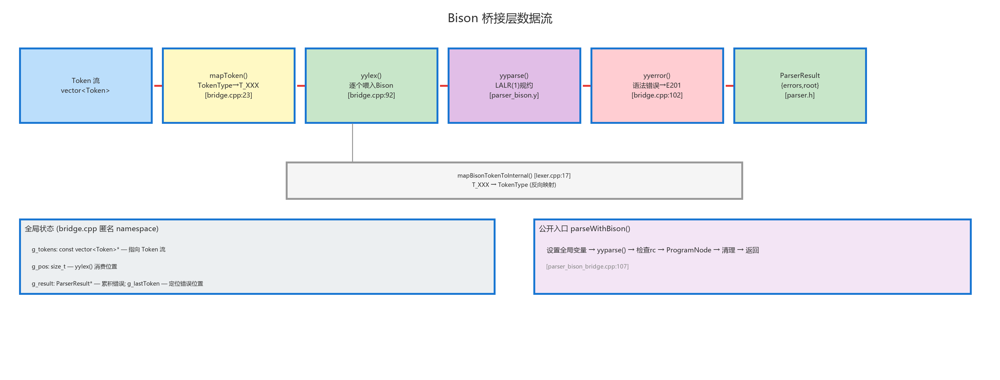

桥接层的核心机制围绕五个全局状态变量展开：

```cpp
const std::vector<Token>* g_tokens = nullptr;  // 输入 Token 流指针
size_t g_pos = 0;                               // 当前读取位置
Token g_lastToken;                              // 最近被 yylex() 返回的 Token
ParserResult* g_result = nullptr;               // 结果累积指针
AstNode* g_ast_root = nullptr;                  // Bison 产出的 AST 根节点
```

数据流转路径：
1. `parseWithBison()` 设置 `g_tokens` 指向输入的 Token 向量，`g_pos = 0`，`g_ast_root = nullptr`
2. 调用 `yyparse()` 启动 Bison LALR(1) 自动机
3. Bison 在每次需要下一个 Token 时回调 `yylex()`
4. `yylex()` 从 `g_tokens[g_pos++]` 取出下一个 Token，通过 `mapToken()` 将 `TokenType` 枚举转换为 Bison `T_XXX` 整型码，同时为携带语义值的 Token 类型（`Identifier`、字面量等）设置 `yylval`
5. Bison 按文法规则进行移进-归约，**每条产生式的语义动作在归约时同步构造 AST 节点**（如创建 `IfStmtNode`、`BinaryExprNode` 等），通过 `$$` 将子节点向上传递
6. `program` 起始规则归约时，将完整的 `ProgramNode*` 赋值给全局变量 `g_ast_root`
7. 若归约到 `program` 产生式且到达 EOF，`yyparse()` 返回 0（成功）
8. 若遭遇语法错误，Bison 自动调用 `yyerror()`，构造 `ParseError(E201, ...)`
9. `parseWithBison()` 在 `yyparse()` 返回后将 `g_ast_root` 转移为 `ParserResult.root`（`shared_ptr<ProgramNode>`）

### 4.4 Token 映射体系

Flex 返回给 Bison 的是 int 类型的 Token 码，而编译器其余模块使用 `TokenType` 枚举。因此需要两个对称的映射函数。

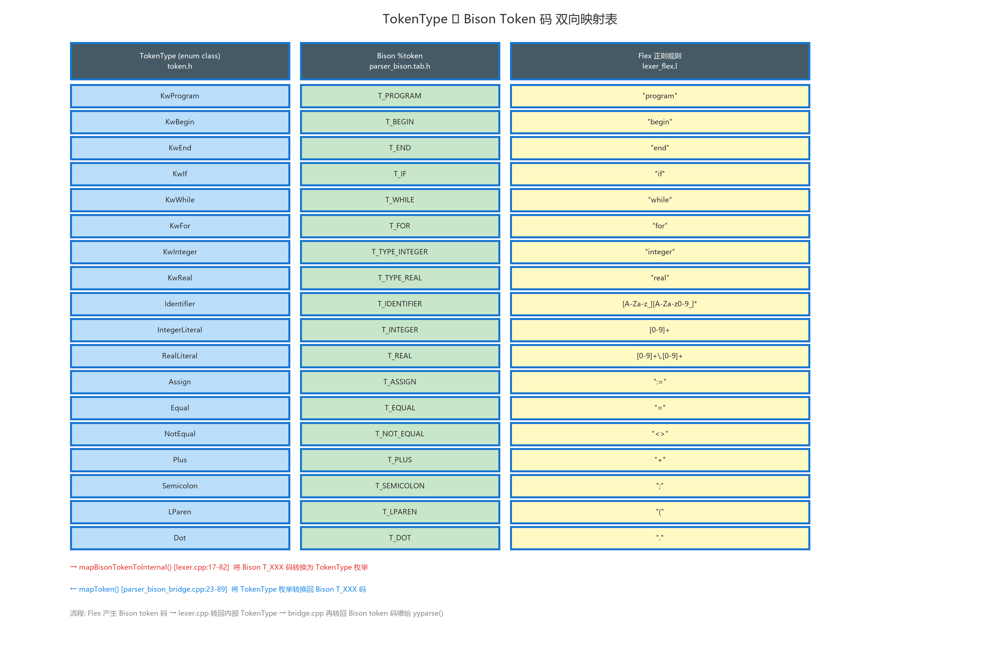

上图展示了三个层面的对应关系：最左侧的 `TokenType (enum class)` 定义于 `token.h`，中间的 `Bison T_XXX (%token)` 宏定义于 Bison 生成的 `parser_bison.tab.h`，最右侧的 `Flex 正则` 定义于 `lexer_flex.l`。

双向映射的实现：

- **正向映射 `mapToken(TokenType → int)`**：定义于 `parser_bison_bridge.cpp:23-89`，将内部 `TokenType` 枚举转换为 Bison 期望的 `T_XXX` 整型码。此函数被 `yylex()` 调用，是 Token 从 C++ 世界进入 Bison C 世界的入口。
- **反向映射 `mapBisonTokenToInternal(int → TokenType)`**：定义于 `lexer.cpp:17-82`，将 Flex 返回的 Bison `T_XXX` 整型码转换回内部 `TokenType` 枚举。此函数被 `Lexer::tokenizeDetailed()` 调用，是 Token 从 Flex/Bison C 世界回到 C++ 世界的出口。

两个映射表必须保持严格的 1:1 对应关系，任何不对称都会导致解析器收到错误的 Token 类型。

### 4.5 文法设计

文件：`parser_bison.y`（848 行）

#### 语义值联合体与非终结符类型

Bison 文法使用 `%union` 定义了 12 种语义值类型，确保在归约过程中类型安全地传递 AST 节点：

```yacc
%union {
    AstNode*                    node;
    TypeNode*                   typeNode;
    StmtNode*                   stmtNode;
    ExprNode*                   exprNode;
    VarExprNode*                varExprNode;
    VarPartNode*                varPartNode;
    std::vector<AstNode*>*      nodeList;
    std::vector<ExprNode*>*     exprList;
    std::vector<VarExprNode*>*  varExprList;
    std::vector<VarPartNode*>*  varPartList;
    std::vector<std::string>*   strList;
    std::string*                str;
    int                         ival;
}
```

`%type` 声明为每个非终结符指定了语义值类型（如 `%type <stmtNode> if_stmt while_stmt for_stmt`），`%token` 声明为携带语义值的 Token 指定了类型（如 `%token <str> T_IDENTIFIER T_INTEGER T_REAL T_CHAR T_STRING`）。这种完整的类型化文法体系使 Bison 在编译期即可检测类型不匹配错误。

#### Token 声明与优先级

```yacc
%left T_OR
%left T_PLUS T_MINUS
%left T_MULTIPLY T_DIVIDE T_DIV T_MOD T_AND
%right T_NOT
```

优先级声明定义了四层优先级（从低到高），每一层内部为左结合（`%left`）或右结合（`%right`）：

| 层级 | 声明 | 运算符 | 结合性 | 优先级 |
|------|------|--------|--------|--------|
| 1 | `%left T_OR` | `or` | 左结合 | 最低 |
| 2 | `%left T_PLUS T_MINUS` | `+`, `-` | 左结合 | |
| 3 | `%left T_MULTIPLY T_DIVIDE T_DIV T_MOD T_AND` | `*`, `/`, `div`, `mod`, `and` | 左结合 | |
| 4 | `%right T_NOT` | `not` | 右结合 | 最高 |

`not` 声明为右结合是因为 `not not x` 应解析为 `not (not x)`。

#### 产生式层次结构

以下树形图展示了从顶层 `program` 到底层 `factor` 的完整产生式依赖关系。

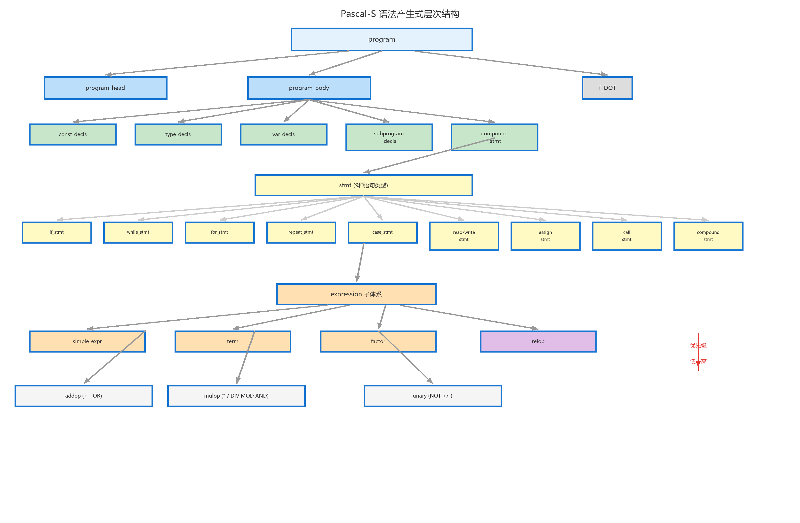

图的根节点为 `program`，逐层展开揭示了 Pascal-S 文法的层次化结构，包括：

**程序结构（顶层）**：`program → program_head program_body T_DOT`，`program_head` 支持三种形式（带参数列表、空括号、无括号）。

**常量声明**：`const_declarations → ε | T_CONST const_declaration T_SEMICOLON`，多常量通过 `const_declaration` 内部的左递归实现。

**类型声明**：`type_spec → basic_type | T_ARRAY T_LBRACKET periods T_RBRACKET T_OF type_spec | T_RECORD record_body T_END | T_IDENTIFIER`，其中最值得注意的是数组类型中 `type_spec` 递归引用自身，从而支持多维数组。

**变量声明**：`var_declaration → id_list T_COLON type_spec | var_declaration T_SEMICOLON id_list T_COLON type_spec`。

**子程序（过程/函数）**：`subprogram_body` 复用了 `const/type/var_declarations` 产生式，但不包含 `subprogram_declarations`——这意味着 Pascal-S 的子程序体中不能嵌套定义子程序。`var_parameter → T_VAR value_parameter` 在语法层通过前置关键字 `var` 区分引用参数。

**语句**：包含 12 种语句类型的产生式备选，空语句备选（`/* empty */`）允许连续分号，`identifier_stmt` 的歧义（赋值 vs 过程调用）在语法层不做区分——由 Bison 通过前瞻 Token 自动选择正确的归约路径。

**表达式（带优先级）**：表达式子体系是 Bison 文法中最精巧的部分，通过产生式嵌套层次与 `%left`/`%right` 优先级声明共同保证正确的运算符优先级和结合性。

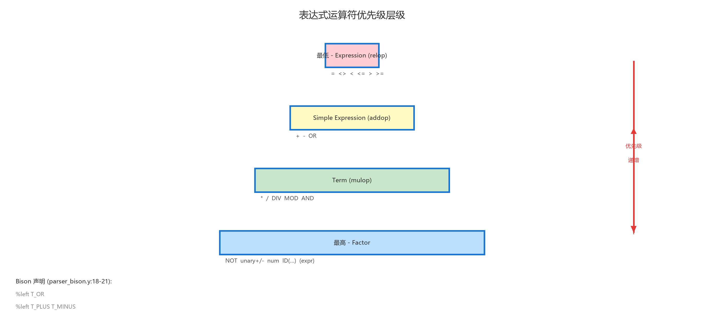

表达式优先级从低到高共 4 层：

| 层级 | 产生式 | 运算符 | 结合性 | C 等价 |
|------|--------|--------|--------|--------|
| 1 | `expression → simple_expression relop simple_expression` | `=`, `<>`, `<`, `<=`, `>`, `>=` | 无结合性 | `a == b` |
| 2 | `simple_expression → simple_expression addop term` | `+`, `-`, `or` | 左 | `a + b - c` |
| 3 | `term → term mulop factor` | `*`, `/`, `div`, `mod`, `and` | 左 | `a * b / c` |
| 4 | `factor → T_NOT factor | T_MINUS factor` | `not`, `-`（一元） | 右 | `not not x` |

关系运算符不声明结合性——这意味着 `a = b = c` 这样的链式比较在 Pascal-S 中是语法错误。

#### 错误恢复策略

Bison 文法中嵌入了 4 处错误恢复产生式：

```yacc
const_declaration: const_declaration T_SEMICOLON error { yyerrok; }
var_declaration: var_declaration T_SEMICOLON error { yyerrok; }
statement_list: statement_list error T_SEMICOLON { yyerrok; }
stmt: error { yyerrok; }
```

每处错误恢复的核心是 `yyerrok` 宏——它告诉 Bison 错误恢复已完成，可以恢复正常解析。

### 4.6 yylex/yyerror 实现

```cpp
extern "C" int yylex(void) {
    if (!g_tokens || g_pos >= g_tokens->size()) return 0;  // EOF
    const Token& token = (*g_tokens)[g_pos++];
    g_lastToken = token;     // 保存位置用于 yyerror 报错

    // 为携带语义值的 Token 类型注入 yylval
    switch (token.type) {
        case TokenType::Identifier:
        case TokenType::CharLiteral:
        case TokenType::StringLiteral:
        case TokenType::IntegerLiteral:
        case TokenType::RealLiteral:
            yylval.str = new std::string(token.lexeme); break;
        case TokenType::BooleanLiteral:
            yylval.ival = (token.lexeme == "true") ? 1 : 0; break;
        default: break;
    }
    return mapToken(token.type);  // TokenType → Bison T_XXX
}

extern "C" void yyerror(const char* msg) {
    const SourcePosition pos = g_lastToken.pos;
    addParseError("E201", std::string("Syntax error: ") + msg, pos);
}
```

关键变化：`yylex()` 现在不仅返回 Token 码，还为 6 种携带语义值的 Token 类型设置 `yylval`。这使得 Bison 的语义动作能够通过 `$1`、`$2` 等伪变量获取 Token 的词素字符串或布尔整数值，从而填充 AST 节点的具体字段。

### 4.7 AST 节点体系（完整实现）

`ast.h`（283 行）定义了完整的富语义 AST 节点体系。`AstKind` 枚举包含 32 种取值，覆盖程序的全部语言构造。下图展示了未来可实现的 AST 完整节点设计，当前已全部实现。

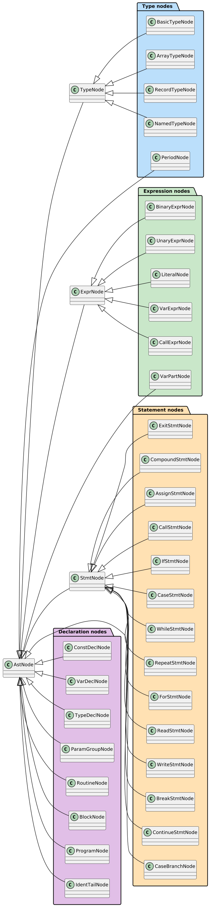

AST 节点体系按语义分为五大类：

#### 类型节点（TypeNode 体系）

| 节点 | AstKind | 关键字段 |
|------|---------|---------|
| `BasicTypeNode` | `BasicType` | `name`（"integer"/"real"/"boolean"/"char"）|
| `ArrayTypeNode` | `ArrayType` | `periods`（`vector<PeriodNode*>`）+ `elemType`（`TypeNode*`）|
| `RecordTypeNode` | `RecordType` | `fields`（`vector<AstNode*>`，实际为 `VarDeclNode*` 列表）|
| `NamedTypeNode` | `NamedType` | `name`（类型别名引用）|
| `PeriodNode` | `Period` | `low` + `high`（数组下标界的 C 表示字符串）|

#### 表达式节点（ExprNode 体系）

| 节点 | AstKind | 关键字段 |
|------|---------|---------|
| `BinaryExprNode` | `BinaryExpr` | `op`（运算符字符串）+ `left` + `right` |
| `UnaryExprNode` | `UnaryExpr` | `op`（"-"/"+"not"/"not"）+ `operand` |
| `LiteralNode` | `LiteralExpr` | `litKind`（`Int`/`Real`/`Char`/`Str`/`Bool` 枚举）+ `raw` |
| `VarExprNode` | `VarExpr` | `name` + `parts`（`vector<VarPartNode*>`，支持下标访问和字段访问）|
| `CallExprNode` | `CallExpr` | `name` + `args`（`vector<ExprNode*>`）|
| `VarPartNode` | `VarPart` | `isField` 布尔歧义消除 + `fieldName` 或 `indices` |

`VarPartNode` 的设计解决了 Pascal 变量访问中的文法歧义：`r.x` 中的 `.x` 是字段访问（`isField=true`），而 `a[i]` 中的 `[i]` 是下标访问（`isField=false`）。

#### 语句节点（StmtNode 体系）

| 节点 | AstKind | 关键字段 |
|------|---------|---------|
| `CompoundStmtNode` | `CompoundStmt` | `stmts`（`vector<StmtNode*>`）|
| `AssignStmtNode` | `AssignStmt` | `varName` + `varParts` + `rhs` |
| `CallStmtNode` | `CallStmt` | `name` + `args` |
| `IfStmtNode` | `IfStmt` | `cond` + `then_` + `else_`（可为空）|
| `CaseStmtNode` | `CaseStmt` | `expr` + `branches`（`vector<CaseBranchNode*>`）|
| `CaseBranchNode` | `CaseBranch` | `values`（`vector<string>`）+ `body` |
| `WhileStmtNode` | `WhileStmt` | `cond` + `body` |
| `RepeatStmtNode` | `RepeatStmt` | `body`（`CompoundStmtNode*`）+ `cond` |
| `ForStmtNode` | `ForStmt` | `var` + `from_` + `isTo`（true=TO, false=DOWNTO）+ `to_` + `body` |
| `ReadStmtNode` | `ReadStmt` | `vars` + `withLn` |
| `WriteStmtNode` | `WriteStmt` | `exprs` + `withLn` |
| `BreakStmtNode` | `BreakStmt` | 无额外字段 |
| `ContinueStmtNode` | `ContinueStmt` | 无额外字段 |
| `ExitStmtNode` | `ExitStmt` | `value`（可为空，表示 `exit` 或 `exit(expr)`）|

#### 声明节点

| 节点 | AstKind | 关键字段 |
|------|---------|---------|
| `ConstDeclNode` | `ConstDecl` | `name` + `cType`（"int"/"float"/"char"/"string"）+ `cValue` |
| `VarDeclNode` | `VarDecl` | `names`（`vector<string>`）+ `typeNode` |
| `TypeDeclNode` | `TypeDecl` | `name` + `typeNode` |
| `ParamGroupNode` | `ParamGroup` | `byRef` + `names` + `typeName` |
| `RoutineNode` | `Routine` | `isFunction` + `name` + `params` + `returnTypeName` + `body`（`BlockNode*`）|
| `BlockNode` | `Block` | `consts` + `types` + `vars` + `routines` + `compound` |
| `ProgramNode` | `Program` | `name` + `params` + `body`（`BlockNode*`）|

#### 辅助节点

| 节点 | AstKind | 用途 |
|------|---------|------|
| `IdentTailNode` | `IdentTail` | Bison 内部节点：消除 `identifier_stmt_tail` 文法中的 Assign / Call / BareCall 三路歧义 |

---

## 第五章 语义分析模块

### 5.1 模块职责

语义分析模块是编译流水线的第三阶段，在语法分析通过后对程序进行语义正确性检查。模块的核心职责包括四个方面：

1. **标识符声明检查**：检测标识符在被使用前是否已声明（"声明前使用"错误 S103），以及同一作用域内是否存在重复定义（S101）。
2. **类型兼容性检查**：对表达式中的运算符-操作数类型约束进行验证，对赋值语句的左右类型进行兼容性判断。
3. **过程/函数调用检查**：验证调用时的实参数量是否与形参数量匹配，实参类型是否与形参类型兼容（值参数允许 Int→Real 拓宽，VAR 参数要求类型完全一致），VAR 参数位置是否传入了可赋值的左值。
4. **控制流条件检查**：验证 if/while/repeat-until 的条件表达式类型为 Boolean。

语义分析器采用**独立递归下降**策略——不对 AST 做遍历，而是自己维护 Token 流游标逐 Token 前进，按 Pascal-S 结构递归下降分析。

### 5.2 文件结构

| 文件 | 行数 | 职责 |
|------|------|------|
| `semantic_tables.h` | 261 | 完整类型系统、符号系统、作用域栈、内建类型池 |
| `semantic_declaration.h` | 26 | `SemanticDeclarationAnalyzer` 公开接口、`SemanticResult`/`SemanticError` 结构体 |
| `semantic_declaration.cpp` | 992 | 全部语义分析逻辑 |

### 5.3 符号表体系

符号表体系是语义分析模块的核心基础设施。下图以完整 UML 类图展示类型系统、符号系统、作用域管理和内建类型池之间的继承与组合关系。

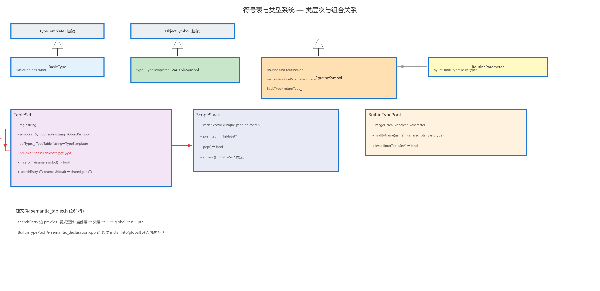

该图清晰揭示了以下关键设计：

#### 类型系统（左上部分）

- **`TypeTemplate`** 是抽象基类，持有 `Kind` 枚举（`Basic`/`Array`/`Record`）。当前实现中只有 `BasicType` 子类被实际使用。
- **`BasicType`** 进一步通过 `BasicKind` 枚举区分 `Int`/`Real`/`Bool`/`Char`/`None` 五种基本类型。类型比较通过枚举值实现 O(1) 的类型等价判断。

#### 符号系统（右上部分）

- **`ObjectSymbol`** 是抽象基类，持有 `name_`（标识符字符串）。
- **`VariableSymbol`** 通过组合关系持有 `shared_ptr<TypeTemplate>`，表示变量的类型引用。
- **`RoutineSymbol`** 持有 `RoutineKind` 枚举（`Procedure`/`Function`）、`parameters_` 向量（每个元素是 `RoutineParameter` 结构体，含 `byRef` 布尔和 `type` 指针）和 `returnType_`。

#### 作用域管理（左下部分）

- **`TableSet`** 是作用域管理的核心单元。每个 TableSet 代表一层作用域，包含 `symbols_`（`SymbolTableTemplate<ObjectSymbol>`，底层为 `unordered_map`）和 `defTypes_`（`TypeTable`）两张表。`prevSet_` 指针形成单向链表，指向外层作用域。
- `insert<T>(name, symbol)` 模板方法利用 C++17 的 `if constexpr` 在编译期自动分发。
- `searchEntry<T>(name, &local)` 模板方法实现链式查找：先在当前层查询，未命中则沿着 `prevSet_` 指针向外递归搜索。
- **`ScopeStack`** 持有 `vector<unique_ptr<TableSet>>`，拥有所有作用域层的所有权。

#### 内建类型池（右下部分）

- **`BuiltinTypePool`** 持有四种内建类型（`integer_`/`real_`/`boolean_`/`character_`）的 `shared_ptr<BasicType>` 单例。`installInto(TableSet*)` 将四种类型全部注入指定作用域。

### 5.4 作用域链结构

作用域链是语义分析中标识符查找的核心数据结构。下图展示了三层嵌套作用域的链式关系。

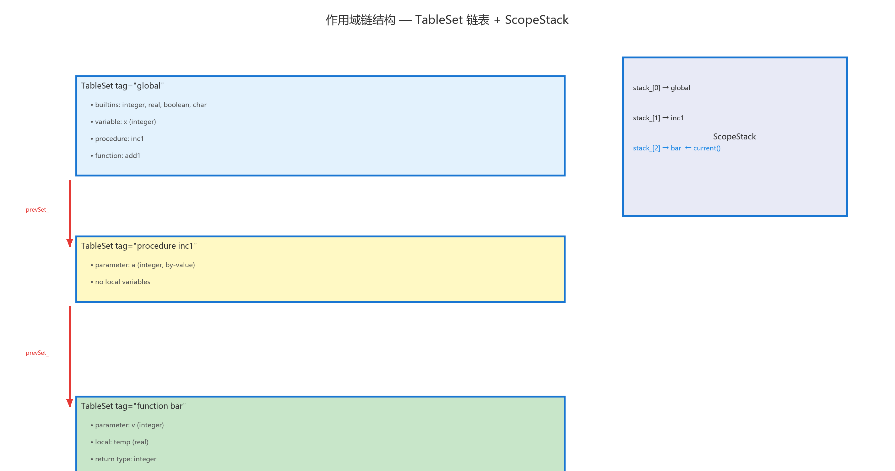

图中展示了三个作用域层纵向排列所形成的单向链表：最上层的 `global` 作用域（含内建类型和全局变量/例程符号），中层的 `procedure foo` 作用域，下层的 `function bar` 作用域。每层通过 `prevSet_` 指针指向上层，形成从内向外的作用域访问路径。右侧标注的 `ScopeStack::current()` 指针始终指向当前最内层作用域（栈顶），而 `searchEntry()` 方法沿 `prevSet_` 链向外逐层查找。

### 5.5 ScopeStack 运行时快照

为了更直观地理解作用域栈在语义分析过程中的动态变化，下图以对象图形式展示了运行时的内存布局。

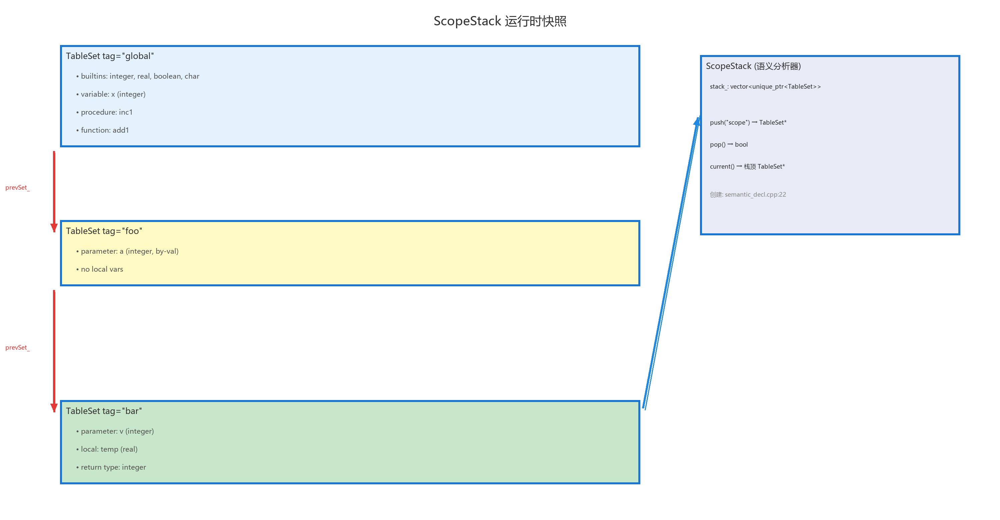

图中模拟了程序 `program demo; procedure foo; function bar: integer; begin ...` 的语义分析过程。ScopeStack 内部 `vector` 纵向展开三层：

- **stack_[0]**：`TableSet { tag="global", prevSet=nullptr }`，内含全局变量和例程符号以及四种内建类型。
- **stack_[1]**：`TableSet { tag="foo", prevSet=→ stack_[0] }`，内含 foo 的局部变量和参数。
- **stack_[2]**：`TableSet { tag="bar", prevSet=→ stack_[1] }`，内含 bar 的局部变量、参数和返回值符号。

红色虚线箭头标注了 `searchEntry("x")` 的链式查找路径：从 `bar` 作用域查起，若本地 `symbols_` 未命中则沿 `prevSet_` 指针向上到 `foo`，再到 `global`。

### 5.6 语义分析器实现

所有实现逻辑封装在匿名 `namespace {}` 内的 `SemanticDeclarationAnalyzerImpl` 类中（`semantic_declaration.cpp:12-988`）。核心数据结构包括：

```cpp
const std::vector<Token>* tokens_;     // 输入 Token 流只读指针
std::size_t pos_;                       // 当前读取位置（游标）
SemanticResult result_;                 // 累积的错误列表
ScopeStack scopes_;                     // 作用域栈
BuiltinTypePool builtins_;             // 内建类型单例池
```

Token 流遍历辅助函数：`current()` 安全访问当前 Token；`advance()` 移动游标；`match(type)` 匹配并前进；`peekType(n)` 前瞻 n 个 Token 的类型。这些辅助函数将 Token 流抽象为类似迭代器的接口，使递归下降分析器的代码清晰简洁。

#### 主流程

```
run(tokens, parseResult)
  ├─ 检查 parseResult.root 是否为空
  ├─ 创建全局作用域 "global"
  ├─ BuiltinTypePool::installInto(global) — 注入 integer/real/boolean/char
  └─ parseProgram()
       ├─ match(KwProgram) → 跳过程序名和参数列表 → parseBlock()
       │    ├─ skipConstDeclarations() — 为每个常量注册 VariableSymbol
       │    ├─ skipTypeDeclarations() — 跳过 type 区
       │    ├─ parseVarDeclarationsInCurrentScope() — 注册每个变量
       │    ├─ parseSubprogram() 循环
       │    └─ analyzeCompoundStatement() — 验证主程序体语句
```

#### 子程序语义分析

```cpp
parseSubprogram() {
    // 1. 判断 routineKeyword (Procedure/Function)
    // 2. 读取子程序名
    // 3. 在父作用域注册 RoutineSymbol（声明前使用检测在这里生效）
    // 4. scopes_.push(routineName) — 创建子作用域
    // 5. parseFormalParameters() — 为每个形参注册 VariableSymbol
    //    VAR 参数: RoutineParameter.byRef = true
    // 6. 若为函数: 解析返回类型 → routine->setReturnType()
    // 7. parseBlock() 递归处理子程序体
    // 8. scopes_.pop() — 退出子作用域
}
```

关键语义约束：第 3 步中**先在父作用域注册 RoutineSymbol，再进入子作用域**——这允许子程序体内部递归调用自身。

### 5.7 类型检查规则

语义分析器的核心工作之一是运算符和语句的类型检查。下图以决策树形式展示主要类型检查的逻辑流程。

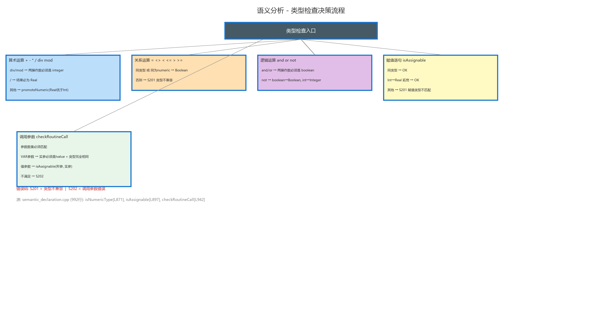

#### 核心类型判断函数

```cpp
static bool isNumeric(const shared_ptr<BasicType>& t)    // Int 或 Real
static bool isBooleanType(const shared_ptr<BasicType>& t) // Bool
static bool isIntegerType(const shared_ptr<BasicType>& t) // Int
static shared_ptr<BasicType> promoteNumeric(lhs, rhs)     // Int+Real→Real
static bool isAssignable(lhs, rhs)    // 同类型直接兼容; Int→Real 拓宽兼容
```

#### 运算符类型约束汇总

| 运算符 | 操作数类型要求 | 结果类型 |
|--------|---------------|---------|
| `+`, `-`, `*` | 两边均为 numeric | `promoteNumeric(lhs, rhs)` |
| `/` | 两边均为 numeric | 始终为 Real |
| `div`, `mod` | 两边均为 Integer | Integer |
| `and`, `or` | 两边均为 Boolean | Boolean |
| `not` | Boolean → Boolean；Integer → Integer | 与操作数相同 |
| `=`, `<>`, `<`, `<=`, `>`, `>=` | 两边同类型，或同为 numeric | Boolean |

#### 形参/实参匹配算法

```cpp
checkRoutineCallArguments(routine, args, callPos) {
    if (args.size() != routine->parameters().size()) → S202
    for (size_t i = 0; i < args.size(); ++i) {
        if (param.byRef) {
            // VAR 引用参数：要求类型完全一致 + 实参必须是左值
            if (!args[i].isLvalue) → S202
            if (args[i].type ≠ param.type) → S202
        } else {
            // 值参数：允许 Int→Real 拓宽
            if (!isAssignable(param.type, args[i].type)) → S202
        }
    }
}
```

### 5.8 错误码体系

| 错误码 | 含义 | 典型触发场景 |
|--------|------|-------------|
| S101 | 同一作用域内重复定义 | `var x: integer; var x: real;` |
| S102 | 未定义的类型引用 | `var x: unknownType;` |
| S103 | 未定义标识符的使用 | `x := 5;` 但 x 未声明 |
| S199 | 语法阶段未产出 AST 根 | 防御性检查 |
| S201 | 类型不兼容 | 赋值类型不匹配、运算符操作数类型错误 |
| S202 | 例程调用参数错误 | 参数数量/类型不匹配、VAR 参数传入非左值 |

---

## 第六章 代码生成模块

### 6.1 模块职责

代码生成模块是编译流水线的第四阶段，负责将 Bison 产出的完整 AST（`ProgramNode*`）翻译为等效的 C 语言源代码。模块的设计理念是**"直译"**——不做中间代码优化，直接对 AST 做递归遍历，逐节点模式匹配并生成对应的 C 代码。与旧版基于 Token 流的直译相比，基于 AST 的直译不再需要两遍扫描策略——类型信息、函数签名、变量声明等全部从 AST 声明节点中直接获取。

下图展示了代码生成器从 AST 到 C 输出的整体处理流程。


### 6.2 文件结构与公开接口

| 文件 | 行数 | 职责 |
|------|------|------|
| `code_generator.h` | 26 | `CodegenResult` 结构体 + `CodeGenerator` 类公开接口（含 `generate()` 和 `generateTemplate()`）|
| `code_generator.cpp` | 791 | 全部代码生成逻辑：`CodeGenContext` 上下文 + AST 遍历发射函数族 |

```cpp
// code_generator.h
struct CodegenResult {
    bool ok = false;
    std::string message;
    std::string cSource;       // 生成的完整 C 语言源代码字符串
};

class CodeGenerator {
public:
    // 主入口：从 AST 生成 C 代码
    CodegenResult generate(const ParserResult& parseResult) const;
    // 便捷包装：lex + parse → AST → generate()
    CodegenResult generateTemplate(const std::string& inputPath) const;
    static std::string sanitizeIdentifier(const std::string& rawName);
};
```

`generate()` 接收 `ParserResult`（含完整 AST），由 `CompilerDriver` 在流水线中直接调用。`generateTemplate()` 降格为便捷包装——内部自行完成词法分析和语法分析后调用 `generate()`，用于独立测试场景。

### 6.3 代码生成上下文

代码生成器在匿名 namespace 内定义了 `CodeGenContext` 结构体，在翻译过程中传递类型信息和函数元数据：

```cpp
struct CodeGenContext {
    std::string currentFuncName;       // 当前函数名（主程序/过程中为空）
    std::string currentFuncRetVar;     // 返回值变量名 "__ret_funcname"

    std::unordered_map<std::string, std::string> typeMap;          // 标识符→C 类型
    std::unordered_set<std::string> allRoutines;                   // 所有例程名
    std::unordered_map<std::string, std::string> routineRetType;   // 函数名→C 返回类型
    std::unordered_map<std::string, std::vector<bool>> routineByRef; // 例程→各参数 byRef
    std::unordered_set<std::string> byRefParams;                   // 当前作用域 VAR 参数名
};
```

`CodeGenContext` 的信息完全从 AST 中提取（通过 `buildContext()` 函数遍历 `ProgramNode` 的声明节点），不再需要手动扫描 Token 流来收集。

### 6.4 从 AST 构建上下文

`buildContext(ProgramNode*, CodeGenContext&)` 函数在生成开始前遍历 AST 的声明部分，填充 `CodeGenContext`：

```cpp
void buildContext(ProgramNode* prog, CodeGenContext& ctx) {
    BlockNode* body = prog->body;
    // 常量 → typeMap
    for (auto* c : body->consts) ctx.typeMap[c->name] = c->cType;
    // 全局变量 → typeMap
    for (auto* vd : body->vars) {
        TypeEmit te = emitTypeNode(vd->typeNode);
        for (const auto& nm : vd->names) ctx.typeMap[nm] = te.cType;
    }
    // 例程 → allRoutines + routineRetType + routineByRef
    for (auto* n : body->routines) {
        auto* r = static_cast<RoutineNode*>(n);
        ctx.allRoutines.insert(r->name);
        if (r->isFunction)
            ctx.routineRetType[r->name] = basicTypeToCType(r->returnTypeName);
        std::vector<bool> byRef;
        for (auto* pg : r->params)
            for (size_t i = 0; i < pg->names.size(); ++i)
                byRef.push_back(pg->byRef);
        ctx.routineByRef[r->name] = byRef;
    }
}
```

### 6.5 类型映射

```cpp
basicTypeToCType(name):
    "integer" / "boolean" → "int"
    "real"    → "float"
    "char"    → "char"
```

`emitTypeNode(TypeNode*)` 函数递归处理类型 AST 节点，返回 `TypeEmit { cType, suffix }`：

- **`BasicTypeNode`**：直接映射为 C 基本类型（`"int"` / `"float"` / `"char"`）
- **`ArrayTypeNode`**：递归处理元素类型，逐维追加 C 数组后缀 `[high+1]`（使用 `high + 1` 确保 Pascal 1-based 索引在 C 0-based 数组中安全访问）
- **`RecordTypeNode`**：当前返回 `{"int", ""}` 作为占位
- **`NamedTypeNode`**（类型别名）：默认退化为 `{"int", ""}`

### 6.6 表达式发射

`emitExpr(ExprNode*, ctx)` 是代码生成器的核心递归函数，通过 `dynamic_cast` 分发到五种表达式节点的处理逻辑：

**BinaryExprNode** — 二元表达式 `left op right`：
- 运算符映射：`"="` → `"=="`，`"<>"` → `"!="`，`"and"` → `"&&"`，`"or"` → `"||"`，`"div"` → `"/"`，`"mod"` → `"%"`
- 表达式整体包括号以保留 Pascal 优先级语义：`"(" + left + " " + cOp + " " + right + ")"`

**UnaryExprNode** — 一元表达式 `op operand`：
- `not` 运算符根据操作数是否为布尔表达式选择 `!`（逻辑非）或 `~`（位取反）
- 一元 `+`/`-` 后加空格防止 C 的 `--`/`++` 歧义

**LiteralNode** — 字面量：
- `Int`：直接输出 raw 值
- `Real`：直接输出 raw 值
- `Char`：保留单引号输出
- `Str`：转换为 C 双引号字符串（内部转义 `"` 和 `\`）
- `Bool`：`"true"` → `"1"`，`"false"` → `"0"`

**VarExprNode** — 变量引用：
- 若引用当前函数名且存在 `currentFuncRetVar`，重定向到返回值变量
- 若无子部分（`parts` 为空）且是已知函数名，自动补 `()` 调用
- 若无子部分且是 VAR 参数，解除引用：`(*name)`
- 遍历 `parts`：字段访问（`.fieldName`）或下标访问（`[idx1][idx2]...`）

**CallExprNode** — 函数调用：
- 发射为 `name ( arg1, arg2 )`
- 查询 `routineByRef` 判断各参数位置是否为 VAR，若为 VAR 则实参前加 `&`

#### 运算符映射表

| Pascal 运算符 | C 翻译 |
|-------------|--------|
| `div` | `/` |
| `mod` | `%` |
| `and` | `&&` |
| `or` | `||` |
| `not` | `!` 或 `~`（根据操作数类型）|
| `=` | `==` |
| `<>` | `!=` |

### 6.7 语句发射

`emitStmt(StmtNode*, lvl, ctx, out)` 是语句翻译的分发器，通过 `dynamic_cast` 分发到 13 种语句节点的处理逻辑。下表汇总了各语句的 Pascal → C 映射：


| Pascal 结构 | C 翻译 | 关键处理 |
|------------|--------|---------|
| `if cond then stmt1 else stmt2` | `if (cond) { stmt1 } else { stmt2 }` | else 分支可能为空 |
| `while cond do stmt` | `while (cond) { stmt }` | |
| `for i := A to B do stmt` | `for (i = A; i <= B; ++i) { stmt }` | `isTo=true` → `<=` / `++` |
| `for i := A downto B do stmt` | `for (i = A; i >= B; --i) { stmt }` | `isTo=false` → `>=` / `--` |
| `repeat stmts until cond` | `do { stmts } while (!(cond));` | until 条件取反 |
| `case expr of 1,2: s1; 3: s2 end` | `switch (expr) { case 1: case 2: { s1; break; } case 3: { s2; break; } }` | 逗号多值 → case 穿透 |
| `read(a, b)` | `scanf("%d", &a); scanf("%d", &b);` | 根据 `typeMap` 选择 `%d`/`%f`/`%c` |
| `readln(a)` | `scanf(...); ` + 消耗行尾 | `withLn=true` → 追加 `getchar()` 循环 |
| `write(a)` | `pas_write_int(a);` | 通过 `inferExprType()` 选择 helper |
| `writeln` | `pas_writeln();` | 支持无括号和有空括号形式 |
| `break` | `break;` | |
| `continue` | `continue;` | |
| `exit` / `exit(expr)` | `return;` / `return expr;` | |

`emitCompound(CompoundStmtNode*, lvl, ctx, out)` 发射 C 花括号块，内部递归调用 `emitStmt()` 处理每条子语句。

#### 赋值语句特殊处理

`AssignStmtNode` 的发射涉及多个特殊逻辑：

1. **函数返回赋值**：若左值是当前函数名且存在 `currentFuncRetVar`，重定向到 `__ret_funcname = rhs`
2. **VAR 参数左值**：若左值是无子部分的 VAR 参数，发射 `*param = rhs`
3. **下标/字段赋值**：遍历 `varParts`，分别处理字段（`.fieldName`）和下标（`[idx1][idx2]...`）

#### 类型推断

`inferExprType(ExprNode*, ctx)` 函数从 AST 表达式节点推断 C 类型，用于 `write` 语句选择正确的 I/O helper：

| 节点类型 | 推断逻辑 |
|---------|---------|
| `LiteralNode` | `Real` → `"float"`，`Char` → `"char"`，`Str` → `"string"`，其它 → `"int"` |
| `VarExprNode` | 查 `typeMap` |
| `CallExprNode` | 查 `routineRetType` |
| `BinaryExprNode` | 左右任一为 float → `"float"`，否则 `"int"` |
| `UnaryExprNode` | 递归推断操作数 |

### 6.8 VAR 参数指针转换机制

VAR 参数的翻译逻辑在 AST 遍历中保持与旧版相同的四种场景处理。下图展示了四种场景的翻译对照。


**场景 1 — 声明**：`ParamGroupNode.byRef == true` → 参数类型为 `int*`（`emitForwardDecl()` / `emitRoutine()` 中处理）

**场景 2 — 写入（左值）**：`emitStmt(AssignStmtNode)` 检测左值是否为 `byRefParams` 成员 → 发射 `*param = rhs`

**场景 3 — 读取（表达式内）**：`emitExpr(VarExprNode)` 检测标识符是否在 `byRefParams` 中 → 发射 `(*param)`

**场景 4 — 传参调用**：`emitExpr(CallExprNode)` 查询 `routineByRef` 判断参数位置 → 实参前加 `&`

### 6.9 函数返回值实现

代码生成器采用"返回值变量"模式。在 `emitRoutine()` 中，函数体开头自动声明 `Type __ret_funcname = 0;`，函数体内的 `funcname := expr` 被识别为返回赋值（通过比对 `AssignStmtNode::varName` 与 `currentFuncName`），翻译为 `__ret_funcname = expr;`，函数末尾自动追加 `return __ret_funcname;`。

### 6.10 输出管线

`generate()` 的主流程按以下顺序依次调用各发射函数：

```
generate(parserResult)
├─ buildContext(prog, ctx)           // 从 AST 提取类型/函数信息
├─ emitPreamble(out)                 // #include + 8 个 static I/O helper
├─ emitGlobalConsts(body, out)       // #define 或 static const float
├─ emitGlobalVars(body, ctx, out)    // 类型 变量名[后缀] = 初值;
├─ emitForwardDecl(routine × N)      // 前向声明所有例程
├─ emitRoutine(routine × N, ctx)     // 逐例程定义（含嵌套子例程）
└─ emitMain(body, ctx, out)          // int main(void) { ... return 0; }
```

`emitRoutine()` 会递归处理嵌套子例程：子例程体在外层函数体末尾以独立 C 函数形式输出（标准的 C 函数定义，不使用 GCC 嵌套函数扩展）。

### 6.11 运行时 I/O 辅助函数

代码生成器自动生成 8 个静态辅助函数（新增 `pas_write_str`）：

```c
static int    pas_read_int(void)    { int v = 0; (void)scanf("%d", &v); return v; }
static float  pas_read_real(void)   { float v = 0.0f; (void)scanf("%f", &v); return v; }
static char   pas_read_char(void)   { char v = 0; (void)scanf(" %c", &v); return v; }
static void   pas_write_int(int v)  { (void)printf("%d", v); }
static void   pas_write_real(float v)  { (void)printf("%f", v); }
static void   pas_write_char(char v)   { (void)printf("%c", v); }
static void   pas_write_str(const char* v) { (void)printf("%s", v); }
static void   pas_writeln(void)     { (void)printf("\n"); }
```

---

## 第七章 编译驱动与主程序

### 7.1 模块职责

编译驱动是整个编译流水线的**编排者**（Orchestrator），负责串联词法→语法→语义→代码生成四个阶段，在每个阶段之间做错误检查（采用 fail-fast 策略：任一阶段失败即立即停止后续阶段），并管理文件输入输出。模块同时承担命令行接口的职责。

### 7.2 文件结构

| 文件 | 行数 | 职责 |
|------|------|------|
| `main.cpp` | 22 | 程序入口：命令行参数解析 |
| `compiler_driver.h` | 15 | `CompilerDriver` 类公开接口 |
| `compiler_driver.cpp` | 106 | 完整的流水线编排逻辑、文件 IO、错误汇总和统计输出 |

### 7.3 main.cpp — 程序入口

```cpp
int main(int argc, char* argv[]) {
    if (argc != 3 || std::string(argv[1]) != "-i") {
        printUsage();                              // 输出用法说明到 stderr
        return toExitCode(ErrorCode::Usage);       // 退出码 2
    }
    const std::string inputPath = argv[2];
    CompilerDriver driver;
    return driver.run(inputPath);
}
```

`main()` 的逻辑极简——仅做命令行参数验证后即委托给 `CompilerDriver::run()`。这种设计使得 `CompilerDriver` 可以脱离 `main()` 被独立测试。

### 7.4 run() — 流水线编排时序

下图以 UML 时序图的形式精确展示了 `run()` 内部各阶段之间的调用关系和错误分支处理。


时序图揭示了几个重要的设计细节：

1. **fail-fast 错误策略**：每个阶段完成后 Driver 立即检查 `errors.empty()`，若不为空则遍历错误列表通过 `logutil::error()` 逐条输出到 stderr，然后直接 `return` 对应的退出码。这意味着如果词法分析有错误，用户将只看到词法错误，后续阶段都不会执行。
2. **错误汇总报告**：每个阶段的失败都会额外输出一条汇总信息（如 `"E199 Lexical analysis failed with N error(s)."`）。
3. **CodeGenerator 直接接收 AST**：`generate()` 接口接收 `ParserResult`（含完整 AST），由 `CompilerDriver` 在流水线中直接调用，不再重新执行词法分析。

```
CompilerDriver::run(inputPath)
│
├─ STEP 1: 扩展名检查 (.pas 大小写不敏感) → E001 / 退出码 3
├─ STEP 2: 文件可读性检查 → E002 / 退出码 4
├─ STEP 3: 读取全部源码到内存
├─ STEP 4: 词法分析 → E1xx 错误 → E199 / 退出码 7
├─ STEP 5: 语法分析 → E2xx 错误 → E299 / 退出码 8
├─ STEP 6: 语义分析 → S1xx/S2xx 错误 → E399 / 退出码 9
├─ STEP 7: 打开输出文件 → E004 / 退出码 6
├─ STEP 8: 代码生成 → E499 / 退出码 10
├─ STEP 9: 写入输出 .c 文件
└─ STEP 10: 输出成功统计信息 → 退出码 0
```

### 7.5 退出码体系

| 退出码 | ErrorCode 枚举值 | 含义 |
|--------|-----------------|------|
| 0 | Ok | 编译成功 |
| 2 | Usage | 命令行参数错误 |
| 3 | InvalidExtension | 输入文件非 .pas 扩展名 |
| 4 | InputNotFound | 输入文件不存在或不可读 |
| 5 | InputUnreadable | （预留）|
| 6 | OutputCreateFailed | 无法创建输出 .c 文件 |
| 7 | LexicalError | 词法分析阶段失败 |
| 8 | SyntaxError | 语法分析阶段失败 |
| 9 | SemanticError | 语义分析阶段失败 |
| 10 | GenerationError | 代码生成阶段失败 |

---

## 第八章 错误处理与日志模块

### 8.1 模块职责

错误处理与日志模块是整个编译器的"基础设施"层，为所有其他模块提供统一的错误码定义、进程退出码转换和格式化控制台日志输出功能。模块的设计哲学是极简主义——两个头文件共 38 行代码，全部实现为 inline 函数，零外部依赖，零编译开销。

### 8.2 文件结构

| 文件 | 行数 | 职责 |
|------|------|------|
| `error_codes.h` | 21 | `ErrorCode` 枚举定义（11 种退出状态）+ `toExitCode()` 转换函数 |
| `log.h` | 17 | 控制台日志工具函数：`info()`（stdout）、`error()`（stderr）|

### 8.3 运行时错误码体系

各模块内部使用字符串错误码（而非数字），分为四个系列，实现分层错误追踪。下图展示了完整的分层映射关系。

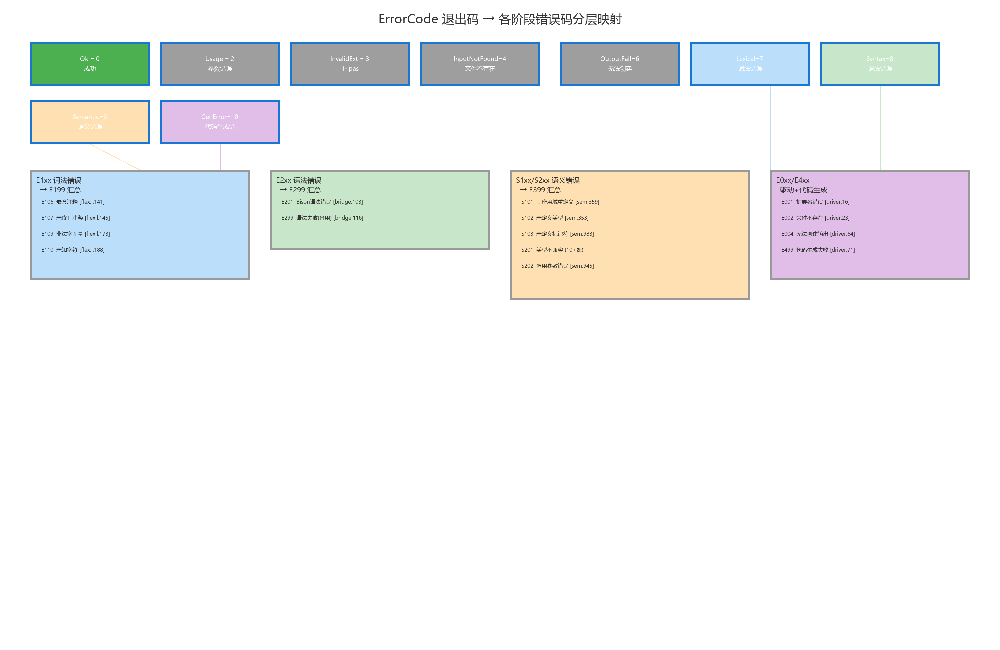

#### E 系列 — 编译驱动层错误（总管级）

| 错误码 | 含义 | 退出码 |
|--------|------|--------|
| E001 | 输入文件扩展名不正确 | 3 |
| E002 | 输入文件不存在或不可读 | 4 |
| E004 | 无法创建输出 .c 文件 | 6 |
| E199 | 词法分析汇总失败 | 7 |
| E299 | 语法分析汇总失败 | 8 |
| E399 | 语义分析汇总失败 | 9 |
| E499 | 代码生成汇总失败 | 10 |

#### E1xx 系列 — 词法层错误

| 错误码 | 含义 |
|--------|------|
| E106 | 嵌套注释不允许 |
| E107 | 未结束的注释 |
| E109 | 未终止的字符串字面量 |
| E110 | 未知字符 |

#### E2xx 系列 — 语法层错误

| 错误码 | 含义 |
|--------|------|
| E201 | Bison 语法错误（LALR(1) 解析冲突）|
| E299 | 语法分析汇总失败（备用）|

#### S1xx 系列 — 语义层声明错误

| 错误码 | 含义 |
|--------|------|
| S101 | 同一作用域内重复定义 |
| S102 | 未定义的类型 |
| S103 | 未定义标识符的使用（声明前使用）|
| S199 | 语法阶段未产出 AST 根（防御性检查）|

#### S2xx 系列 — 语义层类型错误

| 错误码 | 含义 |
|--------|------|
| S201 | 类型不兼容（表达式/赋值/条件）|
| S202 | 例程调用参数错误（数量/类型/左值）|

### 8.4 日志模块

```cpp
namespace logutil {
inline void info(const std::string& msg) {
    std::cout << "[INFO] " << msg << std::endl;     // 标准输出
}
inline void error(const std::string& code, const std::string& msg) {
    std::cerr << "[" << code << "] " << msg << std::endl;  // 标准错误
}
}
```

极简设计要点：

- **全部 inline**：两个函数都在头文件中直接定义，无需链接单独的日志库。
- **输出分流**：`info()` 写入 stdout（供用户查看的正常信息），`error()` 写入 stderr（供管道/脚本捕获的错误信息）。
- **格式一致**：`info()` 输出 `[INFO] msg`，`error()` 输出 `[CODE] msg`，统一的前缀格式便于机器解析。

### 8.5 错误上报模式

所有编译阶段的错误上报遵循统一的三步模式：

1. 模块内部操作时累积错误到 `result.errors` 向量
2. `CompilerDriver` 在每个阶段后检查 `errors.empty()` 判断是否通过
3. 若失败：遍历 errors 逐条调用 `logutil::error(code, "(line:col) " + message)`，输出汇总信息，return 对应退出码

这种统一模式确保了错误输出的一致性——无论错误来自哪个模块，用户看到的格式都是 `[CODE] (line:col) message`。

---

## 第九章 测试体系与构建系统

### 9.1 构建系统

文件：`CMakeLists.txt`（200 行）

#### Flex/Bison 集成

Flex 和 Bison 的编译集成是 CMake 构建系统中最具技术含量的部分。下图展示了自定义命令之间的依赖关系。

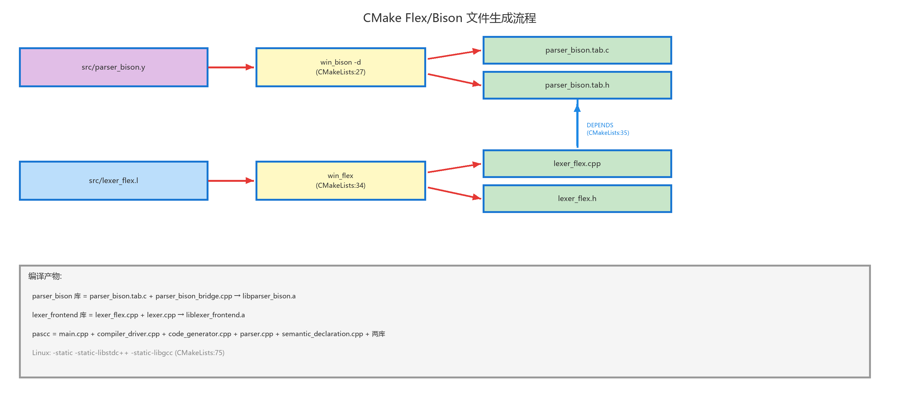

关键的依赖链：`parser_bison.y` → `parser_bison.tab.h` → `lexer_flex.l` → `lexer_flex.cpp`。Flex 的编译必须等待 Bison 生成的头文件就绪，因为 `lexer_flex.l` 中 `#include "parser_bison.tab.h"` 需要 `T_IDENTIFIER` 等 Token 编号宏。

```cmake
# Bison 自定义命令: parser_bison.y → parser_bison.tab.c + parser_bison.tab.h
add_custom_command(
    OUTPUT ${BISON_OUTPUT_C} ${BISON_OUTPUT_H}
    COMMAND ${BISON_EXECUTABLE} -d -o ${BISON_OUTPUT_C} src/parser_bison.y
    DEPENDS src/parser_bison.y
)

# Flex 自定义命令: lexer_flex.l → lexer_flex.cpp + lexer_flex.h
add_custom_command(
    OUTPUT ${FLEX_OUTPUT_C} ${FLEX_OUTPUT_H}
    COMMAND ${FLEX_EXECUTABLE} --header-file=${FLEX_OUTPUT_H}
            -o ${FLEX_OUTPUT_C} src/lexer_flex.l
    DEPENDS src/lexer_flex.l ${BISON_OUTPUT_H}
)
```

#### 目标架构

CMake 定义了两个静态库和 13 个可执行目标。下图展示了它们之间的链接依赖关系。

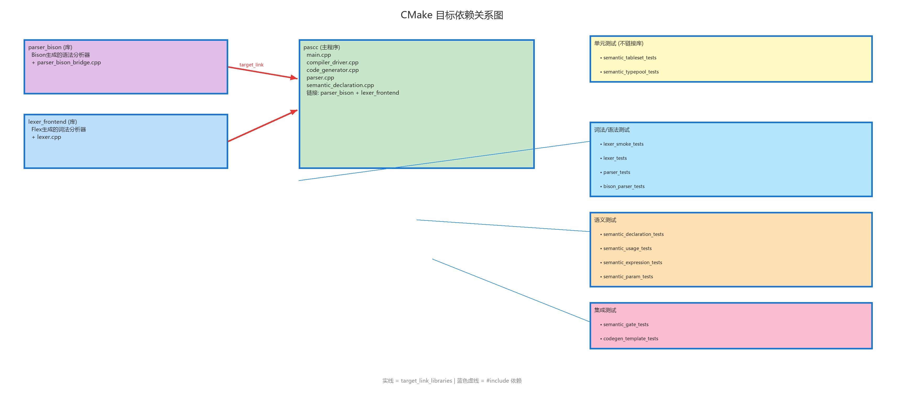

```
libraries:
  parser_bison      — Bison 生成的语法分析器 + 桥接层
  lexer_frontend    — Flex 生成的词法分析器 + 封装层

executables:
  pascc             — 编译器主程序（链接两个库）
  *_tests           — 12 个测试可执行文件
```

### 9.2 测试体系总览

测试体系遵循经典的"测试金字塔"分层设计，共 12 个测试目标，分为 4 个层级。下图以金字塔形式展示了这一分层结构。

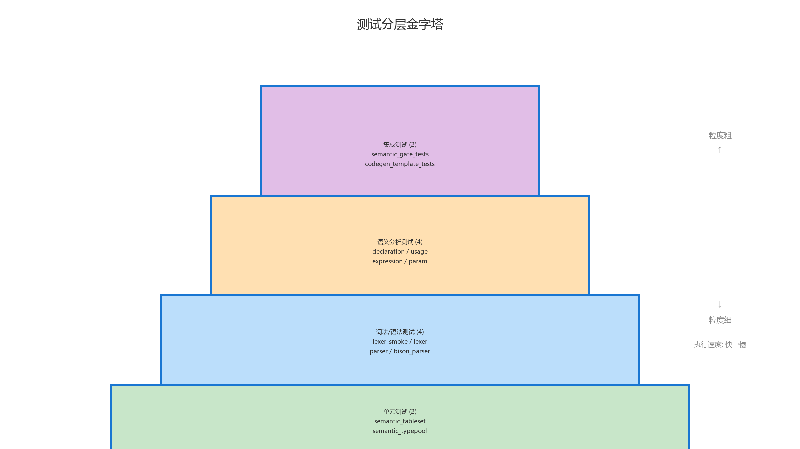

#### 层级 1：单元测试（底层，2 个测试，不依赖 Flex/Bison）

| 测试名 | 测试内容 |
|--------|---------|
| `semantic_tableset_tests` | `TableSet::insert()` 插入、`searchEntry()` 链式查找、`prevSet_` 作用域链 |
| `semantic_typepool_tests` | `BuiltinTypePool` 的创建、`findByName()` 查询、`installInto()` 注入 |

#### 层级 2：词法/语法模块测试（4 个测试）

| 测试名 | 测试内容 |
|--------|---------|
| `lexer_smoke_tests` | 冒烟测试：基本 Token 识别 |
| `lexer_tests` | 词法详细测试：关键字、字面量、注释、错误 |
| `parser_tests` | 语法解析测试：各种程序结构的 Bison 解析验证 |
| `bison_parser_tests` | Bison 解析器专项测试：合并冲突验证、错误恢复 |

#### 层级 3：语义分析模块测试（4 个测试）

| 测试名 | 测试内容 |
|--------|---------|
| `semantic_declaration_tests` | 声明检查：同作用域重定义（S101）、作用域嵌套 |
| `semantic_usage_tests` | 标识符使用检查：未定义标识符使用（S103）|
| `semantic_expression_tests` | 表达式类型检查：运算符类型约束、promoteNumeric |
| `semantic_param_tests` | 参数类型匹配：值参数兼容性、VAR 参数严格匹配（S202）|

#### 层级 4：端到端集成测试（顶层，2 个测试）

| 测试名 | 测试内容 |
|--------|---------|
| `semantic_gate_tests` | 端到端语义门控：写 .pas 临时文件 → 完整调用 `CompilerDriver::run()` → 验证退出码和输出 .c 文件 |
| `codegen_template_tests` | 代码生成模板测试：对 `samples/*.pas` 调用 `CodeGenerator::generateTemplate()` 生成 C 代码，检查包含特定翻译模式 |

### 9.3 测试命名约定

每个测试函数内的断言使用描述性名称 `"module_feature_detail"` 格式：

- `codegen_template_basic_ok`
- `codegen_controlflow_while`
- `gate_semantic_fail_exit_code_9`

通过 `expect(condition, testName)` 辅助函数统一输出 `[PASS]` / `[FAIL]` 格式的测试结果。

### 9.4 构建与测试命令

```bash
# 配置
cmake -B build -S .

# 构建
cmake --build build

# 运行全部测试
cd build && ctest

# 运行单个测试
./build/codegen_template_tests
./build/semantic_gate_tests
```

---

## 第十章 示例程序与端到端数据流

### 10.1 示例程序概览

`samples` 目录包含 6 组 Pascal-S 源文件及其编译输出的 C 文件，按照功能复杂度从低到高排列：

| 文件 | Pascal 源码 | C 输出 | 覆盖特性 |
|------|-----------|--------|---------|
| 00_main | `00_main.pas` | `00_main.c` | 空程序——验证最小编译流水线通路 |
| 01_features | `01_features.pas` | `01_features.c` | 变量声明、赋值、write 输出——基本翻译能力 |
| 02_lex_error | `02_lex_error.pas` | —（预期失败）| 词法错误用例 |
| 03_controlflow | `03_controlflow.pas` | `03_controlflow.c` | 全部 7 种控制流语句 |
| 04_routines | `04_routines.pas` | `04_routines.c` | procedure/function 声明、调用、返回值 |
| 05_realmap | `05_realmap.pas` | `05_realmap.c` | float 类型映射、实数函数参数/返回、实数 I/O |

### 10.2 完整端到端数据流

以 `01_features.pas` 为例，下图展示了从 Pascal 源码到 C 输出的完整转换过程。

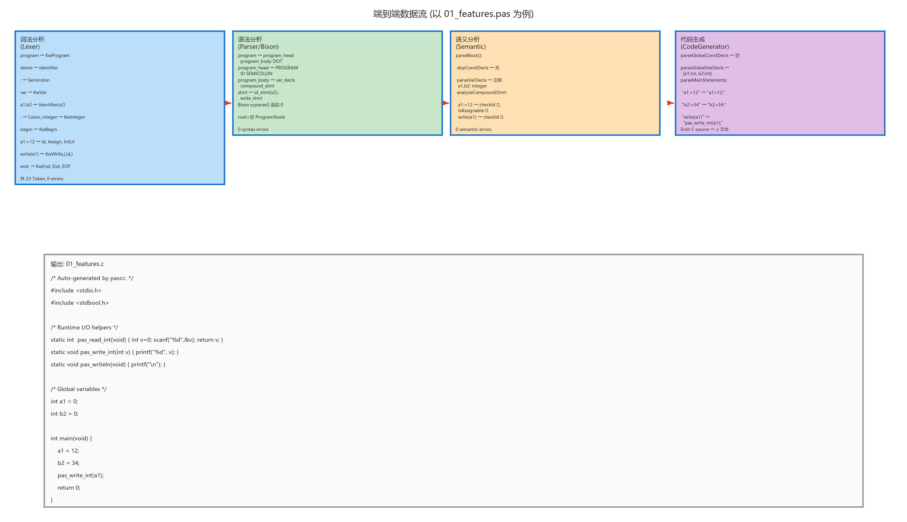

上图以四列横向布局详细展示了每个编译阶段的核心处理函数和输入/输出格式。以 `01_features.pas` 为例的完整数据流：

**输入**：
```pascal
program demo;
var a1, b2: integer;
begin
  a1 := 12;
  b2 := 34;
  write(a1)
end.
```

**阶段 1 — 词法分析**：Flex DFA 扫描产生 23 个 Token（`KwProgram, Identifier("demo"), Semicolon, KwVar, Identifier("a1"), Comma, Identifier("b2"), Colon, KwInteger, Semicolon, KwBegin, Identifier("a1"), Assign, IntegerLiteral("12"), Semicolon, Identifier("b2"), Assign, IntegerLiteral("34"), Semicolon, KwWrite, LParen, Identifier("a1"), RParen, KwEnd, Dot, EndOfFile`），0 个词法错误。

**阶段 2 — 语法分析**：Bison LALR(1) 自动机成功将 Token 序列归约到 `program` 产生式，在归约过程中自底向上构建完整的 `ProgramNode` AST（含 `BlockNode` → `VarDeclNode` → `BasicTypeNode` 等声明节点，以及语句节点树）。

**阶段 3 — 语义分析**：`SemanticDeclarationAnalyzer` 在全局作用域中注册 `a1 → VariableSymbol(Int)` 和 `b2 → VariableSymbol(Int)`，验证两个赋值语句的类型兼容性（`isAssignable(Int, Int)` 通过），验证 `write(a1)` 中 a1 已声明。

**阶段 4 — 代码生成**：`CodeGenerator::generate(parserResult)` 接收完整 AST，通过 `buildContext()` 从声明节点提取类型映射（`a1→"int"`, `b2→"int"`），通过 `emitExpr()` / `emitStmt()` 递归遍历 AST 翻译赋值和 write 语句，按 `emitPreamble → emitGlobalVars → emitMain` 管线组装完整 C 源文件。

**输出**：完整 C 源文件，包含运行时 I/O helper、全局变量声明和 `main()` 函数。

### 10.3 逐示例分析

#### 00_main — 最小空程序

```
Pascal: program sample; begin end.
C:      int main(void) { return 0; }  (+ I/O helpers)
```

空程序体——`program_body` 中的五部分全部为空产生式，生成的 C 代码包含空的 `main()` 和所有运行时 I/O helper（确保模板完整）。

#### 01_features — 基本特性

```
Pascal: var a1, b2: integer; a1 := 12; b2 := 34; write(a1)
C:      int a1 = 0; int b2 = 0; a1 = 12; b2 = 34; pas_write_int(a1);
```

关键映射：`var a1, b2: integer` → `int a1 = 0; int b2 = 0;`（全局变量初始化为 0）；`:=` → `=`；`write(a1)` → `pas_write_int(a1)`（通过 `inferWriteType()` 判断类型）。

#### 03_controlflow — 控制流语句

该示例覆盖了全部 7 种控制流结构的翻译。各结构的关键转换：

| Pascal 结构 | C 翻译 |
|------------|--------|
| `while i < 3 do ...` | `while (i < 3) { ... }` |
| `if i = 1 then ... else ...` | `if (i == 1) { ... } else { ... }` |
| `for i := 1 to 2 do ...` | `for (i = 1; i <= 2; ++i) { ... }` |
| `for i := 3 downto 1 do ...` | `for (i = 3; i >= 1; --i) { ... }` |
| `repeat ... until cond` | `do { ... } while (!(cond));` |
| `case x of 1,2: s1; 3: s2 end` | `switch (x) { case 1: case 2: s1; break; case 3: s2; break; }` |

#### 04_routines — 过程与函数

```pascal
procedure inc1(a: integer); begin x := x + a end;
function add1(v: integer): integer; begin add1 := v + 1 end;
```

翻译关键：`procedure inc1(a: integer)` → `void inc1(int a)`；`function add1(v: integer): integer` → `int add1(int v)`；函数名赋值 `add1 := v + 1` → `__ret_add1 = v + 1; return __ret_add1;`；全局变量 `x` 在过程体中被修改——代码生成器的两遍扫描策略正确处理了函数在定义前被调用的情况。

#### 05_realmap — 实数类型

翻译关键：Pascal `real` → C `float`；`x := 1.25` → `x = 1.25;`（实数字面量直接透传）；`write(x)` → `pas_write_real(x);`；实数常量：`const pi = 3.14` → `static const float pi = 3.14f;`。

### 10.4 Pascal-S 语言覆盖矩阵

下图以热力矩阵的形式展示了 Pascal-S 各语言特性在四个编译阶段的覆盖程度。

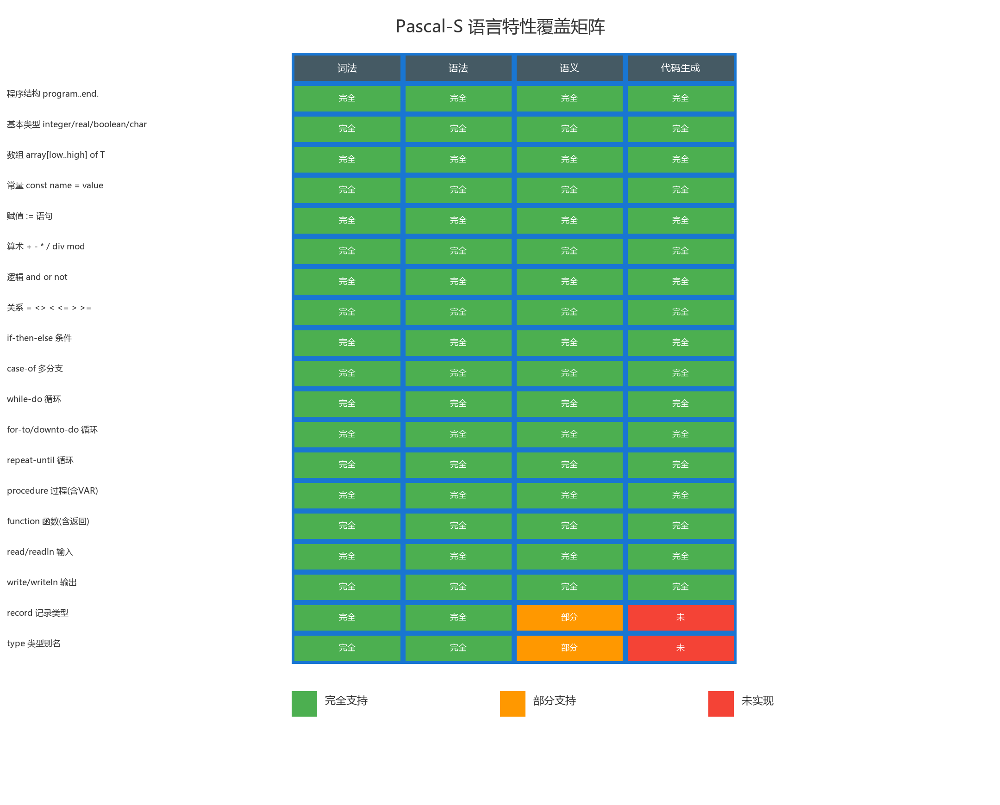

#### 已支持的特性（全部四个阶段覆盖）

| 特性 | 词法 | 语法 | 语义 | 代码生成 |
|------|------|------|------|---------|
| 程序结构 | ✓ | ✓ | ✓ | ✓ |
| 基本类型 | ✓ | ✓ | ✓ | ✓ |
| 数组（多维）| ✓ | ✓ | — | ✓ |
| 常量 | ✓ | ✓ | ✓ | ✓ |
| 赋值 | ✓ | ✓ | ✓ | ✓ |
| 算术运算 | ✓ | ✓ | ✓ | ✓ |
| 逻辑运算 | ✓ | ✓ | ✓ | ✓ |
| 关系运算 | ✓ | ✓ | ✓ | ✓ |
| if-then-else | ✓ | ✓ | ✓ | ✓ |
| case-of | ✓ | ✓ | — | ✓ |
| while-do | ✓ | ✓ | ✓ | ✓ |
| for-to/downto | ✓ | ✓ | ✓ | ✓ |
| repeat-until | ✓ | ✓ | ✓ | ✓ |
| procedure | ✓ | ✓ | ✓ | ✓ |
| function | ✓ | ✓ | ✓ | ✓ |
| read/readln | ✓ | ✓ | ✓ | ✓ |
| write/writeln | ✓ | ✓ | ✓ | ✓ |
| break/continue/exit | ✓ | ✓ | — | ✓ |
| 字符串字面量 | ✓ | ✓ | ✓ | ✓ |

#### 未实现 / 部分支持的特性

| 特性 | 状态 | 说明 |
|------|------|------|
| record 类型 | 语法+A ST支持，代码生成占位 | AST 有 `RecordTypeNode`，代码生成退化为 `int` |
| type 别名 | 语法+A ST支持，代码生成退路 | AST 有 `NamedTypeNode`，代码生成退化为 `int` |
| 程序参数列表 | 文法解析但忽略 | `program demo(input, output)` 被解析但不产生代码 |
| 嵌套子程序 | 代码生成支持 | `emitRoutine()` 递归处理嵌套子例程为独立 C 函数 |
| goto/label | 不在 Pascal-S 子集中 | — |
| set/pointer/file 类型 | 不在 Pascal-S 子集中 | — |
| with 语句 | 不在 Pascal-S 子集中 | — |

---

## 第十一章 附录：架构演进与未来方向

### 11.1 AST 从占位到完整的演进

AST 节点体系已完成从占位骨架到完整富语义树的演进。下图展示了当前已实现的完整 AST 节点设计。


AST 的完整实现带来了以下架构收益：

1. **Bison 成为 AST 构建器**：`parser_bison.y`（848 行）中每条产生式的语义动作在归约时同步构造 AST 节点，通过 `%union`（12 种语义值类型）和 `%type` 声明实现类型安全的自底向上树构造。
2. **代码生成器基于 AST 遍历**：`code_generator.cpp`（791 行）通过 `emitExpr(ExprNode*)` / `emitStmt(StmtNode*)` 递归遍历 AST，代码量较旧版 Token 流直译减少 47%，逻辑清晰度显著提升。
3. **编译流水线单次词法分析**：`CompilerDriver` 中的代码生成阶段直接接收 `ParserResult`，不再重复执行词法分析。
4. **类型信息从 AST 声明节点获取**：`buildContext()` 遍历 `BlockNode` 中的 `ConstDeclNode`/`VarDeclNode`/`RoutineNode` 填充 `CodeGenContext`，替代了旧版的两遍 Token 扫描策略。

### 11.2 后续优化方向

- **语义分析器接入 AST**：当前语义分析器仍独立遍历 Token 流。将其改为遍历 AST 可消除 Token 流的重复遍历，并利用 AST 的结构化信息简化类型推导逻辑。
- **中间表示层**：在语义分析和代码生成之间插入中间表示（IR）层，支持与目标语言无关的优化遍。
- **错误恢复增强**：在语义分析阶段引入类似 Bison 的错误恢复机制，使语义分析可以在一轮中报告多个错误。
- **代码生成优化**：引入常量折叠、死代码消除等基本优化；支持 record 类型的完整 C 代码生成。
- **多目标后端**：抽象代码生成接口，支持除 C 以外的目标语言（如 LLVM IR、WebAssembly 等）。
