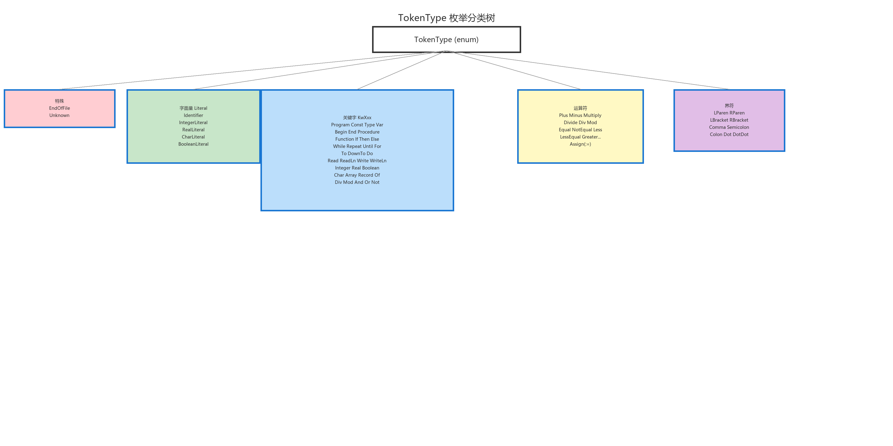
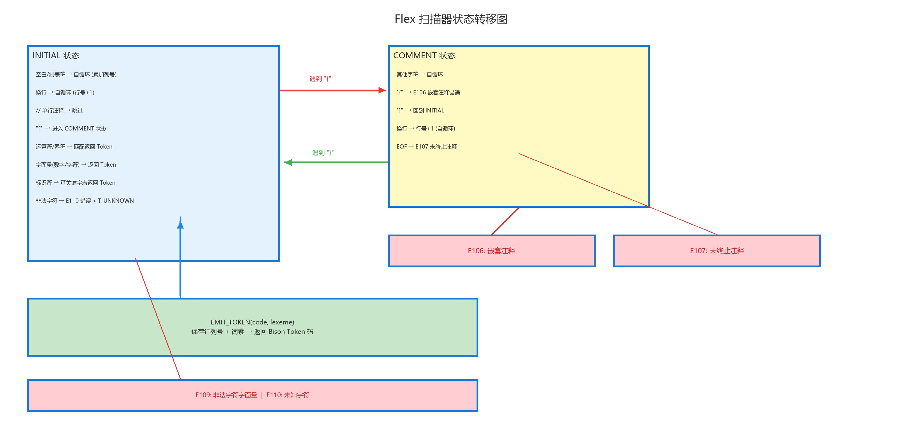

# 词法分析模块 (Lexer)

## 模块职责

词法分析模块是编译流水线的第一阶段，负责将 Pascal-S 源代码字符串转换为结构化的 Token 流（`std::vector<Token>`），同时检测三类词法错误：非法字符、未闭合注释、非法字符字面量。模块的核心由 Flex 生成的确定性有限自动机（DFA）驱动，外层通过 `Lexer` 类封装 Flex 的 C 语言接口，向编译器其余部分提供类型安全的 C++ 接口。

## 文件结构

| 文件 | 行数 | 职责 |
|------|------|------|
| `token.h` | 86 | `TokenType` 枚举（50+ 种取值）、`Token` 与 `SourcePosition` 结构体定义 |
| `lexer.h` | 27 | `LexError`、`LexerResult` 结构体 + `Lexer` 类公开接口 |
| `lexer.cpp` | 115 | Flex 扫描器调用的 C++ 封装、`mapBisonTokenToInternal()` 反向映射表的实现 |
| `lexer_flex.l` | 192 | Flex 词法规则源文件（正则表达式 → Bison Token 码） |

模块的物理依赖关系：`lexer_flex.l` →（`#include`）→ `parser_bison.tab.h`（Bison 生成，提供 `T_IDENTIFIER` 等 Token 编号宏）→ `lexer.cpp` → `token.h`。Flex/Bison 之间通过 Token 编号宏实现"编号契约"：Flex 返回的整型码必须与 Bison `%token` 声明中分配的编号完全一致。

## Token 类型体系

定义于 `token.h`，`TokenType` 是一个 `enum class`，共包含 50+ 种取值。这些取值按语义分为五大类，下图以树形结构展示了完整分类。



树的根节点为 `TokenType (enum class)`，五个一级分支分别对应：

### 1. 特殊类型（2 种）

- **`EndOfFile`**：流结束标记。由 `Lexer::tokenizeDetailed()` 在 Token 序列末尾手动追加（`lexer.cpp:108-112`），而非由 Flex 规则产生。后续阶段（语义分析、代码生成）依赖此哨兵值判断是否到达输入末尾。
- **`Unknown`**：无法识别的字符。当 Flex 最末规则 `.` 匹配到任何未被前述规则捕获的字符时返回。虽然 Token 类型为 Unknown，但扫描器仍继续运行（不中断），错误信息通过 `addError("E110", ...)` 记录。

### 2. 字面量类型（5 种）

- **`Identifier`**：标识符。由正则 `[A-Za-z_][A-Za-z0-9_]*` 匹配，经 `toLower()` ASCII 小写化后，在 `keywordOrIdentifier()` 中查关键字哈希表；若未命中关键字则返回 `T_IDENTIFIER`。
- **`IntegerLiteral`**：无符号整数。由正则 `[0-9]+` 匹配。注意 Pascal-S 中整数字面量不含符号——`-5` 被词法分析为 `Minus` + `IntegerLiteral(5)`，符号由语法层作为一元运算符处理。
- **`RealLiteral`**：实数。由正则 `[0-9]+"."[0-9]+` 匹配，必须包含小数点（`1.0` 合法，`1.` 不合法）。
- **`CharLiteral`**：字符字面量。由正则 `'([^\\\'\n\r])'` 匹配，仅接受单个非反斜杠、非引号、非换行的可打印字符。
- **`BooleanLiteral`**：布尔字面量 `true` / `false`。在 `keywordOrIdentifier()` 中将 `true` 和 `false` 映射到 `T_BOOLEAN`（与 `T_IDENTIFIER` 区分）。

### 3. 关键字类型（KwXxx，共 30+ 种）

关键字在 `keywordOrIdentifier()` 函数（`lexer_flex.l:47-92`）中通过 `std::unordered_map<std::string, int>` 哈希表实现 O(1) 查找。按语义可细分五组：

- **程序结构**（6 个）：`Program`, `Const`, `Type`, `Var`, `Begin`, `End`
- **子程序**（2 个）：`Procedure`, `Function`
- **控制流**（13 个）：`If`, `Then`, `Else`, `Case`, `While`, `Repeat`, `Until`, `For`, `To`, `DownTo`, `Do`, `Break`, `Continue`
- **I/O**（4 个）：`Read`, `ReadLn`, `Write`, `WriteLn`
- **类型与运算符关键字**（9 个）：`Record`, `Array`, `Of`, `Integer`, `Real`, `Boolean`, `Char`, `Div`, `Mod`, `And`, `Or`, `Not`

### 4. 运算符类型（11 种）

运算符的匹配遵循 Flex 的"最长匹配优先"原则。多字符运算符（`:="`, `"<="`, `">="`, `"<>"`, `".."`）的规则排在单字符运算符之前，确保 Flex 不会将 `:=` 误匹配为 `:` 后跟 `=`。

- 赋值：`Assign`（`:=`）
- 算术：`Plus`（`+`）, `Minus`（`-`）, `Multiply`（`*`）, `Divide`（`/`）
- 关系：`Equal`（`=`）, `NotEqual`（`<>`）, `Less`（`<`）, `LessEqual`（`<=`）, `Greater`（`>`）, `GreaterEqual`（`>=`）

### 5. 界符类型（10 种）

- 括号类：`LParen`（`(`）, `RParen`（`)`）, `LBracket`（`[`）, `RBracket`（`]`）
- 分隔类：`Comma`（`,`）, `Semicolon`（`;`）, `Colon`（`:`）, `Dot`（`.`）, `DotDot`（`..`）

### Token 数据结构

```cpp
// token.h:76-83
struct SourcePosition {
    int line = 1;      // 1-based 行号
    int column = 1;    // 1-based 列号
};

struct Token {
    TokenType type = TokenType::Unknown;
    std::string lexeme;   // 原始词素（已做 ASCII 小写化处理）
    SourcePosition pos;   // 起始行列号（1-based）
};
```

`lexeme` 字段存储的是经过 `toLower()` 处理的小写形式，这一设计简化了下游模块（语义分析、代码生成）的字符串比较逻辑——所有标识符比较均基于小写形式，无需重复调用 `tolower()`。

## Flex 规则设计

文件：`lexer_flex.l`（192 行）

### Flex 选项与状态

```flex
// lexer_flex.l:1-5
%option noyywrap        // 单文件扫描模式：不调用 yywrap()，到达 EOF 后 yylex() 返回 0
%option nounput         // 禁止 unput() 宏，减少生成代码体积
%option noinput         // 禁止 input() 宏，减少生成代码体积
%option prefix="pascclex"  // 函数名前缀，将所有 yyXxx 函数重命名为 pascclexXxx
%x COMMENT              // 独占状态（Exclusive start condition）：处理 { ... } 块注释
%x COMMENT2             // 独占状态：处理 (* ... *) 块注释（Pascal 传统注释语法）
```

使用 `%option prefix="pascclex"` 是为避免在链接多个 Flex 扫描器时出现符号冲突（`yylex`、`yywrap` 等均为全局 C 符号）。`%x`（独占状态）意味着进入 COMMENT 状态后，只有以 `<COMMENT>` 前缀标记的规则会被激活，INITIAL 状态的规则全部失效。

### Flex 状态转移流程

下图展示了 Flex 扫描器在 INITIAL 和 COMMENT 两个核心状态之间的转移关系，以及每条边上标注的匹配条件。



状态转移的核心逻辑如下：

- **INITIAL 状态**是扫描器的起始状态和默认状态。在该状态下，空白字符（空格、制表符、回车）仅累加列号不产生 Token；换行符递增行号并复位列号；遇到 `{` 时进入 COMMENT 状态并记录注释起始位置；遇到 `(*` 时进入 COMMENT2 状态。标识符和关键字通过 `keywordOrIdentifier()` 查表返回对应的 Bison Token 码；运算符和界符按最长匹配优先原则直接返回；字面量（整数、实数、字符）在匹配后通过 `EMIT_TOKEN` 宏返回；无法匹配的字符由最末规则 `.` 捕获，产生 E110 错误。
- **COMMENT 状态**处理 `{ ... }` 形式的块注释。在该状态下，`}` 使扫描器回到 INITIAL 状态；`{` 触发 E106 错误（嵌套注释）；换行正常递增行号；其他字符被静默消耗。若到达 EOF 仍未闭合注释，则触发 E107 错误。
- **COMMENT2 状态**处理 `(* ... *)` 形式的块注释（Pascal 传统的替代注释语法），逻辑与 COMMENT 状态对称：`*)` 回到 INITIAL；到达 EOF 触发 E107 错误。

### 规则详细分析

#### 空白与注释处理

```flex
// lexer_flex.l:136-150
[ \t\r]+                   { g_col += yyleng; }
\n                         { ++g_line; g_col = 1; }
"//"[^\n]*                 { g_col += yyleng; }
"{"                        { g_comment_start_line = g_line; g_comment_start_col = g_col;
                             g_col += yyleng; BEGIN(COMMENT); }
<COMMENT>"{"               { addError("E106", "Nested comment is not allowed.", g_line, g_col);
                             g_col += yyleng; }
<COMMENT>"}"               { g_col += yyleng; BEGIN(INITIAL); }
<COMMENT>\n                { ++g_line; g_col = 1; }
<COMMENT>.                 { g_col += yyleng; }
<COMMENT><<EOF>>           { addError("E107", "Unterminated comment.",
                             g_comment_start_line, g_comment_start_col);
                             BEGIN(INITIAL); return 0; }
```

关键设计细节：注释起始位置（`g_comment_start_line`/`g_comment_start_col`）在进入 COMMENT 状态时保存，用于在检测到 E107 错误时报告注释开始位置（而非 EOF 位置）。单行注释 `//` 被直接跳过不产生 Token，`g_col += yyleng` 确保后续列号计算正确。

#### 运算符与界符匹配（最长匹配优先）

```flex
// lexer_flex.l:152-175
":="   → T_ASSIGN        // 双字符优先匹配，避免被拆分为 ':' + '='
"<="   → T_LESS_EQUAL
">="   → T_GREATER_EQUAL
"<>"   → T_NOT_EQUAL
".."   → T_DOTDOT
// 单字符运算符排在其后
"+"    → T_PLUS
"-"    → T_MINUS
"*"    → T_MULTIPLY
"/"    → T_DIVIDE
// 界符
"("    → T_LPAREN
...
```

Flex 采用"最长匹配优先 + 先定义优先"的双重策略。多字符运算符的规则排在单字符之前，确保 `:=` 不会错误地匹配为 `:` 再匹配 `=`。

#### 字面量匹配

```flex
// lexer_flex.l:177-189
[0-9]+"."[0-9]+    → T_REAL       // 实数：必须含小数点。例如 3.14 合法
[0-9]+             → T_INTEGER    // 整数。注意排在实数规则之后，因为 Flex 优先最长匹配
'([^\\\'\n\r])'    → T_CHAR       // 合法单字符字面量，排除反斜杠、引号、换行
'([^\'\n\r])*'     → T_STRING     // 多字符字符串字面量，lexeme 存储去掉引号的内容
'([^\'\n\r])*      → E109 错误     // 未终止的字符串字面量（单引号不配对）
```

实数规则必须排在整数规则**之前**，因为 `3.14` 的前缀 `3` 也会匹配 `[0-9]+`。Flex 的最长匹配优先策略自动选择 `[0-9]+"."[0-9]+`。

字符串字面量（`T_STRING`）的处理比较特殊：Flex 匹配整个 `'...'` 结构后，通过 `std::string content(yytext + 1, yyleng - 2)` 提取引号内的内容作为 lexeme，去掉了外围单引号。

#### 标识符与关键字识别

```flex
// lexer_flex.l:191-195
[A-Za-z_][A-Za-z0-9_]*  {
    const std::string lowered = toLower(yytext, yyleng);
    const int token = keywordOrIdentifier(lowered);
    EMIT_TOKEN(token, lowered);
}
```

识别流程：正则匹配 → `toLower()` ASCII 小写化 → `keywordOrIdentifier()` 在 `std::unordered_map` 中 O(1) 查表 → 若命中则返回关键字对应的 Bison Token 码，否则返回 `T_IDENTIFIER`。

`keywordOrIdentifier()` 函数（`lexer_flex.l:47-92`）包含一个静态的 `std::unordered_map<std::string, int>` 常量表，映射 30+ 个 Pascal 关键字到对应的 Bison Token 编号。该表在首次调用时通过静态初始化构造，后续调用均为 O(1) 查找。

#### 错误恢复

```flex
// lexer_flex.l:197-200
.  {
    addError("E110", "Unknown character: " + std::string(yytext, yyleng), g_line, g_col);
    EMIT_TOKEN(T_UNKNOWN, std::string(yytext, yyleng));
}
```

最末规则 `.` 匹配任何未被前述规则捕获的单字符，产生 E110 错误但不中断扫描。返回 `T_UNKNOWN` Token（由 Bison 的错误恢复产生式处理），确保语法分析阶段可以继续。这种"错误恢复"策略使编译器能在一次运行中报告多个词法错误。

### 辅助 C 函数

Flex 文件的 `%{ %}` 代码块（`lexer_flex.l:7-133`）中定义了扫描器所需的全部辅助函数和全局状态变量：

| 函数/宏 | 位置 | 功能 |
|---------|------|------|
| `pasccLexerResetState(errors*)` | `lexer_flex.l:94-103` | 重置所有全局状态（行号、列号、错误列表、上次词素等） |
| `pasccLexerLastLexeme()` | `lexer_flex.l:105-107` | 返回最近匹配 Token 的词素（C 字符串） |
| `pasccLexerLastLine()` | `lexer_flex.l:109-111` | 返回最近 Token 的行号 |
| `pasccLexerLastColumn()` | `lexer_flex.l:113-115` | 返回最近 Token 的列号 |
| `pasccLexerCurrentLine()` | `lexer_flex.l:117-119` | 返回当前扫描位置的行号 |
| `pasccLexerCurrentColumn()` | `lexer_flex.l:121-123` | 返回当前扫描位置的列号 |
| `toLower(text, len)` | `lexer_flex.l:31-39` | ASCII 小写化辅助函数 |
| `keywordOrIdentifier(lowered)` | `lexer_flex.l:47-92` | 关键字哈希表 O(1) 查询 |
| `addError(code, msg, line, col)` | `lexer_flex.l:41-45` | 向全局错误列表追加 `LexError` |
| `EMIT_TOKEN(code, lexeme)` | `lexer_flex.l:86-92` | 宏：保存位置、词素到全局变量，递增列号，返回 Token 码 |

### 全局状态管理

Flex 使用 C 语言的全局变量模式管理扫描状态（因为 `yylex()` 是无参数函数，无法通过参数传递上下文）：

```cpp
static std::vector<LexError>* g_errors = nullptr;  // 错误列表指针（外部传入）
static int g_line = 1;                              // 当前行号
static int g_col = 1;                               // 当前列号
static int g_comment_start_line = 1;                // 注释起始行号（用于 E107 报错）
static int g_comment_start_col = 1;                 // 注释起始列号
static std::string g_last_lexeme;                   // 最近匹配的词素
static int g_last_line = 1;                         // 最近 Token 行号
static int g_last_col = 1;                          // 最近 Token 列号
```

这种设计的一个副作用是**不可重入**——同一进程内不能同时运行两个 Flex 扫描器实例。但对于单文件编译器而言这不是问题。每次调用 `tokenizeDetailed()` 前都会调用 `pasccLexerResetState()` 重置状态。

## Lexer 类封装

文件：`lexer.cpp`（115 行）

### mapBisonTokenToInternal() 反向映射

```cpp
// lexer.cpp:17-82
static TokenType mapBisonTokenToInternal(int bisonToken)
```

此函数将 Flex 返回的 Bison Token 整型码（`T_IDENTIFIER`、`T_BEGIN` 等，定义于 `parser_bison.tab.h`）转换为内部的 `TokenType` 枚举值。这是一个 1:1 的反向映射，与 `parser_bison_bridge.cpp:23-89` 中的 `mapToken(TokenType → int)` 形成对称的双向映射。

为什么需要双向映射？因为：
1. Flex 规则动作必须返回 Bison Token 码（Bison 生成的 `yyparse()` 只认识 `parser_bison.tab.h` 中的 `T_XXX` 宏）
2. 但编译器下游模块（语义分析、代码生成）不应依赖 Bison 的内部编号——它们应使用 `token.h` 中的 `TokenType` 枚举
3. 因此 `lexer.cpp` 在 Flex 返回后立即通过 `mapBisonTokenToInternal()` 转换，对外只暴露 `TokenType`

### tokenizeDetailed() 主流程

```cpp
// lexer.cpp:85-114
LexerResult Lexer::tokenizeDetailed(const std::string& source) {
    LexerResult result;
    std::vector<LexError> errors;

    // 1. 重置 Flex 全局状态
    pasccLexerResetState(&errors);                    // lexer.cpp:91

    // 2. 创建 Flex 扫描缓冲区（从内存字符串扫描）
    YY_BUFFER_STATE buf = pascclex_scan_string(source.c_str());  // lexer.cpp:93

    // 3. 循环调用 yylex() 收集 Token
    int tokenCode;
    while ((tokenCode = pascclexlex()) != 0) {        // lexer.cpp:94-105
        TokenType type = mapBisonTokenToInternal(tokenCode);
        result.tokens.push_back(Token{
            type,
            pasccLexerLastLexeme(),
            {pasccLexerLastLine(), pasccLexerLastColumn()}
        });
    }

    // 4. 释放缓冲区
    pascclex_delete_buffer(buf);                       // lexer.cpp:106

    // 5. 追加 EndOfFile 哨兵 Token
    result.tokens.push_back(Token{TokenType::EndOfFile, "<EOF>", ...}); // lexer.cpp:108-112

    // 6. 移动错误列表
    result.errors = std::move(errors);                 // lexer.cpp:114
    return result;
}
```

关键步骤说明：
- 第 2 步使用 `pascclex_scan_string()`（由 `%option prefix="pascclex"` 重命名自 `yy_scan_string()`）从内存中的 `std::string` 创建扫描缓冲区，避免文件 I/O。
- 第 3 步的 `pascclexlex()` 是 `yylex()` 的重命名版本。循环在 `yylex()` 返回 0（EOF）时终止。
- 第 5 步手动追加 `EndOfFile` 哨兵 Token，这是为了简化下游模块的边界判断——递归下降分析器可以通过检查 `current().type == TokenType::EndOfFile` 来判断是否已到达输入末尾。
- 第 6 步使用 `std::move` 转移错误列表的所有权，避免拷贝。

### tokenize() 简化接口

```cpp
// lexer.cpp:85-88
std::vector<Token> Lexer::tokenize(const std::string& source) {
    return tokenizeDetailed(source).tokens;
}
```

此简化接口仅返回 Token 向量，丢弃错误信息。在测试代码中常用（因为测试通常只关心 Token 序列内容），但在正式编译流水线中应使用 `tokenizeDetailed()` 以获得完整的错误报告。

## 错误处理

词法分析阶段定义了 4 种错误码，均以 `E1xx` 格式命名：

| 错误码 | 触发条件 | Flex 规则位置 |
|--------|---------|--------------|
| E106 | 嵌套块注释 `{ ... { ... } ... }`（Pascal 标准不允许嵌套注释） | `lexer_flex.l:141` |
| E107 | 未终止的块注释 `{ ... EOF` 或 `(* ... EOF` | `lexer_flex.l:145, 155` |
| E109 | 未终止的字符串字面量（单引号不配对） | `lexer_flex.l:187-189` |
| E110 | 无法识别的字符（不在 Pascal-S 字符集中的 ASCII 字符） | `lexer_flex.l:197-200` |

所有错误通过 `addError()` 函数存入全局 `g_errors` 向量（指向外部传入的 `std::vector<LexError>`），最终通过 `LexerResult.errors` 暴露给调用者。

错误恢复策略：词法错误**不中断**扫描过程。E106 仅记录错误并继续（多余的 `{` 仍在 COMMENT 状态内被消耗）；E107 记录错误后通过 `BEGIN(INITIAL); return 0;` 强制终止扫描；E109/E110 记录错误后返回 `T_UNKNOWN` Token（由 Bison 的错误恢复产生式跳过）。

## 数据流输出

```
Lexer::tokenizeDetailed(source)
  ↓
Flex DFA 扫描：pascclexlex() 循环
  ├─ 每次匹配返回 Bison Token 码 (int)
  ├─ 通过 mapBisonTokenToInternal() 转换为 TokenType 枚举
  ├─ 通过 pasccLexerLastLexeme()/Line()/Column() 获取词素和位置
  └─ 构造 Token 对象追加到 tokens 向量
  ↓
LexerResult {
    tokens: [Token, Token, ..., EndOfFile]   // Token 序列，最后一个是 EOF 哨兵
    errors: [LexError, ...]                   // 词法错误列表（可能为空）
}
```

Token 序列中的最后一个元素始终是 `EndOfFile` 类型的哨兵 Token，其 `lexeme` 为 `"<EOF>"`。这一设计确保了任何遍历 Token 流的下游模块都可以安全地通过 `current().type == TokenType::EndOfFile` 来判断到达末尾，而无需额外检查数组边界。
