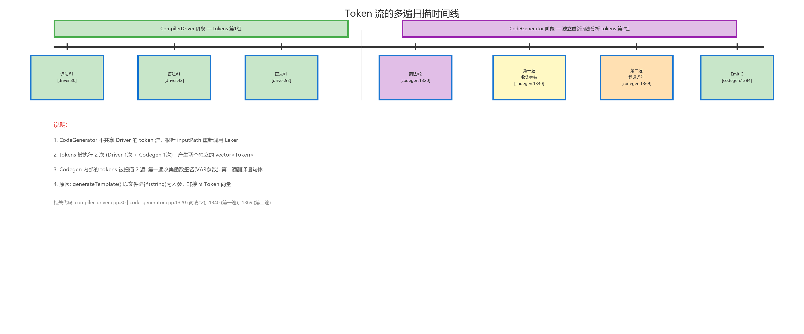
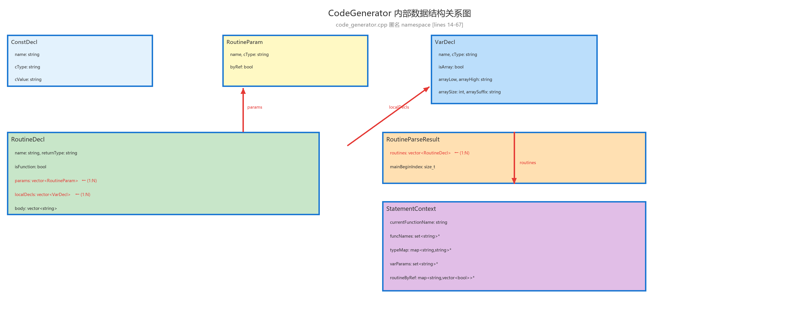
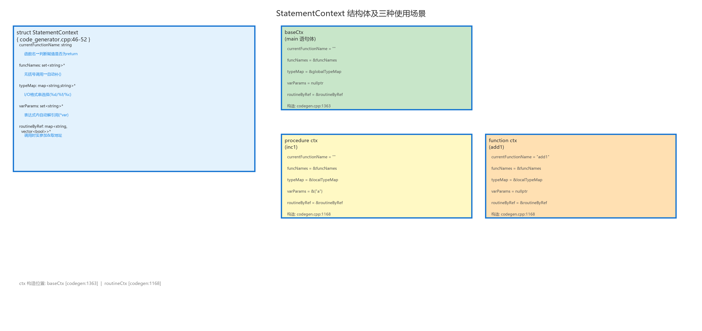

# 代码生成模块 (Code Generator)

## 模块职责

代码生成模块是编译流水线的第四阶段，也是整个编译器最核心、代码量最大的模块。其职责是将 Pascal-S Token 流直接翻译为等效的 C 语言源代码。模块的设计理念是**"直译"**——不做 AST 遍历，不做中间代码优化，而是对 Token 流做两遍递归下降扫描，逐结构模式匹配并生成对应的 C 代码。

## Token 流多遍扫描策略

代码生成器对 Token 流执行两遍扫描，外加一次独立的词法分析调用。下图以时间线形式展示了完整的扫描策略。



上图揭示了几个关键的架构事实：

1. **代码生成器的词法分析是独立的**：`CodeGenerator::generateTemplate()` 在内部通过 `Lexer::tokenizeDetailed()` 重新执行词法分析（`code_generator.cpp:1311-1322`），产生的 tokens 与 `CompilerDriver` 中传给 Parser 和 Semantic 的 tokens 是完全独立的两个 `vector<Token>` 副本。这意味着代码生成器可以被独立测试和调用（`codegen_template_tests` 直接调用 `generateTemplate()` 而不经过 CompilerDriver）。

2. **第一遍扫描**（`code_generator.cpp:1340-1360`）遍历全局 tokens，收集两部分信息：
   - `funcNames`：所有 procedure/function 的名称集合（`unordered_set<string>`），用于后续在表达式翻译中识别无括号的函数调用引用并自动补全 `()`。
   - `routineByRef`：所有例程的 VAR 参数位置信息（`unordered_map<string, vector<bool>>`），记录每个例程的哪个参数位置是 VAR 引用参数，用于调用时在对应实参前加 `&`。

3. **第二遍扫描**（`code_generator.cpp:1369-1379`）执行实际翻译：
   - `parseRoutinesAndMain()` 遍历 tokens，收集所有例程的完整定义（`RoutineDecl`）并定位主程序体的 begin 位置。
   - `parseMainStatements()` 从主程序体的 begin 开始翻译语句。

4. **Emit 阶段**（`code_generator.cpp:1384-1455`）将所有收集到的声明和语句组装为完整的 C 源文件字符串。

## 文件结构

| 文件 | 行数 | 职责 |
|------|------|------|
| `code_generator.h` | 20 | `CodegenResult` 结构体 + `CodeGenerator` 类公开接口 |
| `code_generator.cpp` | 1481 | 全部代码生成逻辑：约 67 行数据结构定义 + 1280 行匿名 namespace 内部实现 + 170 行公开接口 |

## 公开接口

```cpp
// code_generator.h:6-10
struct CodegenResult {
    bool ok = false;           // 代码生成是否成功
    std::string message;       // 成功时为 "ok"，失败时为错误描述
    std::string cSource;       // 生成的完整 C 语言源代码字符串
};

// code_generator.h:12-18
class CodeGenerator {
public:
    CodegenResult generateTemplate(const std::string& inputPath) const;
private:
    static std::string sanitizeIdentifier(const std::string& rawName);
};
```

`sanitizeIdentifier()` 用于处理文件名中的特殊字符（如将 `01_features` 处理为合法的 C 标识符前缀）。

## 内部数据结构

代码生成器在匿名 namespace 内定义了 6 个核心内部结构体，用于在翻译过程中累积和传递信息。下图展示了它们之间的组合关系。



```cpp
// code_generator.cpp:14-67
struct ConstDecl {                        // 常量声明
    std::string name;                     //   常量名
    std::string cType;                    //   C 类型 ("int"/"float"/"char"/"string")
    std::string cValue;                   //   C 端的字面值
};

struct VarDecl {                          // 变量声明
    std::string name;                     //   变量名
    std::string cType;                    //   C 类型 ("int"/"float"/"char")
    bool isArray = false;                 //   是否为数组
    std::string arrayLow;                 //   数组下界 (Pascal 侧)
    std::string arrayHigh;                //   数组上界 (Pascal 侧)
    int arraySize = 0;                    //   首维尺寸 (high - low + 1)
    std::string arraySuffix;              //   C 数组后缀 ("[10]" / "[10][5]")
};

struct RoutineParam {                     // 例程参数
    std::string name;                     //   参数名
    std::string cType;                    //   C 类型
    bool byRef = false;                   //   VAR 引用参数标记
};

struct RoutineDecl {                      // 例程（过程/函数）完整定义
    std::string name;                     //   例程名
    std::string returnType;               //   返回类型（过程为空）
    bool isFunction = false;              //   是否为函数
    std::vector<RoutineParam> params;     //   参数列表 (1:N 组合)
    std::vector<VarDecl> localDecls;      //   局部变量 (1:N 组合)
    std::vector<std::string> body;        //   函数体的 C 语句行
    std::string retVarName;               //   返回值变量名 ("__ret_funcname")
};

struct StatementContext {                 // 语句翻译上下文（贯穿整个语句翻译过程）
    std::string currentFunctionName;      //   当前函数名（在 main 语句体中为空）
    std::string currentFunctionRetVar;    //   返回值变量名
    const std::unordered_set<std::string>* funcNames = nullptr;      // 所有函数名集合
    const std::unordered_map<std::string, std::string>* typeMap = nullptr;  // 变量名→C类型
    const std::unordered_set<std::string>* varParams = nullptr;      // 当前作用域 VAR 参数名
    const std::unordered_map<std::string, std::vector<bool>>* routineByRef = nullptr;
};

struct RoutineParseResult {               // 例程解析结果
    std::vector<RoutineDecl> routines;    //   所有例程的完整定义
    std::size_t mainBeginIndex;           //   主程序 begin 的 Token 索引
};
```

`StatementContext` 是翻译过程中最重要的上下文传递结构体，其在不同场景下的取值各不相同：



- **baseCtx**（主程序体上下文）：`currentFunctionName` 为空，`varParams` 为空（主程序没有 VAR 参数），`funcNames` 指向所有例程名集合。
- **procedure 的 ctx**：`currentFunctionName` 为过程名（空 `retVar`），`varParams` 指向该过程的 VAR 参数名集合。
- **function 的 ctx**：`currentFunctionName` 为函数名，`currentFunctionRetVar` 为 `"__ret_funcname"`，可用于判断 `funcname := expr` 形式的返回赋值。

## 主流程：generateTemplate()

位置：`code_generator.cpp:1293-1461`。下图直观展示了 10 个步骤的处理流程。


```
generateTemplate(inputPath)
│
├─ STEP 1: 提取文件名前缀 → sanitizeIdentifier()               [line 1297-1308]
│    如 "samples/01_features.pas" → "01_features"
│
├─ STEP 2: 读取文件，独立执行词法分析                            [line 1311-1322]
│    Lexer::tokenizeDetailed(sourceCode) → tokens
│    (注意：这里重新调用 Lexer，与 CompilerDriver 的词法分析完全独立)
│
├─ STEP 3: parseGlobalConstDecls(tokens) → vector<ConstDecl>  [line 1325]
│    解析所有全局常量声明
│
├─ STEP 4: parseGlobalVarDecls(tokens) → vector<VarDecl>      [line 1328]
│    解析所有全局变量声明（支持数组类型）
│
├─ STEP 5: 构建 globalTypeMap                                  [line 1331-1337]
│    合并常量名和变量名 → C 类型映射 (unordered_map<string, string>)
│    用于后续 I/O 格式推断和表达式翻译
│
├─ STEP 6: 第一遍扫描 — 收集函数签名信息                         [line 1340-1360]
│    → funcNames: 所有函数/过程名集合
│    → routineByRef: 每个例程的 VAR 参数位置 (name → vector<bool>)
│
├─ STEP 7: 构建 StatementContext baseCtx                       [line 1363-1366]
│    设置 funcNames, typeMap, routineByRef (不含 currentFunction)
│
├─ STEP 8: parseRoutinesAndMain(tokens, baseCtx)               [line 1369]
│    → RoutineParseResult { routines[], mainBeginIndex }
│    第二遍扫描前半部分：收集所有例程定义 + 定位主程序 begin
│
├─ STEP 9: parseMainStatements(tokens, mainBeginIndex, baseCtx)[line 1379]
│    → vector<string> (逐行 C 语句)
│    第二遍扫描后半部分：翻译主程序体中的语句
│
└─ STEP 10: Emit C source → ostringstream                      [line 1384-1455]
    ├─ 文件头注释 "/* Auto-generated by pascc. */"
    ├─ #include <stdio.h> + #include <stdbool.h>
    ├─ Runtime I/O helper 函数 (7 个 static 函数)
    ├─ 常量定义 (#define / static const)
    ├─ 全局变量声明 + 初始化
    ├─ 前向声明 (所有非 main 函数)
    ├─ 例程定义 (按 Pascal 源码顺序)
    └─ int main(void) { ... return 0; }
```

## 各子模块详细设计

### 类型映射

```cpp
// code_generator.cpp:70-78
std::string mapTypeTokenToC(TokenType type) {
    case KwInteger → "int"
    case KwReal    → "float"
    case KwBoolean → "int"    // C 无原生 bool 类型，用 int 替代 (0/1)
    case KwChar    → "char"
    default        → ""       // 未识别的类型名返回空
}
```

### 数组类型解析

```cpp
// code_generator.cpp:83-136
parseArrayTypeToC(tokens, i, outLow, outHigh, outSuffix) → 元素 C 类型
    // 输入 Token 序列: array, [, 1, .., 10, ,, 1, .., 5, ], of, integer
    // 解析过程:
    //   1. consume 'array' 关键字
    //   2. 循环解析 [low..high, low..high, ...]
    //      - 支持负数下标 (前导 + / -)
    //      - 每维计算: sz = high + 1 (C 数组 0-based 索引补偿)
    //      - outSuffix 累积: "[10][5]"
    //   3. consume 'of' 关键字
    //   4. 解析元素类型 Token (mapTypeTokenToC)
    // 输出:
    //   元素类型: "int"
    //   outLow="1", outHigh="10", outSuffix="[10][5]"
```

关键设计细节：Pascal 数组 `array[1..10] of integer` 中，索引范围是 1 到 10（10 个元素）。由于生成的 C 代码中直接使用 Pascal 索引（不做索引偏移），C 数组必须声明为 `int arr[11]`（索引 0..10，其中索引 10 对应 Pascal 的索引 10）。因此数组尺寸计算公式为 `high + 1` 而非 `high - low + 1`。

### 表达式翻译

#### Token → C 片段映射

```cpp
// code_generator.cpp:142-174
tokenToExprPiece(tok) → string
    Identifier         → tok.lexeme
    IntegerLiteral     → tok.lexeme
    RealLiteral        → tok.lexeme
    CharLiteral        → tok.lexeme (保留单引号)
    BooleanLiteral     → tok.lexeme == "true" ? "1" : "0"
    Plus/Minus/Multiply/Divide → "+" / "-" / "*" / "/"
    Div                → "/"       // Pascal 整数除法在 C 中退化为 /
    Mod                → "%"       // Pascal mod → C %
    And                → "&&"      // Pascal and → C 逻辑与
    Or                 → "||"      // Pascal or → C 逻辑或
    Not                → "!"       // 在 parseExpressionUntil 中进一步判断 ! 或 ~
    Equal/NotEqual     → "==" / "!="
    Less/LessEqual/Greater/GreaterEqual → "<" / "<=" / ">" / ">="
    LBracket/RBracket  → "[" / "]"
```

#### parseExpressionUntil() 核心逻辑

```cpp
// code_generator.cpp:191-302
parseExpressionUntil(tokens, i, stopTokens, funcNames, varParams, routineByRef, currentFuncRetVar) → string
```

这是代码生成器中最核心的函数，负责将 Pascal 表达式（直到遇到 `stopTokens` 中的 Token）翻译为 C 表达式字符串。核心转换逻辑：

**1. 多维数组下标逗号替换**（`code_generator.cpp:224-228`）：
```cpp
if (type == TokenType::Comma && bracketDepth > 0) {
    pieces.push_back("][");  // a[i,j] → a[i][j]
}
```
当逗号出现在中括号内部时（`bracketDepth > 0`），将其替换为 `][`——这是 Pascal 多维数组索引 `a[i, j]` 到 C 多维数组索引 `a[i][j]` 的核心转换。

**2. not 运算符的上下文选择**（`code_generator.cpp:231-236`）：
```cpp
if (type == TokenType::Not) {
    bool nextIsParen = (tokens[i+1].type == TokenType::LParen);
    pieces.push_back(nextIsParen ? "!" : "~");
}
```
当 `not` 后跟括号时（如 `not (a > b)`），使用逻辑非 `!`；否则使用位取反 `~`。这是为了兼容 `not` 在 Pascal 中既可用于布尔逻辑也可用于整数位运算的语义。

**3. VAR 参数自动解引用**（`code_generator.cpp:243-247`）：
```cpp
if (!nextIsLParen && varParams && varParams->count(nm) > 0) {
    pieces.push_back("(*" + nm + ")");  // VAR param → (*param)
}
```
当 VAR 引用参数作为普通表达式使用时（非函数调用），自动包装为 `(*paramName)` 进行解引用。

**4. VAR 参数传参加 &**  （`code_generator.cpp:250-283`）：
当调用包含 VAR 参数位置的例程时，在对应实参前添加 `&`：
```cpp
callArgs.push_back(isVarPos && !arg.empty() ? "& " + arg : arg);
```

**5. 无参函数调用自动补括号**（`code_generator.cpp:287-291`）：
```cpp
if (!nextIsLParen && funcNames && funcNames->count(nm) > 0) {
    if (nm == currentFuncRetVar.substr(6))  // 是当前函数自身的返回变量
        pieces.push_back(currentFuncRetVar);
    else
        pieces.push_back(nm + "()");  // 无参函数调用补 ()
}
```

## Pascal → C 控制流映射

代码生成器支持 7 种控制流结构的翻译。下图以对照表形式展示每种结构从 Pascal 到 C 的完整映射关系。


### if 语句

```cpp
// code_generator.cpp:578-595
// Pascal: if cond then stmt1 else stmt2
// C:      if (cond) { stmt1 } else { stmt2 }
```

### while 语句

```cpp
// code_generator.cpp:597-607
// Pascal: while cond do stmt
// C:      while (cond) { stmt }
```

### for 语句

```cpp
// code_generator.cpp:609-641
// Pascal: for i := 1 to 10 do stmt
// C:      for (i = 1; i <= 10; ++i) { stmt }
// Pascal: for i := 10 downto 1 do stmt
// C:      for (i = 10; i >= 1; --i) { stmt }
```

### repeat-until 语句

```cpp
// code_generator.cpp:643-659
// Pascal: repeat stmts until cond
// C:      do { stmts } while (!(cond));
// 关键：Pascal 的 until 条件为真时退出，C 的 while 条件为真时继续 → 条件取反
```

### case 语句

```cpp
// code_generator.cpp:665-717
// Pascal: case expr of   1, 2: stmt1;   3: stmt2   end
// C:      switch (expr) { case 1: case 2: stmt1; break; case 3: stmt2; break; }
// Pascal 的逗号分隔多值 → C 的 case 穿透（fall-through）
// 每个分支自动加 break
```

### read/readln 语句

```cpp
// code_generator.cpp:746-769
// Pascal: read(a, b)
// C:      scanf("%d", &a); scanf("%d", &b);
// 根据 typeMap 查找变量类型选择格式串
// 格式串选择: int→"%d", float→"%f", char→" %c"
```

### write/writeln 语句

```cpp
// code_generator.cpp:811-829
// Pascal: write(a)     → pas_write_int(a);
// Pascal: writeln(a)   → pas_write_int(a); pas_writeln();
// 通过 inferWriteType() 判断参数类型:
//   float → pas_write_real()
//   char  → pas_write_char()
//   其他   → pas_write_int()
```

### 赋值语句

```cpp
// code_generator.cpp:857-876
parseAssignmentStatement():
    // 1. collectLhsUntilAssign() 收集 ':=' 左侧（处理多维下标逗号→"]["）
    // 2. parseExpressionUntil()  收集右侧表达式
    // 3. 特殊处理：函数内部 funcname := expr → __ret_funcname = expr;
    // 4. VAR 参数作为左值: *param = rhs
```

## VAR 参数指针转换机制

VAR 参数是 Pascal 的重要特性，允许过程/函数修改传入的实参。在 C 中通过指针模拟。下图展示了 VAR 参数在四种场景下的翻译对照。


四种场景及对应的 C 代码转换：

### 场景 1：声明

```
Pascal: procedure p(var x: integer);
C:      void p(int *x)                    // 指针类型
```

`parseRoutineAt()` 在声明例程参数时，若 `RoutineParam.byRef == true`，则将参数类型声明为 `int*`（在 C 类型后加 `*`）。

### 场景 2：写入（作为左值）

```
Pascal: x := 5;           (x 是 VAR 参数)
C:      *x = 5;            // 写指针
```

`parseAssignmentStatement()` 检测左值是否为 VAR 参数（通过 `varParams` 集合），若是则将赋值翻译为 `*param = rhs`。

### 场景 3：读取（表达式内）

```
Pascal: y := x + 1;       (x 是 VAR 参数)
C:      y = (*x) + 1;     // 解引用
```

`parseExpressionUntil()` 检测当前标识符是否为 VAR 参数（`varParams->count(nm) > 0`），若是则自动包装为 `(*paramName)`。

### 场景 4：传参调用

```
Pascal: q(x);             (q 的对应位置是 VAR 参数)
C:      q(&x);            // 取地址
```

`parseExpressionUntil()` 在处理函数调用时，查询 `routineByRef` 判断对应参数位置是否为 VAR，若是则在实参前加 `&`。

## 例程翻译

### 过程/函数定义翻译

```cpp
// code_generator.cpp:1094-1196
parseRoutineAt(tokens, start, outRoutine, nextIndex, baseCtx)
    // 1. 解析头部: procedure/function name(params): returnType
    // 2. 定位 ';' 后 → parseVarDeclsInRange() 解析局部变量
    // 3. 定位 begin...end → parseCompoundBody() 翻译例程体
    // 4. 构建 per-routine 上下文
    //    - routineTypeMap: global + params + locals
    //    - routineVarParams: 当前例程的 VAR 参数名集合
    //    - routineCtx.currentFunctionName = routineName
    // 5. 函数自动补 return 0; 兜底
```

函数返回值的实现采用了"返回值变量"模式：

```
Pascal: function add1(v: integer): integer;
        begin add1 := v + 1 end;
C:      int add1(int v) {
            int __ret_add1 = 0;
            __ret_add1 = v + 1;
            return __ret_add1;
        }
```

函数体开头自动声明 `int __ret_add1 = 0;`（或 float/char 对应类型），函数体内的 `add1 := expr` 被翻译为 `__ret_add1 = expr;`，函数末尾自动追加 `return __ret_add1;`。

### 运行时 I/O 辅助函数

代码生成器自动生成 7 个静态辅助函数（`code_generator.cpp:1384-1455` 的 Emit 阶段）：

```c
static int    pas_read_int(void)    { int v; scanf("%d", &v); return v; }
static float  pas_read_real(void)   { float v; scanf("%f", &v); return v; }
static char   pas_read_char(void)   { char v; scanf(" %c", &v); return v; }
static void   pas_write_int(int v)  { printf("%d", v); }
static void   pas_write_real(float v) { printf("%g", v); }
static void   pas_write_char(char v) { printf("%c", v); }
static void   pas_writeln(void)     { printf("\n"); }
```

这些函数封装了 `scanf`/`printf` 的参数传递和格式串选择，使翻译后的 C 代码保持简洁（`pas_write_int(a)` vs `printf("%d", a)`）。同时解决了 Pascal 的 `read`（无换行）与 `readln`（有换行）之间的差异。

## 各子模块详细设计

### 类型映射

```cpp
// [code_generator.cpp:70-78]
mapTypeTokenToC(TokenType):
    KwInteger → "int"
    KwReal    → "float"
    KwBoolean → "int"    // C 无原生 bool，用 int 替代
    KwChar    → "char"
```

### 数组类型解析

```cpp
// [code_generator.cpp:83-136]
parseArrayTypeToC(tokens, i, outLow, outHigh, outSuffix) → 元素 C 类型
    // 输入: array[1..10, 1..5] of integer
    // 输出: 元素类型 "int"
    //       outLow="1", outHigh="10"
    //       outSuffix="[10][5]"
    // 同时计算各维尺寸: sz = high - low + 1
```

### 全局常量解析

```cpp
// [code_generator.cpp:318-403]
parseGlobalConstDecls(tokens) → vector<ConstDecl>
    // 跳过 program header，定位到 const 区
    // 逐组解析 name = value
    // 支持: integer, real (+/-), char, boolean, identifier(引用其他常量)
    // 遇到 KwVar/KwProcedure/KwFunction/KwBegin 停止
```

### 全局变量解析

```cpp
// [code_generator.cpp:409-484]
parseGlobalVarDecls(tokens) → vector<VarDecl>
    // 定位到 var 区
    // 支持逗号分隔的多变量声明: a, b, c: integer
    // 支持 array 类型: 委托给 parseArrayTypeToC()
    // 遇到 KwBegin/KwProcedure/KwFunction 停止
```

### 局部变量解析

```cpp
// [code_generator.cpp:486-555]
parseVarDeclsInRange(tokens, start, endExclusive) → vector<VarDecl>
    // 在 Token 范围内（子程序体内）解析 var 声明
    // 逻辑与全局变量解析一致，但限制在 [start, endExclusive) 范围
```

### 表达式翻译

#### 核心：parseExpressionUntil()

```cpp
// [code_generator.cpp:191-302]
parseExpressionUntil(tokens, i, stopTokens, funcNames, varParams, routineByRef) → string
    // 递归下降收集表达式片段，遇到 stopTokens 停止
    // 处理括号/中括号嵌套深度
    // Pascal → C 转换要点：
    //   - 多维数组下标逗号替换: a[i,j] → a[i][j]                     [line 224-228]
    //   - 'not' 运算符: 跟 '(' 时用 '!', 否则用 '~' (位取反)         [line 231-236]
    //   - VAR 参数读取: 自动解引用 → "(*paramName)"                  [line 243-247]
    //   - 函数调用有 VAR 参数位置: 实参加 "&"                        [line 250-283]
    //   - 无参函数调用(无括号): 自动补 "()"                           [line 287-291]
    //   - 字面量: Boolean → 1/0                                     [line 142-173]
```

#### Token → 表达式片段映射

```cpp
// [code_generator.cpp:142-174]
tokenToExprPiece(tok) → string
    Div   → "/"    (整数除法，C 中退化为 /)
    Mod   → "%"
    And   → "&&"
    Or    → "||"
    Not   → "!"    (在 parseExpressionUntil 中进一步判断 ! 或 ~)
    Assign → 不在表达式中出现
```

### 语句翻译

#### 分发器

```cpp
// [code_generator.cpp:957-1019]
parseSingleStatement(tokens, i, out, indentLevel, ctx)
    // 根据当前 Token 类型分发到各语句解析器：
    KwBegin    → parseCompoundBody()
    KwIf       → parseIfStatement()
    KwWhile    → parseWhileStatement()
    KwFor      → parseForStatement()
    KwRepeat   → parseRepeatStatement()
    KwCase     → parseCaseStatement()
    KwRead/Ln  → parseReadStatement()
    KwWrite    → parseWriteStatement(withNewline=false)
    KwWriteLn  → parseWriteStatement(withNewline=true)
    Identifier → findAssignIndex() 判断
                   是赋值 → parseAssignmentStatement()
                   是调用 → parseCallStatement()
```

#### if 语句

```cpp
// [code_generator.cpp:578-595]
parseIfStatement():
    if (cond) {           // Pascal: if cond then stmt1 else stmt2
        stmt1             // C:      if (cond) { stmt1 } else { stmt2 }
    } else {
        stmt2
    }
```

#### while 语句

```cpp
// [code_generator.cpp:597-607]
parseWhileStatement():
    while (cond) {        // Pascal: while cond do stmt
        stmt              // C:      while (cond) { stmt }
    }
```

#### for 语句

```cpp
// [code_generator.cpp:609-641]
parseForStatement():
    // Pascal: for i := 1 to 10 do stmt
    // C:      for (i = 1; i <= 10; ++i) { stmt }
    //
    // Pascal: for i := 10 downto 1 do stmt
    // C:      for (i = 10; i >= 1; --i) { stmt }
```

#### repeat-until 语句

```cpp
// [code_generator.cpp:643-659]
parseRepeatStatement():
    do {                  // Pascal: repeat stmts until cond
        stmts             // C:      do { stmts } while (!(cond));
    } while (!(cond));
```

#### case 语句

```cpp
// [code_generator.cpp:665-717]
parseCaseStatement():
    switch (expr) {       // Pascal: case expr of
        case val1:        //           1, 2: stmt1
        case val2:        //           3: stmt2
            stmt1         //         end
            break;        // C:      switch (expr) {
        case val3:        //           case 1: case 2:
            stmt2         //               stmt1; break;
            break;        //           case 3:
    }                     //               stmt2; break;
                          //         }
```

#### read/readln 语句

```cpp
// [code_generator.cpp:746-769]
parseReadStatement():
    // Pascal: read(a, b)
    // C:      scanf("%d", &a); scanf("%d", &b);
    // 根据 typeMap 查找变量类型选择格式串:
    //   int   → "%d"
    //   float → "%f"
    //   char  → " %c"  (前导空格跳过空白)
```

#### write/writeln 语句

```cpp
// [code_generator.cpp:811-829]
parseWriteStatement(withNewline):
    // Pascal: write(a, b)    → pas_write_int(a); pas_write_int(b);
    // Pascal: writeln(a)     → pas_write_int(a); pas_writeln();
    //
    // 通过 inferWriteType() 判断参数类型，选择对应的 helper:
    //   float → pas_write_real()
    //   char  → pas_write_char()
    //   其他   → pas_write_int()
```

#### 类型推断

```cpp
// [code_generator.cpp:772-809]
inferWriteType(expr, typeMap) → "float" | "char" | "int"
    // 1. 查 typeMap（去除括号和下标部分后查询）
    // 2. 启发式：含 '.' 且无 '['/'(' → float
    // 3. 以单引号开头 → char
    // 4. 默认 → int
```

#### 赋值语句

```cpp
// [code_generator.cpp:857-876]
parseAssignmentStatement():
    // 1. collectLhsUntilAssign() 收集 ':=' 左侧 (处理多维下标逗号→"][")
    // 2. parseExpressionUntil()  收集右侧表达式
    // 3. 特殊处理：函数内部 funcname := expr → return expr;
    // 4. VAR 参数作为左值: *param = rhs (写入指针)
```

#### 过程/函数调用语句

```cpp
// [code_generator.cpp:878-933]
parseCallStatement():
    // 1. 有括号: name(args...)
    //    - 如果例行程序有 VAR 参数: 为对应实参加 "&" 前缀
    //    - 否则直接按表达式列表翻译
    // 2. 无括号: name() → 无参调用
```

### 例程（过程/函数）翻译

#### 参数解析

```cpp
// [code_generator.cpp:1041-1092]
parseRoutineParams(tokens, i) → vector<RoutineParam>
    // 解析 (var a, b: integer; c: real)
    // 每组参数: [var] id_list : type
```

#### 单个例程解析

```cpp
// [code_generator.cpp:1094-1196]
parseRoutineAt(tokens, start, outRoutine, nextIndex, baseCtx)
    // 1. 解析头部: procedure/function name(params): returnType
    // 2. 定位 ';' 后的 var 声明区 → parseVarDeclsInRange()
    // 3. 定位 begin...end 体 → parseCompoundBody()
    // 4. 构建 per-routine 上下文 (localTypeMap, routineVarParams)
    // 5. 函数自动补 return 0; 兜底                           [line 1178-1187]
```

#### 所有例程定位

```cpp
// [code_generator.cpp:1198-1230]
parseRoutinesAndMain(tokens, baseCtx) → RoutineParseResult
    // 第一遍扫描 token 流：
    //   - 遇到 procedure/function → parseRoutineAt() 收集到 routines[]
    //   - 遇到 begin → 记录 mainBeginIndex 并停止
```

### C 代码输出

#### 例程定义输出

```cpp
// [code_generator.cpp:1251-1285]
emitRoutineDefinitions(out, routines)
    // 为每个例程输出:
    //   returnType name(params) {
    //       局部变量声明 (带初始化)
    //       函数体语句
    //   }
    // 局部变量初始化策略:
    //   char → '\0', float → 0.0f, 其他 → 0
```

#### 主输出组装

```cpp
// [code_generator.cpp:1384-1455]
// 1. 文件头: /* Auto-generated by pascc. */
// 2. #include <stdio.h>, #include <stdbool.h>
// 3. Runtime I/O helpers (static 函数):
//      pas_read_int()      — scanf("%d", &v)
//      pas_read_real()     — scanf("%f", &v)
//      pas_read_char()     — scanf(" %c", &v)
//      pas_write_int()     — printf("%d", v)
//      pas_write_real()    — printf("%g", (double)v)
//      pas_write_char()    — printf("%c", v)
//      pas_writeln()       — printf("\n")
// 4. 常量: int/char → #define; float → static const float
// 5. 全局变量: 带初始化值
// 6. 前向声明
// 7. 例程定义
// 8. int main(void) { ... return 0; }
```

### sanitizeIdentifier()

```cpp
// [code_generator.cpp:1463-1480]
sanitizeIdentifier(rawName)
    // 将文件名中的非字母数字/下划线字符替换为 '_'
    // 若以数字开头则前导 '_'
```

## 关键技术要点

### 两遍扫描策略

代码生成器对 Token 流做了**至少两遍扫描**：

1. **第一遍**（[line 1340-1360]）：收集所有函数名和 VAR 参数信息，存入 `funcNames` 和 `routineByRef`
2. **第二遍**（[line 1369]）：解析例程体和主程序体，利用第一遍收集的信息做正确的 C 语法变换

这是必需的，因为 Pascal 允许函数在定义之前被调用（不需要前向声明），而 C 需要先知道函数的签名信息。

### VAR 参数处理

这是 Pascal → C 翻译中最复杂的部分。Pascal 的 VAR 参数（引用传递）在 C 中通过指针实现：

- **声明**：`var x: integer` → `int *x`（[line 1240-1242]）
- **读取**：在表达式中自动解引用 `(*x)`（[line 243-247]）
- **写入**：在赋值左值时用 `*x`（[line 872-874]）
- **传参**：实参前加 `&`（[line 267], [line 905]）

### 多维数组下标翻译

Pascal 用 `a[i, j, k]`，C 用 `a[i][j][k]`。逗号在方括号内部时被替换为 `][`（[line 224-228], [line 844-848]）。

### 布尔类型映射

Pascal Boolean → C `int`（0/1），`true`→`1`，`false`→`0`（[line 150-151]），`not` 运算符在括号上下文中用 `!` 否则用 `~`（位取反，因为底层是 int）（[line 232-236]）。

## 数据流

```
CodeGenerator::generateTemplate(.pas file path)
  → 重新 Lexer::tokenizeDetailed()
  → parseGlobalConstDecls()         → ConstDecl[]
  → parseGlobalVarDecls()           → VarDecl[]
  → 第一遍扫描: funcNames + routineByRef
  → parseRoutinesAndMain()          → RoutineParseResult { RoutineDecl[], mainBeginIndex }
  → parseMainStatements()           → C 语句行 vector<string>
  → Emit C source                   → ostringstream
  → CodegenResult { ok=true, cSource="..." }
```
