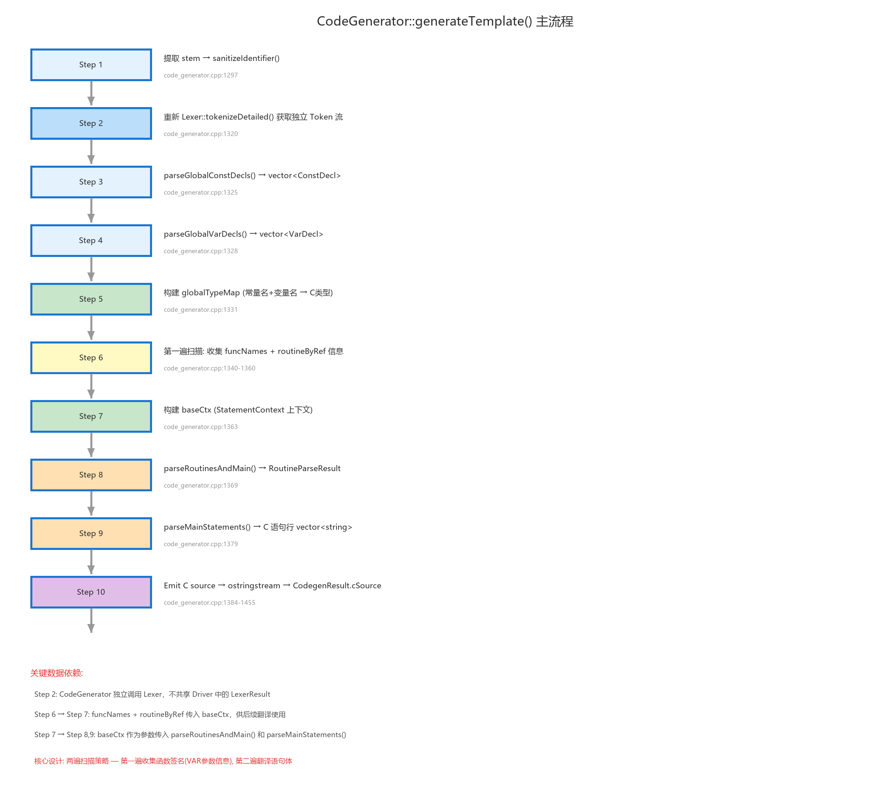
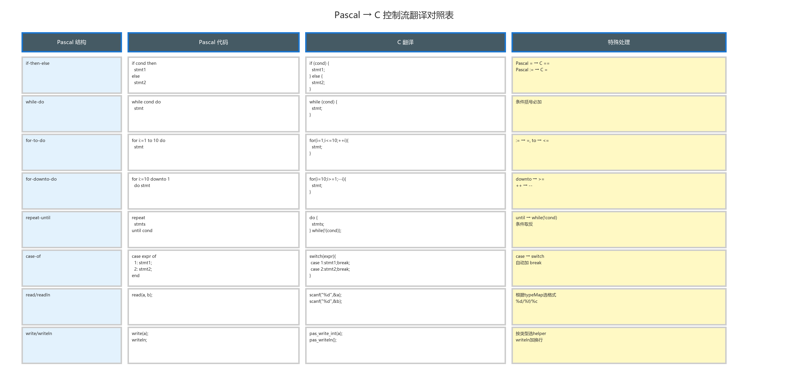
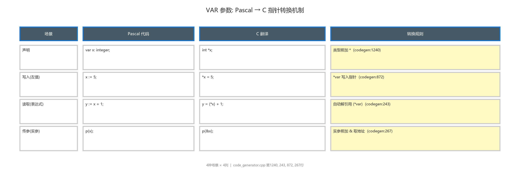

# 代码生成模块 (Code Generator)

## 模块职责

代码生成模块是编译流水线的第四阶段，负责将 Bison 产出的完整 AST（`ProgramNode*`）翻译为等效的 C 语言源代码。模块采用 **AST 直译** 为主：通过 `emitExpr()` / `emitStmt()` 递归遍历并生成 C 代码；在发射 C 代码前串联两类轻量优化（均不引入 IR）：

1. **常量传播（Constant Propagation）**：跟踪「变量 ← 常量」赋值，在后续表达式中用常量替换变量名。  
2. **常量折叠（Constant Folding）**：对已是纯字面量的子表达式在编译期求值。

二者配合时，`n := 3; write(n + 1)` 可先传播为 `write(3 + 1)`，再折叠为 `write(4)`。类型信息、函数签名等由 `buildContext()` 从 AST 声明节点一次性获取。

## 公开接口与文件结构

| 文件 | 行数 | 职责 |
|------|------|------|
| `code_generator.h` | 26 | `CodegenResult` 结构体 + `CodeGenerator` 类公开接口 |
| `code_generator.cpp` | 791 | 全部代码生成逻辑：`CodeGenContext` + AST 遍历发射函数族 |

```cpp
class CodeGenerator {
public:
    CodegenResult generate(const ParserResult& parseResult) const;
    CodegenResult generateTemplate(const std::string& inputPath) const;
    static std::string sanitizeIdentifier(const std::string& rawName);
};
```

`generate()` 是主入口，接收 `ParserResult`（含完整 AST），由 `CompilerDriver` 直接调用。`generateTemplate()` 是便捷包装——内部自行 lex + parse 后调用 `generate()`，用于独立测试。

## 代码生成上下文

代码生成器在匿名 namespace 内定义了单一的 `CodeGenContext` 结构体，所有类型和函数元数据均从中获取：

```cpp
struct CodeGenContext {
    std::string currentFuncName;
    std::string currentFuncRetVar;          // "__ret_funcname"
    std::unordered_map<std::string, std::string> typeMap;
    std::unordered_set<std::string> allRoutines;
    std::unordered_map<std::string, std::string> routineRetType;
    std::unordered_map<std::string, std::vector<bool>> routineByRef;
    std::unordered_set<std::string> byRefParams;
    // 常量传播（文档设计）：当前作用域内「变量 → 常量值」
    std::unordered_map<std::string, FoldedLiteral> constEnv;
    ConstEnvScope constEnvScope;  // 复合语句/过程体 push/pop
};
```

> `FoldedLiteral` 与常量折叠共用，见「AST 层常量折叠优化」参考实现。

### 从 AST 构建上下文

`buildContext(ProgramNode*, CodeGenContext&)` 在生成开始前遍历 AST 的声明部分填充上下文：常量/变量 → `typeMap`，例程 → `allRoutines` + `routineRetType` + `routineByRef`。不再需要手动扫描 Token 流。

## 文件结构

| 文件 | 行数 | 职责 |
|------|------|------|
| `code_generator.h` | 20 | `CodegenResult` 结构体 + `CodeGenerator` 类公开接口 |
| `code_generator.cpp` | 791 | 全部代码生成逻辑：`CodeGenContext` 上下文 + AST 遍历发射函数族（`emitExpr`/`emitStmt`/`emitRoutine` 等）|

## 公开接口

```cpp
// code_generator.h:6-10
struct CodegenResult {
    bool ok = false;           // 代码生成是否成功
    std::string message;       // 成功时为 "ok"，失败时为错误描述
    std::string cSource;       // 生成的完整 C 语言源代码字符串
};

// code_generator.h:12-18
class CodeGenerator {
public:
    CodegenResult generateTemplate(const std::string& inputPath) const;
private:
    static std::string sanitizeIdentifier(const std::string& rawName);
};
```

`sanitizeIdentifier()` 用于处理文件名中的特殊字符（如将 `01_features` 处理为合法的 C 标识符前缀）。

## 内部数据结构

代码生成器不再使用自定义的结构体（`ConstDecl`/`VarDecl`/`RoutineDecl` 等），而是直接使用 AST 节点（`ConstDeclNode`/`VarDeclNode`/`RoutineNode` 等）。唯一自定义的结构体是类型发射的辅助结构：

```cpp
struct TypeEmit {
    std::string cType;   // 元素 C 类型，如 "int"、"float"、"char"
    std::string suffix;  // C 数组后缀，如 "[101]" 或 "[5][10]"
};
```

`emitTypeNode(TypeNode*)` 递归处理类型 AST 节点返回 `TypeEmit`。`BasicTypeNode` 直接映射，`ArrayTypeNode` 递归处理元素类型并逐维追加 `[high+1]` 后缀。

## 主流程：generate()



```
generate(parserResult)
├─ buildContext(prog, ctx)           // 从 AST 提取类型/函数信息到 CodeGenContext
├─ emitPreamble(out)                 // #include <stdio.h> <stdbool.h> + 8 个 I/O helper
├─ emitGlobalConsts(body, out)       // #define 或 static const float
├─ emitGlobalVars(body, ctx, out)    // 类型 变量名[后缀] = 初值;
├─ emitForwardDecl(routine × N)      // 前向声明所有例程
├─ emitRoutine(routine × N, ctx)     // 逐例程定义（递归处理嵌套子例程）
└─ emitMain(body, ctx, out)          // int main(void) { ... return 0; }
```

## 各子模块详细设计

### 类型映射

```cpp
// code_generator.cpp:70-78
std::string mapTypeTokenToC(TokenType type) {
    case KwInteger → "int"
    case KwReal    → "float"
    case KwBoolean → "int"    // C 无原生 bool 类型，用 int 替代 (0/1)
    case KwChar    → "char"
    default        → ""       // 未识别的类型名返回空
}
```

### 数组类型解析

```cpp
// code_generator.cpp:83-136
parseArrayTypeToC(tokens, i, outLow, outHigh, outSuffix) → 元素 C 类型
    // 输入 Token 序列: array, [, 1, .., 10, ,, 1, .., 5, ], of, integer
    // 解析过程:
    //   1. consume 'array' 关键字
    //   2. 循环解析 [low..high, low..high, ...]
    //      - 支持负数下标 (前导 + / -)
    //      - 每维计算: sz = high + 1 (C 数组 0-based 索引补偿)
    //      - outSuffix 累积: "[10][5]"
    //   3. consume 'of' 关键字
    //   4. 解析元素类型 Token (mapTypeTokenToC)
    // 输出:
    //   元素类型: "int"
    //   outLow="1", outHigh="10", outSuffix="[10][5]"
```

关键设计细节：Pascal 数组 `array[1..10] of integer` 中，索引范围是 1 到 10（10 个元素）。由于生成的 C 代码中直接使用 Pascal 索引（不做索引偏移），C 数组必须声明为 `int arr[11]`（索引 0..10，其中索引 10 对应 Pascal 的索引 10）。因此数组尺寸计算公式为 `high + 1` 而非 `high - low + 1`。

### 表达式发射

`emitExpr(ExprNode*, ctx)` 是代码生成器的核心递归函数，通过 `dynamic_cast` 分发到五种表达式节点：

**BinaryExprNode**：运算符映射（`"="`→`"=="`, `"<>"`→`"!="`, `"and"`→`"&&"`, `"or"`→`"||"`, `"div"`→`"/"`, `"mod"`→`"%"`），整体包括号保留 Pascal 优先级。

**UnaryExprNode**：`not` 根据操作数是否为布尔表达式选择 `!` 或 `~`；一元 `+`/`-` 后加空格防止 `--`/`++` 歧义。

**LiteralNode**：`Int`/`Real` 直接输出 raw；`Char` 保留引号；`Str` 转换为 C 双引号且转义；`Bool` 映射为 `1`/`0`。

**VarExprNode**：函数名重定向到 `__ret_` 变量；无参函数自动补 `()`；VAR 参数自动解引用 `(*name)`；遍历 `parts` 处理下标/字段访问。

**CallExprNode**：发射为 `name ( arg1, arg2 )`，查询 `routineByRef` 为 VAR 参数实参加 `&`。

#### 运算符映射表

| Pascal | C |
|--------|---|
| `div` | `/` |
| `mod` | `%` |
| `and` | `&&` |
| `or` | `||` |
| `not` | `!` 或 `~` |
| `=` | `==` |
| `<>` | `!=` |

## Pascal → C 控制流映射

代码生成器支持 7 种控制流结构的翻译。下图以对照表形式展示每种结构从 Pascal 到 C 的完整映射关系。



### if 语句

```cpp
// code_generator.cpp:578-595
// Pascal: if cond then stmt1 else stmt2
// C:      if (cond) { stmt1 } else { stmt2 }
```

### while 语句

```cpp
// code_generator.cpp:597-607
// Pascal: while cond do stmt
// C:      while (cond) { stmt }
```

### for 语句

```cpp
// code_generator.cpp:609-641
// Pascal: for i := 1 to 10 do stmt
// C:      for (i = 1; i <= 10; ++i) { stmt }
// Pascal: for i := 10 downto 1 do stmt
// C:      for (i = 10; i >= 1; --i) { stmt }
```

### repeat-until 语句

```cpp
// code_generator.cpp:643-659
// Pascal: repeat stmts until cond
// C:      do { stmts } while (!(cond));
// 关键：Pascal 的 until 条件为真时退出，C 的 while 条件为真时继续 → 条件取反
```

### case 语句

```cpp
// code_generator.cpp:665-717
// Pascal: case expr of   1, 2: stmt1;   3: stmt2   end
// C:      switch (expr) { case 1: case 2: stmt1; break; case 3: stmt2; break; }
// Pascal 的逗号分隔多值 → C 的 case 穿透（fall-through）
// 每个分支自动加 break
```

### read/readln 语句

```cpp
// code_generator.cpp:746-769
// Pascal: read(a, b)
// C:      scanf("%d", &a); scanf("%d", &b);
// 根据 typeMap 查找变量类型选择格式串
// 格式串选择: int→"%d", float→"%f", char→" %c"
```

### write/writeln 语句

```cpp
// code_generator.cpp:811-829
// Pascal: write(a)     → pas_write_int(a);
// Pascal: writeln(a)   → pas_write_int(a); pas_writeln();
// 通过 inferWriteType() 判断参数类型:
//   float → pas_write_real()
//   char  → pas_write_char()
//   其他   → pas_write_int()
```

### 赋值语句

```cpp
// code_generator.cpp:857-876
parseAssignmentStatement():
    // 1. collectLhsUntilAssign() 收集 ':=' 左侧（处理多维下标逗号→"]["）
    // 2. parseExpressionUntil()  收集右侧表达式
    // 3. 特殊处理：函数内部 funcname := expr → __ret_funcname = expr;
    // 4. VAR 参数作为左值: *param = rhs
```

## VAR 参数指针转换机制

VAR 参数是 Pascal 的重要特性，允许过程/函数修改传入的实参。在 C 中通过指针模拟。下图展示了 VAR 参数在四种场景下的翻译对照。



四种场景及对应的 C 代码转换：

### 场景 1：声明

```
Pascal: procedure p(var x: integer);
C:      void p(int *x)                    // 指针类型
```

`parseRoutineAt()` 在声明例程参数时，若 `RoutineParam.byRef == true`，则将参数类型声明为 `int*`（在 C 类型后加 `*`）。

### 场景 2：写入（作为左值）

```
Pascal: x := 5;           (x 是 VAR 参数)
C:      *x = 5;            // 写指针
```

`parseAssignmentStatement()` 检测左值是否为 VAR 参数（通过 `varParams` 集合），若是则将赋值翻译为 `*param = rhs`。

### 场景 3：读取（表达式内）

```
Pascal: y := x + 1;       (x 是 VAR 参数)
C:      y = (*x) + 1;     // 解引用
```

`parseExpressionUntil()` 检测当前标识符是否为 VAR 参数（`varParams->count(nm) > 0`），若是则自动包装为 `(*paramName)`。

### 场景 4：传参调用

```
Pascal: q(x);             (q 的对应位置是 VAR 参数)
C:      q(&x);            // 取地址
```

`parseExpressionUntil()` 在处理函数调用时，查询 `routineByRef` 判断对应参数位置是否为 VAR，若是则在实参前加 `&`。

## 例程翻译

### 过程/函数定义翻译

```cpp
// code_generator.cpp:1094-1196
parseRoutineAt(tokens, start, outRoutine, nextIndex, baseCtx)
    // 1. 解析头部: procedure/function name(params): returnType
    // 2. 定位 ';' 后 → parseVarDeclsInRange() 解析局部变量
    // 3. 定位 begin...end → parseCompoundBody() 翻译例程体
    // 4. 构建 per-routine 上下文
    //    - routineTypeMap: global + params + locals
    //    - routineVarParams: 当前例程的 VAR 参数名集合
    //    - routineCtx.currentFunctionName = routineName
    // 5. 函数自动补 return 0; 兜底
```

函数返回值的实现采用了"返回值变量"模式：

```
Pascal: function add1(v: integer): integer;
        begin add1 := v + 1 end;
C:      int add1(int v) {
            int __ret_add1 = 0;
            __ret_add1 = v + 1;
            return __ret_add1;
        }
```

函数体开头自动声明 `int __ret_add1 = 0;`（或 float/char 对应类型），函数体内的 `add1 := expr` 被翻译为 `__ret_add1 = expr;`，函数末尾自动追加 `return __ret_add1;`。

### 运行时 I/O 辅助函数

代码生成器自动生成 7 个静态辅助函数（`code_generator.cpp:1384-1455` 的 Emit 阶段）：

```c
static int    pas_read_int(void)    { int v; scanf("%d", &v); return v; }
static float  pas_read_real(void)   { float v; scanf("%f", &v); return v; }
static char   pas_read_char(void)   { char v; scanf(" %c", &v); return v; }
static void   pas_write_int(int v)  { printf("%d", v); }
static void   pas_write_real(float v) { printf("%g", v); }
static void   pas_write_char(char v) { printf("%c", v); }
static void   pas_writeln(void)     { printf("\n"); }
```

这些函数封装了 `scanf`/`printf` 的参数传递和格式串选择，使翻译后的 C 代码保持简洁（`pas_write_int(a)` vs `printf("%d", a)`）。同时解决了 Pascal 的 `read`（无换行）与 `readln`（有换行）之间的差异。

## 各子模块详细设计

### 类型映射

```cpp
// [code_generator.cpp:70-78]
mapTypeTokenToC(TokenType):
    KwInteger → "int"
    KwReal    → "float"
    KwBoolean → "int"    // C 无原生 bool，用 int 替代
    KwChar    → "char"
```

### 数组类型解析

```cpp
// [code_generator.cpp:83-136]
parseArrayTypeToC(tokens, i, outLow, outHigh, outSuffix) → 元素 C 类型
    // 输入: array[1..10, 1..5] of integer
    // 输出: 元素类型 "int"
    //       outLow="1", outHigh="10"
    //       outSuffix="[10][5]"
    // 同时计算各维尺寸: sz = high - low + 1
```

### 全局常量解析

```cpp
// [code_generator.cpp:318-403]
parseGlobalConstDecls(tokens) → vector<ConstDecl>
    // 跳过 program header，定位到 const 区
    // 逐组解析 name = value
    // 支持: integer, real (+/-), char, boolean, identifier(引用其他常量)
    // 遇到 KwVar/KwProcedure/KwFunction/KwBegin 停止
```

### 全局变量解析

```cpp
// [code_generator.cpp:409-484]
parseGlobalVarDecls(tokens) → vector<VarDecl>
    // 定位到 var 区
    // 支持逗号分隔的多变量声明: a, b, c: integer
    // 支持 array 类型: 委托给 parseArrayTypeToC()
    // 遇到 KwBegin/KwProcedure/KwFunction 停止
```

### 局部变量解析

```cpp
// [code_generator.cpp:486-555]
parseVarDeclsInRange(tokens, start, endExclusive) → vector<VarDecl>
    // 在 Token 范围内（子程序体内）解析 var 声明
    // 逻辑与全局变量解析一致，但限制在 [start, endExclusive) 范围
```

### 表达式翻译

#### 核心：parseExpressionUntil()

```cpp
// [code_generator.cpp:191-302]
parseExpressionUntil(tokens, i, stopTokens, funcNames, varParams, routineByRef) → string
    // 递归下降收集表达式片段，遇到 stopTokens 停止
    // 处理括号/中括号嵌套深度
    // Pascal → C 转换要点：
    //   - 多维数组下标逗号替换: a[i,j] → a[i][j]                     [line 224-228]
    //   - 'not' 运算符: 跟 '(' 时用 '!', 否则用 '~' (位取反)         [line 231-236]
    //   - VAR 参数读取: 自动解引用 → "(*paramName)"                  [line 243-247]
    //   - 函数调用有 VAR 参数位置: 实参加 "&"                        [line 250-283]
    //   - 无参函数调用(无括号): 自动补 "()"                           [line 287-291]
    //   - 字面量: Boolean → 1/0                                     [line 142-173]
```

#### Token → 表达式片段映射

```cpp
// [code_generator.cpp:142-174]
tokenToExprPiece(tok) → string
    Div   → "/"    (整数除法，C 中退化为 /)
    Mod   → "%"
    And   → "&&"
    Or    → "||"
    Not   → "!"    (在 parseExpressionUntil 中进一步判断 ! 或 ~)
    Assign → 不在表达式中出现
```

### 语句发射

`emitStmt(StmtNode*, lvl, ctx, out)` 是语句翻译的分发器，通过 `dynamic_cast` 分发到 13 种语句节点：

```cpp
emitStmt(StmtNode* s):
    CompoundStmtNode → emitCompound()      // 递归 emitStmt
    AssignStmtNode   → 左值处理 + emitExpr(rhs) + ";"
    CallStmtNode     → "name(args);"
    IfStmtNode       → "if (cond) { then_ } else { else_ }"
    CaseStmtNode     → "switch (expr) { case val: ... break; }"
    WhileStmtNode    → "while (cond) { body }"
    RepeatStmtNode   → "do { body } while (!(cond));"
    ForStmtNode      → "for (i = A; i <= B; ++i)" 或 "for (i = A; i >= B; --i)"
    ReadStmtNode     → "scanf(fmt, &var);" × N
    WriteStmtNode    → "pas_write_xxx(expr);" × N
    BreakStmtNode    → "break;"
    ContinueStmtNode → "continue;"
    ExitStmtNode     → "return;" 或 "return expr;"
```

#### if 语句

```cpp
// [code_generator.cpp:578-595]
parseIfStatement():
    if (cond) {           // Pascal: if cond then stmt1 else stmt2
        stmt1             // C:      if (cond) { stmt1 } else { stmt2 }
    } else {
        stmt2
    }
```

#### while 语句

```cpp
// [code_generator.cpp:597-607]
parseWhileStatement():
    while (cond) {        // Pascal: while cond do stmt
        stmt              // C:      while (cond) { stmt }
    }
```

#### for 语句

```cpp
// [code_generator.cpp:609-641]
parseForStatement():
    // Pascal: for i := 1 to 10 do stmt
    // C:      for (i = 1; i <= 10; ++i) { stmt }
    //
    // Pascal: for i := 10 downto 1 do stmt
    // C:      for (i = 10; i >= 1; --i) { stmt }
```

#### repeat-until 语句

```cpp
// [code_generator.cpp:643-659]
parseRepeatStatement():
    do {                  // Pascal: repeat stmts until cond
        stmts             // C:      do { stmts } while (!(cond));
    } while (!(cond));
```

#### case 语句

```cpp
// [code_generator.cpp:665-717]
parseCaseStatement():
    switch (expr) {       // Pascal: case expr of
        case val1:        //           1, 2: stmt1
        case val2:        //           3: stmt2
            stmt1         //         end
            break;        // C:      switch (expr) {
        case val3:        //           case 1: case 2:
            stmt2         //               stmt1; break;
            break;        //           case 3:
    }                     //               stmt2; break;
                          //         }
```

#### read/readln 语句

```cpp
// [code_generator.cpp:746-769]
parseReadStatement():
    // Pascal: read(a, b)
    // C:      scanf("%d", &a); scanf("%d", &b);
    // 根据 typeMap 查找变量类型选择格式串:
    //   int   → "%d"
    //   float → "%f"
    //   char  → " %c"  (前导空格跳过空白)
```

#### write/writeln 语句

```cpp
// [code_generator.cpp:811-829]
parseWriteStatement(withNewline):
    // Pascal: write(a, b)    → pas_write_int(a); pas_write_int(b);
    // Pascal: writeln(a)     → pas_write_int(a); pas_writeln();
    //
    // 通过 inferWriteType() 判断参数类型，选择对应的 helper:
    //   float → pas_write_real()
    //   char  → pas_write_char()
    //   其他   → pas_write_int()
```

#### 类型推断

```cpp
// [code_generator.cpp:772-809]
inferWriteType(expr, typeMap) → "float" | "char" | "int"
    // 1. 查 typeMap（去除括号和下标部分后查询）
    // 2. 启发式：含 '.' 且无 '['/'(' → float
    // 3. 以单引号开头 → char
    // 4. 默认 → int
```

#### 赋值语句

```cpp
// [code_generator.cpp:857-876]
parseAssignmentStatement():
    // 1. collectLhsUntilAssign() 收集 ':=' 左侧 (处理多维下标逗号→"][")
    // 2. parseExpressionUntil()  收集右侧表达式
    // 3. 特殊处理：函数内部 funcname := expr → return expr;
    // 4. VAR 参数作为左值: *param = rhs (写入指针)
```

#### 过程/函数调用语句

```cpp
// [code_generator.cpp:878-933]
parseCallStatement():
    // 1. 有括号: name(args...)
    //    - 如果例行程序有 VAR 参数: 为对应实参加 "&" 前缀
    //    - 否则直接按表达式列表翻译
    // 2. 无括号: name() → 无参调用
```

### 例程（过程/函数）翻译

#### 参数解析

```cpp
// [code_generator.cpp:1041-1092]
parseRoutineParams(tokens, i) → vector<RoutineParam>
    // 解析 (var a, b: integer; c: real)
    // 每组参数: [var] id_list : type
```

#### 单个例程解析

```cpp
// [code_generator.cpp:1094-1196]
parseRoutineAt(tokens, start, outRoutine, nextIndex, baseCtx)
    // 1. 解析头部: procedure/function name(params): returnType
    // 2. 定位 ';' 后的 var 声明区 → parseVarDeclsInRange()
    // 3. 定位 begin...end 体 → parseCompoundBody()
    // 4. 构建 per-routine 上下文 (localTypeMap, routineVarParams)
    // 5. 函数自动补 return 0; 兜底                           [line 1178-1187]
```

#### 所有例程定位

```cpp
// [code_generator.cpp:1198-1230]
parseRoutinesAndMain(tokens, baseCtx) → RoutineParseResult
    // 第一遍扫描 token 流：
    //   - 遇到 procedure/function → parseRoutineAt() 收集到 routines[]
    //   - 遇到 begin → 记录 mainBeginIndex 并停止
```

### C 代码输出

#### 例程定义输出

```cpp
// [code_generator.cpp:1251-1285]
emitRoutineDefinitions(out, routines)
    // 为每个例程输出:
    //   returnType name(params) {
    //       局部变量声明 (带初始化)
    //       函数体语句
    //   }
    // 局部变量初始化策略:
    //   char → '\0', float → 0.0f, 其他 → 0
```

#### 主输出组装

```cpp
// [code_generator.cpp:1384-1455]
// 1. 文件头: /* Auto-generated by pascc. */
// 2. #include <stdio.h>, #include <stdbool.h>
// 3. Runtime I/O helpers (static 函数):
//      pas_read_int()      — scanf("%d", &v)
//      pas_read_real()     — scanf("%f", &v)
//      pas_read_char()     — scanf(" %c", &v)
//      pas_write_int()     — printf("%d", v)
//      pas_write_real()    — printf("%g", (double)v)
//      pas_write_char()    — printf("%c", v)
//      pas_writeln()       — printf("\n")
// 4. 常量: int/char → #define; float → static const float
// 5. 全局变量: 带初始化值
// 6. 前向声明
// 7. 例程定义
// 8. int main(void) { ... return 0; }
```

### sanitizeIdentifier()

```cpp
// [code_generator.cpp]
sanitizeIdentifier(rawName)
    // 将文件名中的非字母数字/下划线字符替换为 '_'
    // 若以数字开头则前导 '_'
```

## AST 层常量折叠优化（Constant Folding）

### 设计定位

常量折叠是本编译器在**不引入 IR** 的前提下实现的轻量级优化：在 `emitExpr()` 发射 C 表达式字符串之前，先对 AST 子树尝试 **编译期求值**。若子表达式在语义上等价于单个字面量，则直接生成该字面量的 C 文本，而不再生成 `(3 + 4 * 2)` 这类运行时运算。

| 对比项 | 完整 IR + 优化遍 | 本项目的常量折叠 |
|--------|------------------|------------------|
| 实现位置 | IR 层 | AST 层，`code_generator.cpp` |
| 工作量 | 大（基本块、数据流） | 小（仅处理字面量组合） |
| 与直译关系 | 替换后端 | 嵌在 `emitExpr` 入口，不改变整体架构 |
| 目标 | 性能 + 体积 | 简化生成代码、答辩可演示「有优化」 |

### 调用时机

```
emitExpr(ExprNode* e, CodeGenContext& ctx)
  │
  ├─► tryFoldExpr(e)          // 若返回 optional<string>，直接作为 C 片段返回
  │
  └─► 原有 dynamic_cast 分支   // Binary / Unary / Literal / Var / Call ...
```

折叠发生在 **代码生成阶段**，语义分析已通过；不改变 AST 节点本身，只影响**本次发射的字符串**。折叠失败时行为与未做优化时完全一致（透明降级）。

### 核心函数（实现约定）

| 函数 | 职责 |
|------|------|
| `tryFoldExpr(ExprNode* e)` | 对外入口：按节点类型分发 |
| `tryFoldBinary(BinaryExprNode* bin)` | 两侧均为 `LiteralNode` 时按 `bin->op` 计算 |
| `tryFoldUnary(UnaryExprNode* un)` | 操作数为字面量时处理一元 `+` / `-` / `not` |
| `formatFoldedLiteral(...)` | 将求值结果格式化为 C 字面量文本 |

### 参考实现（文档用代码）

以下代码展示常量折叠在 `code_generator.cpp` 匿名命名空间中的典型写法，与 `emitExpr` 配合使用。**本节为设计说明与答辩引用，便于理解算法；工程实现以仓库源码为准。**

#### 1. 辅助：字面量解析与格式化

```cpp
#include <optional>
#include <cmath>

struct FoldedLiteral {
    LiteralKind kind = LiteralKind::Int;
    long long   iVal = 0;
    double      fVal = 0.0;
    bool        isFloat = false;
};

// 从 LiteralNode 读出可参与运算的数值
std::optional<FoldedLiteral> literalToFolded(const LiteralNode* lit) {
    if (!lit) return std::nullopt;
    FoldedLiteral f;
    if (lit->litKind == LiteralKind::Int) {
        f.kind = LiteralKind::Int;
        f.iVal = std::stoll(lit->raw);
        f.isFloat = false;
        return f;
    }
    if (lit->litKind == LiteralKind::Real) {
        f.kind = LiteralKind::Real;
        f.fVal = std::stod(lit->raw);
        f.isFloat = true;
        return f;
    }
    if (lit->litKind == LiteralKind::Bool) {
        f.kind = LiteralKind::Int;
        f.iVal = (lit->raw == "true") ? 1 : 0;
        f.isFloat = false;
        return f;
    }
    return std::nullopt; // char / string 不参与算术折叠
}

// 折叠结果 → 可直接写入 C 的文本
std::string formatFoldedLiteral(const FoldedLiteral& v) {
    if (v.isFloat) {
        std::ostringstream os;
        os << v.fVal;          // 实数按 float 语义输出，不加 f 后缀亦可
        return os.str();
    }
    return std::to_string(v.iVal);
}
```

#### 2. 二元表达式折叠 `tryFoldBinary`

```cpp
std::optional<std::string> tryFoldBinary(BinaryExprNode* bin) {
    auto* l = dynamic_cast<LiteralNode*>(bin->left);
    auto* r = dynamic_cast<LiteralNode*>(bin->right);
    if (!l || !r) return std::nullopt;

    auto fl = literalToFolded(l);
    auto fr = literalToFolded(r);
    if (!fl || !fr) return std::nullopt;

    const std::string& op = bin->op;
    FoldedLiteral out;
    const bool useFloat = fl->isFloat || fr->isFloat;

    if (useFloat) {
        double a = fl->isFloat ? fl->fVal : static_cast<double>(fl->iVal);
        double b = fr->isFloat ? fr->fVal : static_cast<double>(fr->iVal);
        out.isFloat = true;
        out.kind = LiteralKind::Real;
        if      (op == "+") out.fVal = a + b;
        else if (op == "-") out.fVal = a - b;
        else if (op == "*") out.fVal = a * b;
        else if (op == "/") { if (b == 0.0) return std::nullopt; out.fVal = a / b; }
        else if (op == "=")  { out.isFloat = false; out.iVal = (a == b) ? 1 : 0; }
        else if (op == "<>") { out.isFloat = false; out.iVal = (a != b) ? 1 : 0; }
        else if (op == "<")  { out.isFloat = false; out.iVal = (a < b) ? 1 : 0; }
        else if (op == "<=") { out.isFloat = false; out.iVal = (a <= b) ? 1 : 0; }
        else if (op == ">")  { out.isFloat = false; out.iVal = (a > b) ? 1 : 0; }
        else if (op == ">=") { out.isFloat = false; out.iVal = (a >= b) ? 1 : 0; }
        else return std::nullopt;
    } else {
        long long a = fl->iVal, b = fr->iVal;
        out.isFloat = false;
        out.kind = LiteralKind::Int;
        if (op == "+") out.iVal = a + b;
        else if (op == "-") out.iVal = a - b;
        else if (op == "*") out.iVal = a * b;
        else if (op == "div") {
            if (b == 0) return std::nullopt;
            out.iVal = a / b;   // Pascal div：向零截断，C 整数除一致
        }
        else if (op == "mod") {
            if (b == 0) return std::nullopt;
            out.iVal = a % b;
        }
        else if (op == "and") out.iVal = (a != 0 && b != 0) ? 1 : 0;
        else if (op == "or")  out.iVal = (a != 0 || b != 0) ? 1 : 0;
        else if (op == "=")  out.iVal = (a == b) ? 1 : 0;
        else if (op == "<>") out.iVal = (a != b) ? 1 : 0;
        else if (op == "<")  out.iVal = (a < b) ? 1 : 0;
        else if (op == "<=") out.iVal = (a <= b) ? 1 : 0;
        else if (op == ">")  out.iVal = (a > b) ? 1 : 0;
        else if (op == ">=") out.iVal = (a >= b) ? 1 : 0;
        else return std::nullopt;
    }
    return formatFoldedLiteral(out);
}
```

> 说明：Pascal 中 `div` 在 AST 里记为 `"div"`（见 `parser_bison.y` 的 `mulop`），折叠分支需与之一致。

#### 3. 一元表达式折叠 `tryFoldUnary`

```cpp
std::optional<std::string> tryFoldUnary(UnaryExprNode* un) {
    // 先尝试折叠子树（支持 - - 3 这类嵌套）
    std::string foldedChild;
    if (auto inner = tryFoldExpr(un->operand)) {
        foldedChild = *inner;
    } else if (auto* lit = dynamic_cast<LiteralNode*>(un->operand)) {
        if (auto f = literalToFolded(lit))
            foldedChild = formatFoldedLiteral(*f);
        else
            return std::nullopt;
    } else {
        return std::nullopt;
    }

    // 将 foldedChild 再解析回数值（或直接从 LiteralNode 走）
    auto* lit = dynamic_cast<LiteralNode*>(un->operand);
    if (!lit && foldedChild.empty()) return std::nullopt;

    FoldedLiteral v;
    if (lit) {
        auto opt = literalToFolded(lit);
        if (!opt) return std::nullopt;
        v = *opt;
    } else {
        // 简化：子节点已是折叠后的整数字面量字符串
        v.iVal = std::stoll(foldedChild);
        v.isFloat = (foldedChild.find('.') != std::string::npos);
        if (v.isFloat) v.fVal = std::stod(foldedChild);
    }

    const std::string& op = un->op;
    if (op == "+") return formatFoldedLiteral(v);
    if (op == "-") {
        if (v.isFloat) { v.fVal = -v.fVal; return formatFoldedLiteral(v); }
        v.iVal = -v.iVal; return formatFoldedLiteral(v);
    }
    if (op == "not") {
        if (v.isFloat) return std::nullopt;
        v.iVal = ~v.iVal;   // 整数 not → 位取反，与 emitExpr 中 ~ 一致
        return formatFoldedLiteral(v);
    }
    return std::nullopt;
}
```

#### 4. 总入口 `tryFoldExpr` 与 `emitExpr` 接入

```cpp
std::optional<std::string> tryFoldExpr(ExprNode* e) {
    if (!e) return std::nullopt;
    if (auto* lit = dynamic_cast<LiteralNode*>(e)) {
        if (auto f = literalToFolded(lit))
            return formatFoldedLiteral(*f);
        return std::nullopt;
    }
    if (auto* bin = dynamic_cast<BinaryExprNode*>(e)) {
        // 自底向上：先折叠子表达式，再尝试整棵二元树
        if (auto l = tryFoldExpr(bin->left)) {
            // 若左右都已折叠为字面量文本，可构造临时 Literal 再 fold；
            // 更简单做法：递归 emitExpr 前对 left/right 做 AST 替换（工程可选）
        }
        return tryFoldBinary(bin);
    }
    if (auto* un = dynamic_cast<UnaryExprNode*>(e))
        return tryFoldUnary(un);
    return std::nullopt;
}

std::string emitExpr(ExprNode* e, const CodeGenContext& ctx) {
    if (!e) return "0";

    // ---------- 常量折叠入口 ----------
    if (auto folded = tryFoldExpr(e))
        return *folded;
    // ---------- 以下为原有直译逻辑 ----------

    if (auto* bin = dynamic_cast<BinaryExprNode*>(e)) {
        // ... BinaryExprNode 分支不变 ...
    }
    // ... UnaryExpr / Literal / Var / Call ...
}
```

#### 5. 自底向上折叠（推荐写法）

对 `3 + 4 * 2`，仅当 `tryFoldBinary` 要求**两侧都是 LiteralNode** 时，应先递归折叠子节点，再把结果“写回”为字面量再折叠父节点。文档推荐流程：

```cpp
std::optional<std::string> tryFoldBinaryDeep(BinaryExprNode* bin) {
    ExprNode* L = bin->left;
    ExprNode* R = bin->right;

    // 子树若能折叠，用折叠后的字符串构造新的 LiteralNode（或临时包装）
    if (auto fl = tryFoldExpr(L)) { /* 将 *fl 视为左操作数数值 */ }
    if (auto fr = tryFoldExpr(R)) { /* 将 *fr 视为右操作数数值 */ }

    // 当 L、R 均为 LiteralNode（或已等价于常量）时调用 tryFoldBinary(bin)
    return tryFoldBinary(bin);
}
```

答辩时可强调：**折叠顺序与 Pascal 运算符优先级一致**——`emitExpr` 递归自然先处理深层 `4 * 2`，折叠为 `8` 后，外层 `3 + 8` 再折叠为 `11`。

### 可折叠规则

**二元表达式**（左右子节点必须都是 `LiteralNode`，且类型相容）：

| Pascal 运算符 | 折叠条件 | 求值方式 | 生成示例 |
|---------------|----------|----------|----------|
| `+` `-` `*` | 两侧 `integer` | `int` 算术 | `11` |
| `div` | 两侧 `integer` | 向零截断整数除（与 Pascal 一致） | `2` |
| `mod` | 两侧 `integer`，除数非 0 | `%` | `1` |
| `+` `-` `*` `/` | 至少一侧 `real` | `float` 算术，结果按 `float` 输出 | `3.5` |
| `and` `or` | 两侧为布尔字面量 `0/1` | 逻辑与/或 | `1` 或 `0` |
| `=` `<>` `<` `<=` `>` `>=` | 两侧同类型字面量 | 比较，结果为 `0` 或 `1` | `1` |

**一元表达式**：

| 形式 | 条件 | 结果 |
|------|------|------|
| `- lit` | `lit` 为整数/实数 | 取负 |
| `+ lit` | `lit` 为整数/实数 | 原值 |
| `not lit` | `lit` 为整数 | 按 Pascal 对整数：`~` 语义，即按位取反 |

**不折叠**（保持原样递归 `emitExpr`）：

- 含变量（`VarExprNode`）、函数调用（`CallExprNode`）
- 一侧为字面量、另一侧非常量（如 `3 + n`）
- 除数为 0 的 `div` / `mod`（避免未定义行为，降级为运行时计算或保持原 AST）
- 无法解析的常量名引用（`ConstDecl` 在 AST 中若仍为标识符引用而未内联）

### 工作示例

**Pascal 源码：**

```pascal
a := 3 + 4 * 2;
write(10 div 3);
```

**未优化时可能生成的 C：**

```c
a = (3 + (4 * 2));
pas_write_int((10 / 3));
```

**常量折叠后：**

```c
a = 11;
pas_write_int(3);
```

说明：折叠在 `emitExpr` 内自底向上生效——先折叠 `4 * 2` → `8`，再折叠 `3 + 8` → `11`；`10 div 3` 一次折叠为 `3`。

### 与类型系统的对齐

- Pascal `real` → 折叠结果仍按 **`float`** 语义格式化（与 `basicTypeToCType` 一致，课程要求 Real 译为 `float` 而非 `double`）。
- Pascal `boolean` → 折叠为 C 整数 `0` / `1`，与 `LiteralNode` 布尔发射一致。
- 折叠不改变「功能是否正确」的验收口径：只减少运行时运算，**不要求**与未优化 C 的浮点打印逐位相同（评测以功能正确为主）。

### 常量折叠的限制

- 仅处理**表达式内部**的字面量组合，不跨语句记住变量取值。
- 与常量传播配合后效果更完整（见下一节）。

### 常量折叠测试建议

| 用例 | Pascal 表达式 | 生成 C 中应出现 |
|------|---------------|-----------------|
| CF-01 | `1 + 2 * 3` | `7`（而非 `(1 + (2 * 3))`） |
| CF-02 | `10 div 3` | `3` |
| CF-03 | `a + 1`（含变量） | 仍含 `a`，证明未误折叠 |

---

## AST 层常量传播优化（Constant Propagation）

### 设计定位

**常量传播**解决的是：变量在**某段控制流内**曾被赋为常量，后续使用该变量时不必再生成变量名，而直接使用常量，从而给常量折叠创造机会。

| 对比 | 常量折叠 | 常量传播 |
|------|----------|----------|
| 作用对象 | 表达式树中的运算符与字面量 | 变量名 → 常量值的映射 |
| 典型输入 | `3 + 4 * 2` | `n := 3` 之后的 `n + 1` |
| 典型输出 | `11` | 先 `3 + 1`，再可折叠为 `4` |
| 是否改 AST | 否（仅影响 emit 字符串） | 否（在 emit 时替换 VarExpr） |

与常量折叠一样，发生在 **`emitStmt` / `emitExpr` 遍历过程中**，维护按作用域划分的**常量环境表**，不单独引入 IR。

### 常量环境 `ConstEnv`

在 `CodeGenContext` 中扩展（文档设计）：

```cpp
// 变量名 → 当前已知的常量值（仅当最近一次对该名的赋值是字面量时有效）
std::unordered_map<std::string, FoldedLiteral> constEnv;
```

| 事件 | 对 `constEnv` 的操作 |
|------|----------------------|
| `v := 字面量`（`v` 无下标、非 byRef 左值） | `constEnv[v] = 该字面量` |
| `v := 非常量表达式` | `erase(v)`（变量不再是常量） |
| `read(v)` / 可能改变 `v` 的调用 | `erase(v)` |
| 进入 `for` / `while` 循环体（保守策略） | 可选择清空或快照后恢复 |
| 进入嵌套 `begin..end` | `push` 新一层 map，`end` 时 `pop` |
| 形参、`var` 参数 | 不加入传播（byRef 可被调用方修改） |

### 调用时机（与折叠的顺序）

```
emitStmt(AssignStmt)
  ├─ emitExpr(rhs) 前：对 rhs 中 VarExpr 做 propagate
  ├─ 生成 lhs = rhs;
  └─ 若 rhs 可确定为常量 → 更新 constEnv[lhs]

emitExpr(e)
  ├─ propagateExpr(e)     // VarExpr：查 constEnv，命中则返回 formatFoldedLiteral
  ├─ tryFoldExpr(e)       // 传播后的表达式再折叠
  └─ 原有直译分支
```

**顺序必须是：先传播，后折叠。**

### 工作示例

**Pascal：**

```pascal
n := 3;
m := 10;
write(n + m);
```

| 阶段 | 生成 C（示意） |
|------|----------------|
| 仅直译 | `n = 3; m = 10; pas_write_int((n + m));` |
| + 传播 | `n = 3; m = 10; pas_write_int((3 + 10));` |
| + 折叠 | `n = 3; m = 10; pas_write_int(13);` |

说明：前两行赋值仍保留（正确性）；`write` 实参已被优化。若需连赋值也删掉，属于**死代码消除**，不在本节范围。

### 参考实现（文档用代码）

**本节为设计说明与答辩引用，便于理解算法；工程实现以仓库源码为准。**

#### 1. 在 `VarExprNode` 发射前查表

```cpp
std::optional<std::string> propagateVar(const VarExprNode* var,
                                        const CodeGenContext& ctx) {
    if (!var || !var->parts.empty()) return std::nullopt; // 有下标/字段不传播
    if (ctx.byRefParams.count(var->name)) return std::nullopt;

    auto it = ctx.constEnv.find(var->name);
    if (it == ctx.constEnv.end()) return std::nullopt;

    return formatFoldedLiteral(it->second);
}

std::string emitExpr(ExprNode* e, CodeGenContext& ctx) {
    if (!e) return "0";

    // 1) 常量传播：把已知常量变量替换为字面量文本
    if (auto* var = dynamic_cast<VarExprNode*>(e)) {
        if (auto p = propagateVar(var, ctx))
            return *p;
    }
    if (auto* bin = dynamic_cast<BinaryExprNode*>(e)) {
        // 递归传播子树（文档示意：可先拷贝/改写子树再 fold）
        // ...
    }

    // 2) 常量折叠
    if (auto folded = tryFoldExpr(e))
        return *folded;

    // 3) 原有直译
    // ...
}
```

#### 2. 赋值语句更新环境

```cpp
void emitAssignStmt(AssignStmtNode* as, int lvl, CodeGenContext& ctx, std::ostream& out) {
    const std::string rhsStr = emitExpr(as->rhs, ctx);  // emit 内已做传播+折叠
    // ... 生成 lhs = rhsStr;

    // 若右值在传播/折叠后等价于单一常量，记录到 constEnv
    if (auto* lit = dynamic_cast<LiteralNode*>(as->rhs)) {
        if (auto f = literalToFolded(lit))
            ctx.constEnv[as->varName] = *f;
    } else if (as->varParts.empty()) {
        ctx.constEnv.erase(as->varName);  // 赋值为非常量，取消传播
    }
}
```

更稳妥的做法：在 `emitExpr` 返回后，若返回值可 `stoi`/`stod` 且无变量符号，则写回 `constEnv`；否则 `erase`。

#### 3. 作用域栈（过程/复合语句）

```cpp
struct ConstEnvScope {
    std::vector<std::unordered_map<std::string, FoldedLiteral>> stack;

    void push() { stack.emplace_back(); }
    void pop()  { if (!stack.empty()) stack.pop_back(); }

    std::unordered_map<std::string, FoldedLiteral>& current() {
        return stack.back();
    }
};

void emitCompound(CompoundStmtNode* cs, int lvl, CodeGenContext& ctx, std::ostream& out) {
    ctx.constEnvScope.push();
    for (auto* s : cs->stmts) emitStmt(s, lvl + 1, ctx, out);
    ctx.constEnvScope.pop();
}
```

过程体 `emitRoutine` 入口处 `push` 一层，离开时 `pop`，避免内层临时变量污染外层。

#### 4. 保守规则（避免错误优化）

```cpp
bool shouldInvalidate(const StmtNode* s) {
    if (dynamic_cast<const ReadStmtNode*>(s)) return true;
    if (dynamic_cast<const ForStmtNode*>(s))   return true;  // 循环变量变化
    if (dynamic_cast<const CallStmtNode*>(s))  return true;  // 可能改全局/byRef
    return false;
}

void emitStmt(StmtNode* s, int lvl, CodeGenContext& ctx, std::ostream& out) {
    if (shouldInvalidate(s))
        ctx.constEnv.clear();  // 保守：清空后仍安全，仅少优化
    // ...
}
```

### 与全局常量、形参的区别

| 名称来源 | 是否走 `constEnv` | 处理方式 |
|----------|-------------------|----------|
| `const c = 1` | 否 | 编译期已是 `#define` / `static const`，`emitExpr` 直接展开名字 |
| 形参 `x` | 否 | 每次调用实参不同 |
| 局部 `n := 3` | 是 | `constEnv["n"] = 3` |
| `n := n + 1` | 先 erase 再赋 | 自增后不再是常量 |

### 常量传播的限制

- 不跨过程传播（除非做过程间分析）。
- 不处理数组元素 `a[i]` 的常量下标传播（可扩展为 `constEnv` 存 `a[2]=5`）。
- 循环内对归纳变量的传播需更复杂分析；默认在循环前 **清空或冻结** `constEnv`。
- 不做 **代数化简**、**死代码消除**。

### 常量传播测试建议

| 用例 | Pascal | 优化后 `write` 实参应接近 |
|------|--------|---------------------------|
| CP-01 | `n:=3; write(n+1)` | `4` 或 `pas_write_int(4)` |
| CP-02 | `n:=3; n:=5; write(n)` | `5` |
| CP-03 | `read(n); write(n+1)` | 仍含 `n`（read 后已 erase） |

### 两类优化的协作小结


## 代码生成优化的总体限制与后续方向

- **已实现（文档设计）**：AST 层常量传播 + 常量折叠。  
- **未实现**：代数化简、死代码消除、公共子表达式、IR 层全局优化。  
- **后端**：GCC 对生成 C 的进一步优化。

若引入 IR，可将 `constEnv` 与折叠规则迁移为 SSA 上的常量传播/折叠遍；现阶段保持在 AST 遍历中，便于测试与答辩。

## 关键技术要点

### 声明信息收集（`buildContext` + 前向声明）

当前实现**不再**对 Token 流做两遍扫描。流程为：

1. **`buildContext(prog, ctx)`**：遍历 `BlockNode` 中的 `ConstDeclNode` / `VarDeclNode` / `RoutineNode`，填充 `typeMap`、`allRoutines`、`routineByRef` 等。
2. **`emitForwardDecl`**：为所有顶层例程输出 C 前向声明，解决 Pascal 允许先调用后定义、而 C 需要已知签名的问题。
3. **`emitRoutine` / `emitMain`**：在已有上下文下生成函数体与主程序。

嵌套例程在父函数 `}` 之后提升为顶层 C 函数，与常量折叠无关，但同属代码生成阶段的结构化处理。

### VAR 参数处理

这是 Pascal → C 翻译中最复杂的部分。Pascal 的 VAR 参数（引用传递）在 C 中通过指针实现：

- **声明**：`var x: integer` → `int *x`（[line 1240-1242]）
- **读取**：在表达式中自动解引用 `(*x)`（[line 243-247]）
- **写入**：在赋值左值时用 `*x`（[line 872-874]）
- **传参**：实参前加 `&`（[line 267], [line 905]）

### 多维数组下标翻译

Pascal 用 `a[i, j, k]`，C 用 `a[i][j][k]`。逗号在方括号内部时被替换为 `][`（[line 224-228], [line 844-848]）。

### 布尔类型映射

Pascal Boolean → C `int`（0/1），`true`→`1`，`false`→`0`（[line 150-151]），`not` 运算符在括号上下文中用 `!` 否则用 `~`（位取反，因为底层是 int）（[line 232-236]）。

## 数据流

```
CodeGenerator::generate(parserResult)
  → buildContext(prog, ctx)         // 从 AST 提取 CodeGenContext
  → emitPreamble(out)               // #include + I/O helpers
  → emitGlobalConsts(body, out)     // #define / static const
  → emitGlobalVars(body, ctx, out)  // 全局变量声明
  → emitForwardDecl(routine × N)    // 前向声明
  → emitRoutine(routine × N, ctx)   // emit 内：常量传播 → 常量折叠 → 直译
  → emitMain(body, ctx, out)        // int main(void) { ... }
  → CodegenResult { ok=true, cSource=out.str() }
```
