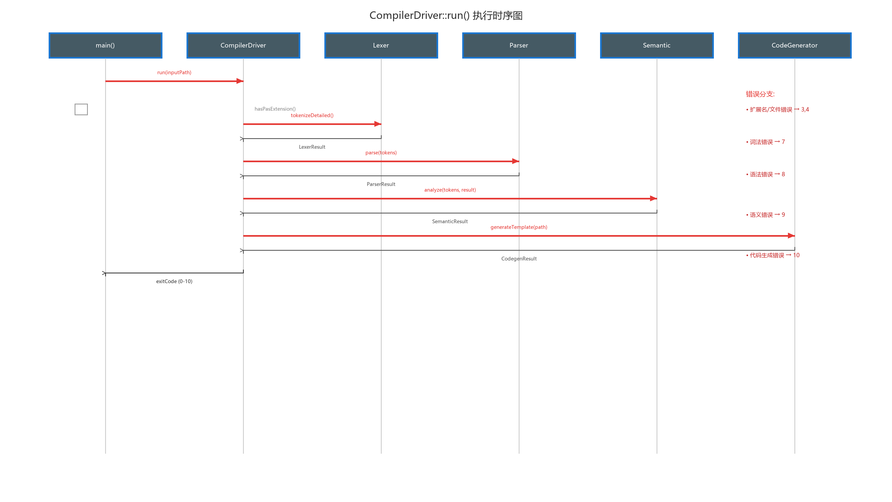

# 编译驱动与主程序 (Compiler Driver & Main)

## 模块职责

编译驱动是整个编译流水线的**编排者**（Orchestrator），负责串联词法→语法→语义→代码生成四个阶段，在每个阶段之间做错误检查（采用 fail-fast 策略：任一阶段失败即立即停止后续阶段），并管理文件输入输出。模块同时承担命令行接口的职责——解析用户传入的参数，验证输入文件的存在性和扩展名合法性。

## 文件结构

| 文件 | 行数 | 职责 |
|------|------|------|
| `main.cpp` | 22 | 程序入口：命令行参数解析（`-i <input.pas>` 格式验证）、创建 CompilerDriver 并委托 |
| `compiler_driver.h` | 15 | `CompilerDriver` 类公开接口：`run()` 主入口 + `deriveOutputPath()` / `hasPasExtension()` 辅助函数 |
| `compiler_driver.cpp` | 106 | 完整的编译流水线编排逻辑、文件 IO、错误汇总和统计输出 |

## main.cpp — 程序入口

```cpp
// main.cpp:13-22
int main(int argc, char* argv[]) {
    // 1. 参数校验: 必须是 -i <input.pas> 格式
    if (argc != 3 || std::string(argv[1]) != "-i") {
        printUsage();                              // 输出用法说明到 stderr
        return toExitCode(ErrorCode::Usage);       // 退出码 2
    }

    // 2. 创建 CompilerDriver 实例并委托执行
    const std::string inputPath = argv[2];
    CompilerDriver driver;
    return driver.run(inputPath);
}
```

`main()` 的逻辑极简——仅做命令行参数验证后即委托给 `CompilerDriver::run()`。这种设计使得 `CompilerDriver` 可以脱离 `main()` 被独立测试（如 `semantic_gate_tests` 测试直接构造 `CompilerDriver` 并调用 `run()`）。

## CompilerDriver — 编译驱动

### 类接口

```cpp
// compiler_driver.h:6-13
class CompilerDriver {
public:
    int run(const std::string& inputPath);                    // 主编排入口

private:
    static std::string deriveOutputPath(const std::string&);  // .pas → .c 路径推导
    static bool hasPasExtension(const std::string&);          // 扩展名验证（大小写不敏感）
};
```

### run() — 流水线编排时序

下图以 UML 时序图的形式精确展示了 `run()` 内部各阶段之间的调用关系和错误分支处理。



时序图揭示了几个重要的设计细节：

1. **fail-fast 错误策略**：每个阶段完成后 Driver 立即检查 `errors.empty()`，若不为空则遍历错误列表通过 `logutil::error()` 逐条输出到 stderr，然后直接 `return` 对应的退出码。这意味着如果词法分析有错误，用户将**只看到词法错误**，语法/语义/代码生成阶段都不会执行。

2. **错误汇总报告**：每个阶段的失败都会额外输出一条汇总信息（如 `"E199 Lexical analysis failed with N error(s)."`），帮助用户快速了解错误的严重程度。

3. **CodeGenerator 直接接收 AST**：`generate()` 接口接收 `ParserResult`（含完整 AST），由 `CompilerDriver` 直接调用，不再重新执行词法分析。

```
CompilerDriver::run(inputPath)                            [compiler_driver.cpp:14-84]
│
├─ STEP 1: 扩展名检查                                     [line 15-18]
│   hasPasExtension(inputPath) → 若非 .pas 则 E001 错误，退出码 3
│   检查逻辑：提取路径最后 4 个字符，大小写不敏感比较
│
├─ STEP 2: 文件可读性检查                                 [line 20-24]
│   std::ifstream in(inputPath) → 若不可读则 E002 错误，退出码 4
│
├─ STEP 3: 读取全部源码到内存                              [line 26-28]
│   std::ostringstream buffer ← in.rdbuf()
│   使用 ostringstream 一次性读取全部内容
│
├─ STEP 4: 词法分析                                        [line 30-39]
│   Lexer lexer; lexer.tokenizeDetailed(sourceCode) → LexerResult
│   若有 errors: 遍历逐条输出 "E1xx (line:col) message"
│   汇总错误 → E199，退出码 7 (ErrorCode::LexicalError)
│
├─ STEP 5: 语法分析                                        [line 41-49]
│   Parser parser; parser.parse(lexResult.tokens) → ParserResult
│   若有 errors: 遍历逐条输出 "E2xx (line:col) message"
│   汇总错误 → E299，退出码 8 (ErrorCode::SyntaxError)
│
├─ STEP 6: 语义分析                                        [line 51-59]
│   SemanticDeclarationAnalyzer analyzer;
│   analyzer.analyze(lexResult.tokens, parserResult) → SemanticResult
│   若有 errors: 遍历逐条输出 "S1xx/S2xx (line:col) message"
│   汇总错误 → E399，退出码 9 (ErrorCode::SemanticError)
│
├─ STEP 7: 打开输出文件                                    [line 61-66]
│   deriveOutputPath(inputPath) 计算输出 .c 路径
│   std::ofstream out(outputPath, std::ios::trunc)
│   若无法打开 → E004 错误，退出码 6
│   路径推导: 将输入路径尾部 .pas（大小写不敏感）替换为 .c
│
├─ STEP 8: 代码生成                                        [line 68-73]
│   CodeGenerator generator;
│   generator.generate(parserResult) → CodegenResult
│   (直接传入 AST，不再重新执行词法分析)
│   若 !ok → E499 错误，退出码 10 (ErrorCode::GenerationError)
│
├─ STEP 9: 写入输出文件                                    [line 75]
│   out << codegenResult.cSource
│
└─ STEP 10: 输出成功统计信息                               [line 77-83]
    logutil::info 输出: Input/Output/Tokenized items/Syntax/Semantic/Codegen stages
    返回退出码 0 (ErrorCode::Ok)
```

### 辅助函数

```cpp
// compiler_driver.cpp:86-98
deriveOutputPath(inputPath)
    // 将尾部 .pas（大小写不敏感）替换为 .c
    // 例: "test.PAS" → "test.c", "dir/my.pas" → "dir/my.c"
    // 路径长度 < 4 时不做替换（防御性编程）

// compiler_driver.cpp:100-105
hasPasExtension(path)
    // 提取路径最后 4 个字符，tolower 后与 ".pas" 比较
    // 例: "demo.PAS" → true, "demo.txt" → false
```

## 错误处理策略

编译器采用 **fail-fast** 策略：任一阶段检测到错误即停止后续阶段。错误信息输出格式统一为：

```
[ERROR_CODE] (line:column) message
```

成功时输出统计信息到 stdout：

```
[INFO] Input:  samples/01_features.pas
[INFO] Output: samples/01_features.c
[INFO] Tokenized items: 23
[INFO] Syntax stage: passed
[INFO] Semantic stage: passed
[INFO] Codegen stage: template emitted
```

## 退出码体系

定义于 `error_codes.h`，通过 `toExitCode()` 将 `ErrorCode` 枚举值转换为进程退出码：

| 退出码 | ErrorCode 枚举值 | 含义 | 触发场景 |
|--------|-----------------|------|---------|
| 0 | Ok | 编译成功 | 所有阶段通过 |
| 2 | Usage | 命令行参数错误 | `argc != 3` 或 `argv[1] != "-i"` |
| 3 | InvalidExtension | 输入文件非 .pas 扩展名 | `hasPasExtension()` 返回 false |
| 4 | InputNotFound | 输入文件不存在或不可读 | `ifstream.good()` 返回 false |
| 5 | InputUnreadable | （预留）输入文件不可读 | 当前未使用 |
| 6 | OutputCreateFailed | 无法创建输出 .c 文件 | `ofstream.good()` 返回 false |
| 7 | LexicalError | 词法分析阶段失败 | `!lexResult.errors.empty()` |
| 8 | SyntaxError | 语法分析阶段失败 | `!parserResult.errors.empty()` |
| 9 | SemanticError | 语义分析阶段失败 | `!semanticResult.errors.empty()` |
| 10 | GenerationError | 代码生成阶段失败 | `!codegenResult.ok` |
